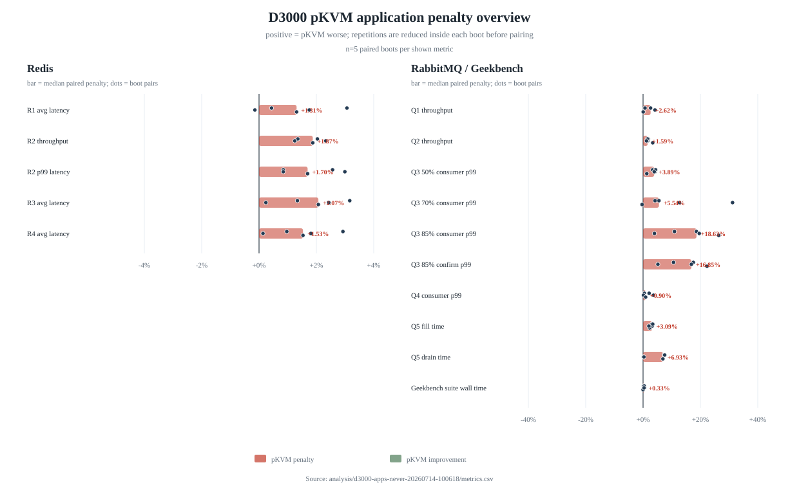
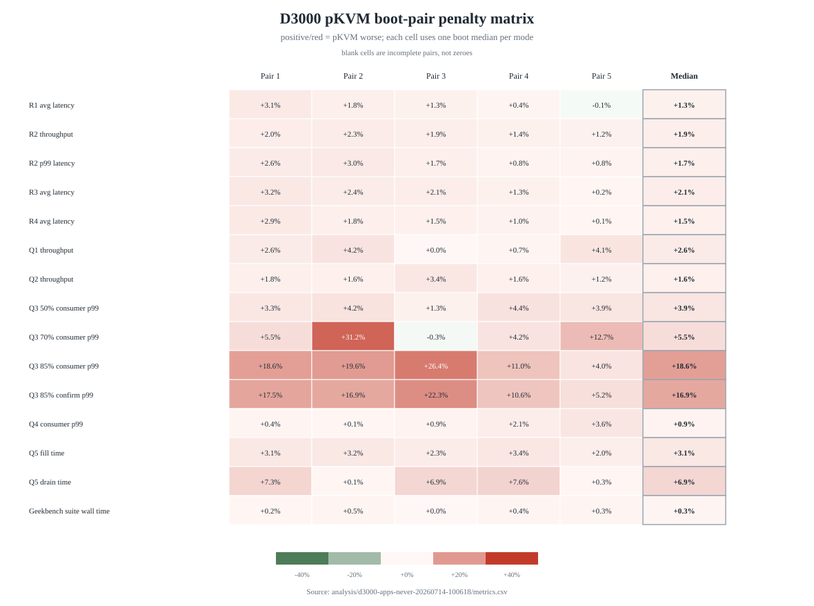
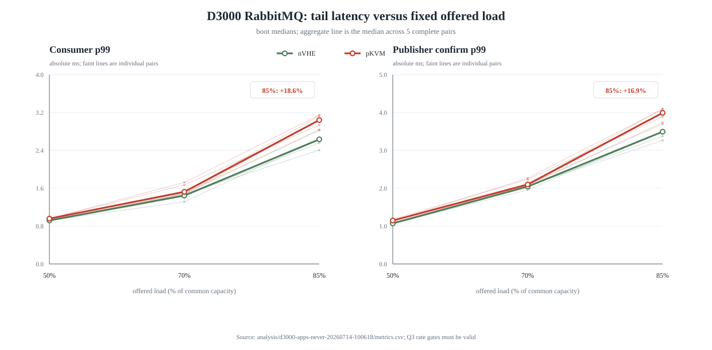
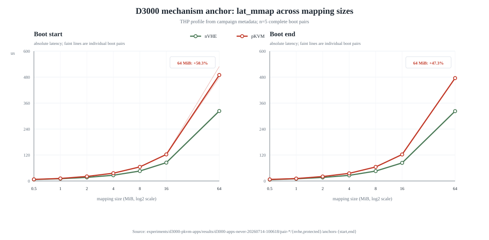
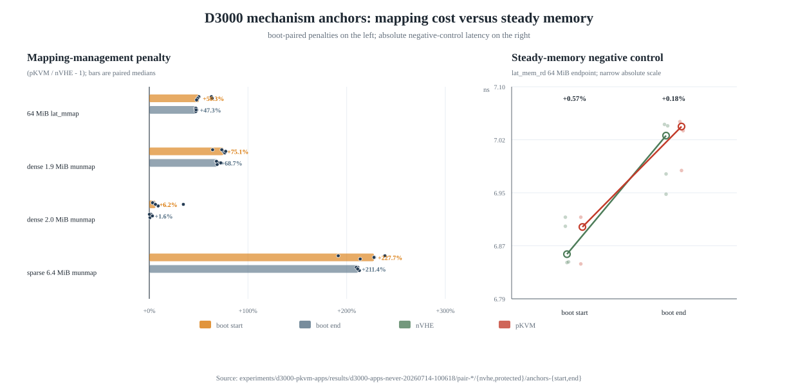

# D3000 pKVM 真实负载实验：THP=never 五个 boot pair 完整分析

本文分析正式 campaign `d3000-apps-never-20260714-100618`。该 campaign 于 2026-07-14 10:06 创建，2026-07-17 09:28 完成，包含 5 个 nVHE/protected boot pair、10 个正式 boot，以及每个 boot 内的 Redis、RabbitMQ、Geekbench 6 CPU 和首尾机制 anchors。本文只使用修复 RabbitMQ Q3/Q5 后重新开始的正式 campaign；已封存的旧 campaign `d3000-apps-20260713-111300` 不进入任何汇总。

文中的 `protected` 与 `pKVM` 指同一种实验模式，即内核启动参数为 `kvm-arm.mode=protected` 且 dmesg 确认启用 Protected KVM；`nVHE` 指启动参数为 `kvm-arm.mode=nvhe` 的宿主机对照。除非特别说明，图表中的 penalty 已统一方向：正值表示 pKVM 更差，负值表示 pKVM 更好。

## 1. 结论摘要

全量结果不支持“开启 pKVM 后所有内存访问都会普遍变慢”，也不支持“真实应用完全没有影响”。更准确的结论是：D3000 上 pKVM 对映射管理路径存在很大的机制成本，真实应用通常只暴露其中一小部分；当负载接近共同容量上限时，队列系统可以把约 2% 的容量差非线性放大为十几个百分点的尾延迟差。

应用级最稳定的信号如下：

| 场景 | 五个 pair 的中位 penalty | 五个 pair 的观察范围 | 方向 | 判断 |
|---|---:|---:|---:|---|
| Redis R2 饱和吞吐 | +1.87% | +1.25%～+2.33% | 5/5 pKVM 更差 | 小而稳定的容量损失 |
| Redis R2 平均延迟 | +1.93% | +1.26%～+2.38% | 5/5 pKVM 更差 | 与吞吐损失相互印证 |
| RabbitMQ Q1 饱和吞吐 | +2.62% | +0.03%～+4.19% | 5/5 pKVM 更差 | 方向稳定，幅度较散 |
| RabbitMQ Q2 可靠消息吞吐 | +1.59% | +1.18%～+3.37% | 5/5 pKVM 更差 | 较稳定的容量损失 |
| RabbitMQ Q3 50% consumer p99 | +3.89% | +1.31%～+4.38% | 5/5 pKVM 更差 | 相同低负载下已有小幅尾延迟差 |
| RabbitMQ Q3 85% consumer p99 | +18.63% | +3.97%～+26.40% | 5/5 pKVM 更差 | 接近容量时明显放大，但幅度随 pair 漂移 |
| RabbitMQ Q3 85% confirm p99 | +16.85% | +5.17%～+22.29% | 5/5 pKVM 更差 | 与 consumer p99 同方向 |
| RabbitMQ Q4 低负载 consumer p99 | +0.90% | +0.15%～+3.63% | 5/5 pKVM 更差 | 低利用率下影响很小 |
| RabbitMQ Q5 固定一百万消息 fill | +3.09% | +2.01%～+3.37% | 5/5 pKVM 更差 | 幅度集中、闭环完整 |
| Geekbench suite wall time | +0.33% | +0.01%～+0.50% | 5/5 pKVM 更慢 | 仅为辅助时间指标，不是官方分数 |

机制 anchors 的量级远大于应用结果：64 MiB `lat_mmap_precise` 在 boot 首、尾分别慢 50.28% 和 47.29%；sparse 6.4 MiB touched-set 的 `munmap` 分别慢 227.69% 和 211.44%；但 64 MiB `lat_mem_rd` endpoint 的 paired gap 中位数只有 +0.57% 和 +0.18%，所有 pair 都在 ±1% 左右。这把影响边界继续限定在映射建立/拆除与失效管理路径，而不是稳态 load latency。



## 2. 数据完整性与可比性

### 2.1 完成性

结果树已经生成 `CAMPAIGN_COMPLETE`，10 个正式 boot 均有 `BOOT_BLOCK_VALID`。每个 boot 都包含 20 个 Redis repetition、35 个 RabbitMQ repetition、5 个 Geekbench 正式 CPU suite，以及 boot 首尾两个有效 anchor group。全 campaign 因而包含 200 个 Redis、350 个 RabbitMQ、50 个 Geekbench 正式 repetition 和 20 个 anchor group。

| 检查项 | 结果 |
|---|---:|
| `BOOT_BLOCK_VALID` | 10/10 |
| Redis `VALID` | 200/200 |
| RabbitMQ `VALID` | 350/350 |
| Geekbench 正式 `VALID` | 50/50 |
| boot 首 anchor `VALID` | 10/10 |
| boot 尾 anchor `VALID` | 10/10 |
| RabbitMQ Q3 `rate-validation.env` | 150/150 |
| RabbitMQ Q5 `QUEUE_COUNTS_VALID` | 100/100 |
| `Parsing failed` | 0 |

Q3 的 150 个正式 repetition 每个都有 301 个去除前 60 秒后的速率样本。三个目标分别为 24,376、34,128 和 41,440 msg/s，所有实测速率相对目标的最大绝对误差为 0.1363%，远小于 ±5% gate。因此 Q3 的 nVHE 与 pKVM 确实接收了相同的绝对 offered load。

Q5 的每个 repetition 都有 fill 后和 drain 后两次队列计数核验。共 100 份 `validation.env` 全部满足实际值等于期望值：fill 后 `ready=1,000,000`、`unacknowledged=0`，drain 后两者均为 0。Q5 时间对应真实的一百万条消息闭环，不是空跑或解析失败。

### 2.2 宿主机与模式控制

10 个正式 boot 使用同一个 `6.6.30+ #2` 内核，ASLR 均为 2，swap 均为空。5 个 protected leg 的 dmesg 都包含 `Protected KVM`，5 个 nVHE leg 都包含 `Hyp mode initialized successfully` 且不包含 protected feature。30 份首尾 anchor/Geekbench 项目元数据中的 THP 状态全部为 `always madvise [never]`，profile 全部为 `never`；events log 在本 campaign 内还记录了 54 次 `effective=never`，其中 4 次来自两侧容量校准，50 次来自 10 个正式 boot 的 anchors、Redis、RabbitMQ 和 Geekbench。

`boot-metadata/metadata.env` 是 `prepare-host.sh` 后、具体项目调用 `set_project_thp` 前的早期快照，因此其中可能看到 `[always] madvise never`。这不代表正式 workload 在 THP=always 下运行。正式判据是每个项目开始时的 setter 读回、项目元数据和最终 boot validity；三者均证明本 campaign 的计分窗口为 THP=never。

所有保存的 `cpufreq.txt` 都显示 CPU 0–7 使用 `performance` governor，采样时频率为 2.5 GHz。该快照不能替代全程温度或频率 trace，但至少没有发现不同 mode 使用不同 governor 或采样频率的配置错误。

### 2.3 交叉顺序

五个 pair 交替 mode 先后顺序，并轮换项目顺序：

| Pair | boot 顺序 | 项目顺序 |
|---:|---|---|
| 1 | nVHE → pKVM | Geekbench → Redis → RabbitMQ |
| 2 | pKVM → nVHE | Redis → RabbitMQ → Geekbench |
| 3 | nVHE → pKVM | RabbitMQ → Geekbench → Redis |
| 4 | pKVM → nVHE | Geekbench → RabbitMQ → Redis |
| 5 | nVHE → pKVM | Redis → Geekbench → RabbitMQ |

这比固定先跑 nVHE、后跑 pKVM 更能抵抗单向时间漂移。它仍不是完全随机化设计：nVHE-first 有 3 个 pair，pKVM-first 有 2 个 pair；容量校准只在 campaign 开始时做一次；整套实验跨越约三天。报告因此同时检查 pair-by-pair matrix、mode 顺序分组和绝对值随 pair 的变化。

## 3. 统计口径和推断边界

### 3.1 实验单位

真正独立的实验单位是 boot pair，不是同一 boot 内的 repetition。处理顺序为：

1. 对每个 `pair × mode × scenario × metric` 的 5 次 repetition 取中位数，得到一个 boot-level 值。
2. 在同一个 pair 内比较 protected 与 nVHE。
3. 对 5 个 pair 的相对差取中位数，并报告 MAD、观察范围和方向计数。

对于延迟和 wall time 等越低越好的指标：

```text
penalty_pair = (protected / nVHE - 1) × 100%
```

对于吞吐和分数等越高越好的指标，图表使用相反号，使正值仍表示 pKVM 更差：

```text
penalty_pair = -(protected / nVHE - 1) × 100%
```

表中的 nVHE 与 protected 绝对值分别是 5 个 boot median 的中位数；主效应则是 5 个 pair ratio 的中位数。由于“中位数之比”不一定等于“比值的中位数”，绝对值直接相除可能与报告 penalty 有轻微差异，这是预期的。

### 3.2 为什么不把 bootstrap CI 当作确认性证据

分析器保留了固定种子、20,000 次 percentile bootstrap 的 median 区间，用于描述 n=5 下重采样结果对某个 pair 的敏感程度。但是 n=5 太小，非参数 bootstrap 的覆盖率不能被视为可靠的总体 95% 置信保证；在本数据中，许多区间实际上退化为五个观察值的最小值到最大值。

精确双侧 sign test 更清楚地展示了样本量边界：即使 5/5 全部同方向，最小可能 p 值仍是 0.0625，达不到传统的 0.05 阈值；4/5 同方向时 p 值为 0.375。因此本文不写“统计显著”，也不把 bootstrap 区间未跨零当作确认性证明。本文使用“5/5 同方向”“幅度集中”“跨 pair 漂移”等可直接审计的描述。

原计划中的 ±3%（吞吐、平均延迟、wall time、分数）和 ±5%（p99）仍作为工程等价带筛查。只有观察范围或描述性 bootstrap 区间完全落入带内时，才可以说“当前五个观察 pair 均位于预设带内”；这不是总体等价性的正式证明。

### 3.3 多指标问题

统一分析器提取了 57 个应用指标。本文不根据单个最有利的端点挑结论，而优先解释预先定义的核心指标：饱和场景吞吐、固定负载场景 p99、Q5 固定消息 wall time、Geekbench 官方分数或其缺失时的辅助 wall time。p50、p95、published/received 双端和其他指标用于一致性检查，完整值保存在机器可读汇总中。



## 4. 容量校准

正式负载前的双模式校准得到：

| 项目 | nVHE 容量中位数 | pKVM 容量中位数 | pKVM 相对差 | 共同容量 |
|---|---:|---:|---:|---:|
| Redis | 138,439.64 ops/s | 136,645.81 ops/s | -1.30% | 136,645.81 ops/s |
| RabbitMQ | 49,691 msg/s | 48,753 msg/s | -1.89% | 48,753 msg/s |

共同容量取两种 mode 中较低者，避免各自按自身容量百分比运行而形成不同绝对工作量。RabbitMQ Q3 的三个绝对目标在 pKVM 下约为其校准容量的 50%、70%、85%，在 nVHE 下约为 49.06%、68.68%、83.40%。因此 Q3 比较的是相同请求速率，但 pKVM 合理地更接近自己的容量上限；高负载尾延迟差包含“容量略低导致排队余量减少”的真实系统效应，而不是每条消息的固定额外时延。

校准只在 campaign 开始时执行一次。若三天内绝对容量发生漂移，同一个 41,440 msg/s 在后续 boot 中可能不再严格等于当时容量的 85%。这可能是 Q3 85% penalty 在后两个 pair 缩小的重要解释之一，也是后续 THP=always 对照和诊断复跑应注意的限制。

## 5. Redis

### 5.1 全量结果

| 场景与指标 | nVHE boot 中位数 | pKVM boot 中位数 | paired penalty 中位数 | 五 pair 范围 | pKVM 更差 pair |
|---|---:|---:|---:|---:|---:|
| R1 steady 吞吐 | 94,003.29 ops/s | 94,002.99 ops/s | +0.0007% | -0.0019%～+0.0015% | 3/5 |
| R1 平均延迟 | 0.687 ms | 0.696 ms | +1.31% | -0.14%～+3.07% | 4/5 |
| R1 p99 | 1.423 ms | 1.439 ms | +1.12% | -0.56%～+2.81% | 3/5，另 1 个相等 |
| R2 pipeline 吞吐 | 631,568.74 ops/s | 621,034.77 ops/s | +1.87% | +1.25%～+2.33% | 5/5 |
| R2 平均延迟 | 2.531 ms | 2.574 ms | +1.93% | +1.26%～+2.38% | 5/5 |
| R2 p99 | 3.775 ms | 3.839 ms | +1.70% | +0.84%～+2.99% | 5/5 |
| R3 TTL/eviction 平均延迟 | 0.822 ms | 0.838 ms | +2.07% | +0.24%～+3.16% | 5/5 |
| R3 p99 | 1.687 ms | 1.719 ms | +1.90% | 0.00%～+3.32% | 4/5，另 1 个相等 |
| R4 BGSAVE 平均延迟 | 0.719 ms | 0.729 ms | +1.53% | +0.14%～+2.92% | 5/5 |
| R4 p99 | 1.463 ms | 1.487 ms | +1.64% | -0.54%～+3.28% | 4/5 |

R1、R3、R4 的吞吐由相同 offered rate 控制，因此吞吐接近相同是测试设计的结果，不能据此说性能等价。这三类场景应主要观察延迟。全量结果显示平均延迟 penalty 的中位数约为 1.3%～2.1%，小于 Pair 1 阶段性报告中约 3% 的印象。

R2 是 Redis 最清楚的结果。五个 pair 的饱和吞吐 penalty 全部为正且集中在 1.25%～2.33%，平均延迟和 p99 也全部同方向。boot 内 repetition 的吞吐稳健相对 MAD 中位数只有 0.17%，明显小于约 1.87% 的 paired effect。它支持“D3000 pKVM 在该 Redis pipeline 饱和场景中带来约 2% 容量损失”，但不支持把这个数字外推到所有 Redis 工作负载。

### 5.2 时间漂移

受控速率场景的平均延迟 penalty 随 pair 整体缩小：R1 为 +3.07%、+1.75%、+1.31%、+0.44%、-0.14%；R3 为 +3.16%、+2.43%、+2.07%、+1.34%、+0.24%；R4 为 +2.92%、+1.81%、+1.53%、+0.97%、+0.14%。R2 吞吐 penalty 也从前两个 pair 的约 2.0%～2.3% 降至后两个的约 1.25%～1.35%。

作为诊断性时间趋势检查，R1/R3/R4 平均延迟 penalty 对 pair index 的 Spearman rho 都为 -1.0；在五点严格单调排序下，精确双侧 permutation p 值为 0.0167。R2 吞吐的 rho 为 -0.9、p=0.0833。三个 Redis 延迟端点高度相关且本报告还检查了许多指标，因此这些 p 值不能当作新的确认性发现；它们的作用是证明“时间趋势不可忽略”，而不是定位趋势原因。

这种趋势在 nVHE-first 与 pKVM-first 两个顺序组中都能看到，CPU 频率快照均为 2.5 GHz，因此不能简单归因于 mode 先后或 governor 配错。它说明整套实验并非完全平稳，可能包含温度、后台状态、内存布局、内核长期状态或固定校准点随时间变化等未观测因素。使用五个 pair 中位数比引用 Pair 1 更稳健，但仍应把约 1%～2% 解释为该 campaign 的观察效应，而不是硬件常数。

## 6. RabbitMQ

### 6.1 饱和吞吐：Q1 与 Q2

| 场景与指标 | nVHE boot 中位数 | pKVM boot 中位数 | paired penalty 中位数 | 五 pair 范围 | boot 内相对 MAD 中位数 |
|---|---:|---:|---:|---:|---:|
| Q1 published | 69,667 msg/s | 67,841 msg/s | +2.62% | +0.03%～+4.19% | 1.83% |
| Q1 consumer p99 | 16.822 ms | 17.371 ms | +4.06% | -3.05%～+5.58% | 4.29% |
| Q2 published | 51,535 msg/s | 50,572 msg/s | +1.59% | +1.18%～+3.37% | 0.54% |
| Q2 confirm p99 | 199.883 ms | 201.549 ms | +0.68% | +0.47%～+3.39% | 0.92% |
| Q2 consumer p99 | 8.147 s | 5.907 s | -17.61% | -43.23%～+10.96% | 19.80% |

Q1 和 Q2 的 published throughput 均为 5/5 pKVM 更低，与 RabbitMQ 校准容量低 1.89% 的方向一致。Q2 的幅度比 Q1 集中，因而是更稳健的容量结果。Q1 consumer p99 的 effect 与 boot 内变动量级相当，并有一个 pair 反向，不能单独作为强结论。

Q2 consumer latency 已经达到 4.7～9.1 秒，且 boot 内相对 MAD 中位数约 19.8%，说明消费者处于明显 backlog/排队状态。其 pKVM 中位数看似更低，不应解释为性能改善；published throughput、confirm latency 和队列是否稳定才是这个场景更可用的指标。

### 6.2 固定 offered load：Q3



| 共同容量负载 | published nVHE → pKVM | consumer p99 nVHE → pKVM | consumer penalty | confirm p99 nVHE → pKVM | confirm penalty |
|---:|---:|---:|---:|---:|---:|
| 50% | 24,402 → 24,402 msg/s | 0.919 → 0.957 ms | +3.89%（+1.31%～+4.38%） | 1.069 → 1.145 ms | +7.03%（+2.72%～+9.33%） |
| 70% | 34,173 → 34,173 msg/s | 1.444 → 1.524 ms | +5.54%（-0.34%～+31.20%） | 2.043 → 2.100 ms | +2.79%（+0.63%～+15.92%） |
| 85% | 41,469 → 41,469 msg/s | 2.632 → 3.040 ms | +18.63%（+3.97%～+26.40%） | 3.493 → 3.989 ms | +16.85%（+5.17%～+22.29%） |

published rate 在两种 mode 中几乎完全相同，且所有 gate 都通过，因此尾延迟差不是请求速率不同造成的。50% 点 consumer 和 confirm p99 都是 5/5 pKVM 更高；70% 点 consumer p99 有一个反向 pair，Pair 2 又出现 +31.20% 的高值，因此该点的中位数不能脱离分布单独解读；85% 点的两个 p99 指标均为 5/5 pKVM 更高，是应用级最强方向信号。

85% 的幅度并不恒定：consumer p99 的五个 pair penalty 为 +18.63%、+19.60%、+26.40%、+10.95%、+3.97%，confirm p99 为 +17.52%、+16.85%、+22.29%、+10.64%、+5.17%。后两个 pair 明显缩小，但方向未改变。这符合队列系统接近饱和时对可用余量高度敏感的特征，也暴露了固定一次容量校准跨三天运行的局限。

Q3 85% consumer 与 confirm p99 对 pair index 的 Spearman rho 分别为 -0.6 和 -0.7，精确 permutation p 分别为 0.35 和 0.233；这不足以单独确认单调时间趋势，但与后两个 pair 幅度缩小的肉眼观察一致。它比 Redis 的严格单调下降更弱。

因此，最严谨的表述不是“pKVM 为每条 RabbitMQ 消息增加约 18% 固定成本”，而是：“在本次共同容量校准和相同绝对 offered load 下，pKVM 的容量略低；当目标提高到共同容量的 85% 时，五个 boot pair 都观察到更高的 consumer/confirm p99，中位放大约 17%～19%。”

### 6.3 低负载负对照：Q4

Q4 固定 10,000 msg/s，只占 pKVM 校准容量约 20.51%。published rate 在两种 mode 中相同；consumer p99 的 paired penalty 中位数为 +0.90%，范围 +0.15%～+3.63%；confirm p99 为 +1.29%，范围 +0.69%～+3.01%。这与 Q3 85% 形成清楚对照：低利用率时 pKVM 差异很小，接近容量时尾延迟明显放大。

### 6.4 固定一百万消息：Q5

| Pair | fill penalty | drain penalty |
|---:|---:|---:|
| 1 | +3.09% | +7.32% |
| 2 | +3.18% | +0.14% |
| 3 | +2.27% | +6.93% |
| 4 | +3.37% | +7.56% |
| 5 | +2.01% | +0.29% |
| 中位数 | **+3.09%** | **+6.93%** |

fill 的五个 pair 集中在 +2.01%～+3.37%，而 boot 内 wall-time 相对 MAD 中位数只有 0.38%，这是一个较稳定的端到端批量写入信号。drain 虽然 5/5 都为正，但呈现接近 0% 与约 7% 两簇，boot 内相对 MAD 中位数约 6.67%，与效应本身相当。对 drain 最合适的结论是“方向一致但幅度不稳定”，不能只引用 +6.93% 中位数。

## 7. Geekbench 6 CPU

50 个正式 CPU suite 都成功运行并保存了互不重复的 canonical result URL，但当前本地没有结果页 HTML，也没有 `scores.json`。因此无法严谨报告 Geekbench 官方 single-core、multi-core 或子项分数。

现有 `/usr/bin/time` 可提供辅助 wall time：nVHE 的五个 boot median 中位数为 399.38 s，pKVM 为 400.24 s；paired penalty 中位数为 +0.33%，范围 +0.01%～+0.50%，5/5 均为 pKVM 略慢，boot 内相对 MAD 中位数为 0.074%。这说明整套 CPU suite 的总耗时差很小，但该时间包含 Geekbench 自身运行和结果上传阶段，不能替代官方分数。

在结果页保存并通过 strict importer 生成 `scores.json` 前，本文对 Geekbench 的正式结论仅限于：“50 次执行链完整，suite wall time 未显示超过 0.5% 的 paired 差异。”

## 8. 机制 anchors

### 8.1 `lat_mmap_precise` 尺寸曲线



| 映射大小 | boot 首 nVHE → pKVM | boot 首 penalty | boot 尾 nVHE → pKVM | boot 尾 penalty |
|---:|---:|---:|---:|---:|
| 0.5 MiB | 6.683 → 7.542 µs | +16.14% | 6.073 → 7.212 µs | +19.04% |
| 1 MiB | 10.524 → 11.702 µs | +13.43% | 10.250 → 11.115 µs | +20.12% |
| 2 MiB | 16.535 → 21.127 µs | +29.71% | 16.331 → 20.789 µs | +28.51% |
| 4 MiB | 26.477 → 36.030 µs | +34.09% | 26.082 → 35.311 µs | +34.47% |
| 8 MiB | 45.937 → 65.066 µs | +41.58% | 45.777 → 64.912 µs | +41.26% |
| 16 MiB | 84.639 → 122.665 µs | +45.43% | 83.585 → 122.524 µs | +45.75% |
| 64 MiB | 323.196 → 489.603 µs | +50.28% | 322.649 → 475.532 µs | +47.29% |

从 2 MiB 开始，penalty 随映射大小增大并在 64 MiB 接近 50%，五个 pair 的方向完全一致。0.5 和 1 MiB 的绝对时间很小，固定开销占比更高，pair 范围也明显更宽，不适合只看百分比。

64 MiB boot 首 penalty 范围为 +47.92%～+63.69%，boot 尾则收敛到 +46.51%～+48.18%。pKVM 侧 64 MiB 绝对值从 boot 首到 boot 尾的变化中位数为 -2.82%，且 Pair 4/5 的 boot 首值约为 529 µs、boot 尾回到约 475 µs。boot 尾 anchor 因而是更平稳的机制估计，但 boot 首尾都证明差异没有被长时间应用运行消除。

### 8.2 `munmap` threshold 与 sparse control



| Anchor | boot 首 penalty 中位数 | boot 首范围 | boot 尾 penalty 中位数 | boot 尾范围 |
|---|---:|---:|---:|---:|
| dense 1.9 MiB touched，4 KiB stride | +75.08% | +64.21%～+77.40% | +68.74% | +67.61%～+72.47% |
| dense 2.0 MiB touched，4 KiB stride | +6.22% | +3.27%～+34.50% | +1.55% | +0.16%～+3.12% |
| sparse 6.4 MiB touched，16 KiB stride | +227.69% | +191.51%～+238.78% | +211.44% | +209.72%～+212.87% |
| `lat_mem_rd` 64 MiB endpoint | +0.57% | -0.97%～+0.77% | +0.18% | -0.10%～+0.98% |

dense 1.9 与 2.0 MiB touched-set 只差 0.1 MiB，却在 boot 尾表现为约 +69% 对约 +1.6%。这重复了映射拆除路径的阈值型行为。dense 2.0 的 boot 首 Pair 2 有 +34.5% 离群值，但 boot 尾五个 pair 全部落在 +0.16%～+3.12%，因此不应把 boot 首中位数 +6.22% 当作稳定机制常数。

sparse 6.4 的差异最大而且 boot 尾极其集中：五个 pair 全部在约 +210%～+213%。与之相对，`lat_mem_rd` 的 paired gap 始终在约 ±1%，而两种 mode 从 boot 首到 boot 尾的绝对 endpoint 都增加约 1.9%。这说明共同的首尾漂移存在，但 pKVM 并没有让稳态 pointer-chasing latency 普遍增加几十个百分点。

## 9. 从机制到应用：能够推断什么

### 9.1 数据支持的解释

机制 anchors 与应用结果共同支持以下层次关系：

1. pKVM 在 D3000 上确实为 host mapping-management path 引入很大的额外成本；该信号跨 5 个 boot pair、跨 boot 首尾都存在。
2. 稳态内存访问负对照基本相同，因此不能把应用差异归因于“所有内存 load 都慢了约 50%”。
3. 大驻留集服务会把映射成本摊薄。Redis 的饱和容量和延迟差约为 1%～2%，远小于 mmap/munmap anchor。
4. 队列系统对容量余量敏感。RabbitMQ 在约 20% 容量的 Q4 中 p99 只差约 1%，在 85% 共同容量的 Q3 中却出现约 17%～19% 的 p99 中位差。
5. 固定一百万消息的 Q5 fill 约慢 3%，说明影响不仅存在于无限时长饱和吞吐指标中，也能在固定工作量 wall time 中观察到。

### 9.2 数据不能单独证明的事项

当前数据不能把某个应用 penalty 精确分解为 mmap、munmap、TLBI、allocator、page fault、scheduler、容器、Erlang GC 或 Java client 的各自贡献。anchors 证明机制路径存在，应用测试证明端到端差异存在，但两者之间还缺少同场景 `perf stat`、内核 trace 或 eBPF 事件计数。尤其是 RabbitMQ 结果包含 broker、Erlang VM、Docker、Java client 和 loopback 的共同成本，不能称为纯 broker 开销。

当前结果也不描述 pVM guest 并发时的系统表现，不描述其他 D3000 固件/内核版本，不描述 x86 或支持不同 TLBI 能力的 ARM 平台。THP=always campaign 尚在运行，因此本文不能回答 THP 是否缓解应用 penalty，也不能把 THP=never 与正在生成的 THP=always repetition 混合统计。

## 10. 统计与实验局限

1. 只有 5 个独立 boot pair，适合报告效应量、范围和一致性，不足以进行强确认性推断；5/5 同方向的精确双侧 sign-test p 值仍为 0.0625。
2. 整个 campaign 跨约三天，只在开始时做一次容量校准。Q3 相对负载可能随机器容量漂移。
3. 客户端与服务端同机，共享 CPU、LLC、内存、内核和 loopback；结果代表这套端到端宿主机负载，不代表独立压测机拓扑。
4. performance governor 与 2.5 GHz 快照不能替代全程温度、功耗和频率 trace；后台噪声也没有通过 CPU/IRQ isolation 完全消除。
5. Redis R1/R3/R4 的 latency penalty 随 pair 下降，说明存在未建模时间趋势。boot pairing 和顺序交叉降低了偏差，但没有消除它。
6. RabbitMQ Q2 consumer latency 已进入多秒 backlog，Q5 drain 呈双簇分布；这些端点不能只看中位数。
7. Redis HDR/HGRM 已保存，但本次自动分析使用 memtier JSON totals，并对每个 boot 的五个 repetition 取中位数；没有把五份 HDR 合并成消息级全局 percentile。
8. RabbitMQ p99 是“丢弃前 60 秒后，每秒 p99 的时间中位数”，不是合并所有消息得到的全局 p99。
9. Geekbench 官方结果页尚未归档，本报告只有 suite wall time，不能代替官方分数。
10. 57 个应用指标存在多重比较问题。本文以预先定义的核心端点和跨相关指标的一致性为主，不根据单个极值宣称结论。

## 11. 对产品问题的回答

如果问题是“在 D3000、当前内核、THP=never、没有 pVM guest 的宿主机上，开启 pKVM 对真实 workload 的影响多大”，当前最有证据支持的回答是：

- CPU 综合 suite 的辅助 wall time 差约 0.3%，尚无官方 Geekbench 分数。
- Redis 饱和 pipeline 容量损失约 1.9%，受控负载平均延迟中位差约 1.3%～2.1%，但后者存在随时间缩小的趋势。
- RabbitMQ 饱和吞吐损失约 1.6%～2.6%；低负载 p99 约差 1%；固定一百万消息 fill 约慢 3%。
- 当 RabbitMQ 工作点提高到共同容量的 85% 时，consumer 与 confirm p99 的五-pair 中位差扩大到约 17%～19%，但单 pair 幅度从约 4% 到 26% 不等。
- 映射管理微基准仍慢约 47%～228%，而稳态访存只差约 ±1%。因此用户可见影响取决于 workload 是否频繁触发相关内核路径，以及它离饱和点还有多少余量。

这是一组“通常为低个位数、接近容量时尾延迟可显著放大”的结果，而不是一个适用于所有应用的单一 pKVM 百分比。

## 12. 后续工作

THP=always campaign 完成后，应先在其内部独立完成同样的 5-pair 分析，再比较两套 profile 的 paired penalty 分布。正确的 interaction 量是各 profile 已完成 boot pairing 后的 penalty 差，而不是把两个 campaign 的 repetition 直接混在一起。

无 tracing 的主计分完成后，建议只对预先触发诊断门槛的核心场景做独立诊断复跑：Redis R2、RabbitMQ Q2、Q3 85%、Q5 fill，并保留 Q4 作为低负载负对照。先使用匹配内核的 `perf stat` 检查 page fault、context switch、CPU time、cycles/instructions 和内核时间；只有仍需要定位时再加入短时 trace。诊断结果必须与本次无 tracing 主分数分目录、分结论。

Geekbench 仍需保存 50 个结果页 HTML，并通过 strict importer 生成 `scores.json`。导入后应重新运行统一分析器和绘图脚本，报告 official single-core、multi-core 和预先选定子项，而不是继续用 wall time 代替分数。

## 13. 复现与证据路径

- 原始 campaign：[`results/d3000-apps-never-20260714-100618`](../../experiments/d3000-pkvm-apps/results/d3000-apps-never-20260714-100618/)
- Campaign 完成标记：[`CAMPAIGN_COMPLETE`](../../experiments/d3000-pkvm-apps/results/d3000-apps-never-20260714-100618/CAMPAIGN_COMPLETE)
- 统一逐 repetition 指标：[`analysis/d3000-apps-never-20260714-100618/metrics.csv`](../../analysis/d3000-apps-never-20260714-100618/metrics.csv)
- 应用汇总：[`application-summary.csv`](../../analysis/d3000-apps-never-20260714-100618/application-summary.csv)
- 应用逐 pair 原值：[`application-pair-values.csv`](../../analysis/d3000-apps-never-20260714-100618/application-pair-values.csv)
- Anchor 汇总：[`anchor-summary.csv`](../../analysis/d3000-apps-never-20260714-100618/anchor-summary.csv)
- Anchor 逐 pair 原值：[`anchor-pair-values.csv`](../../analysis/d3000-apps-never-20260714-100618/anchor-pair-values.csv)
- Anchor 首尾漂移：[`anchor-drift-summary.csv`](../../analysis/d3000-apps-never-20260714-100618/anchor-drift-summary.csv)
- 完整性审计：[`quality-summary.json`](../../analysis/d3000-apps-never-20260714-100618/quality-summary.json)
- 基础分析器：[`analyze-results.py`](../../experiments/d3000-pkvm-apps/analyze-results.py)
- 审计型深度分析器：[`deep-analysis.py`](../../experiments/d3000-pkvm-apps/deep-analysis.py)
- 应用绘图脚本：[`plot-d3000-app-results.py`](scripts/plot-d3000-app-results.py)
- Anchor 绘图脚本：[`plot-d3000-anchors.py`](scripts/plot-d3000-anchors.py)

复现命令：

```bash
cd /home/jose/kylin-lmbench

python3 experiments/d3000-pkvm-apps/analyze-results.py \
  experiments/d3000-pkvm-apps/results/d3000-apps-never-20260714-100618 \
  --out analysis/d3000-apps-never-20260714-100618

python3 experiments/d3000-pkvm-apps/deep-analysis.py \
  experiments/d3000-pkvm-apps/results/d3000-apps-never-20260714-100618 \
  analysis/d3000-apps-never-20260714-100618/metrics.csv \
  --out analysis/d3000-apps-never-20260714-100618

python3 docs/mmap/scripts/plot-d3000-app-results.py \
  analysis/d3000-apps-never-20260714-100618/metrics.csv \
  --figure-dir docs/mmap/figures \
  --prefix d3000-thp-never-full

python3 docs/mmap/scripts/plot-d3000-anchors.py \
  experiments/d3000-pkvm-apps/results/d3000-apps-never-20260714-100618 \
  --figure-dir docs/mmap/figures \
  --prefix d3000-thp-never-full
```
