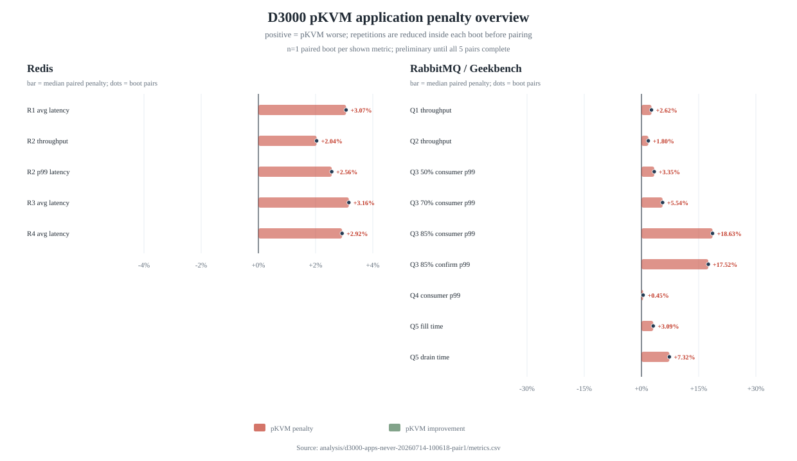
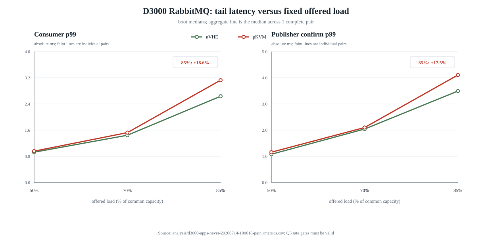
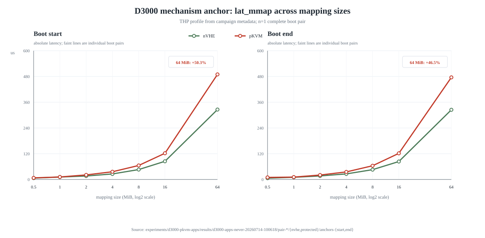
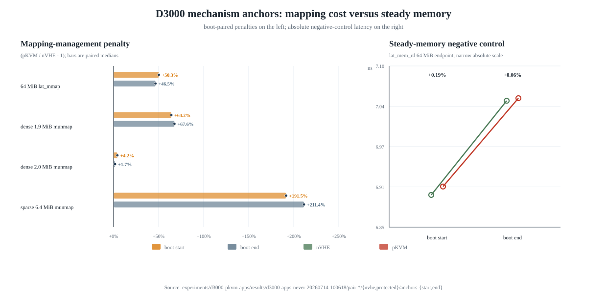
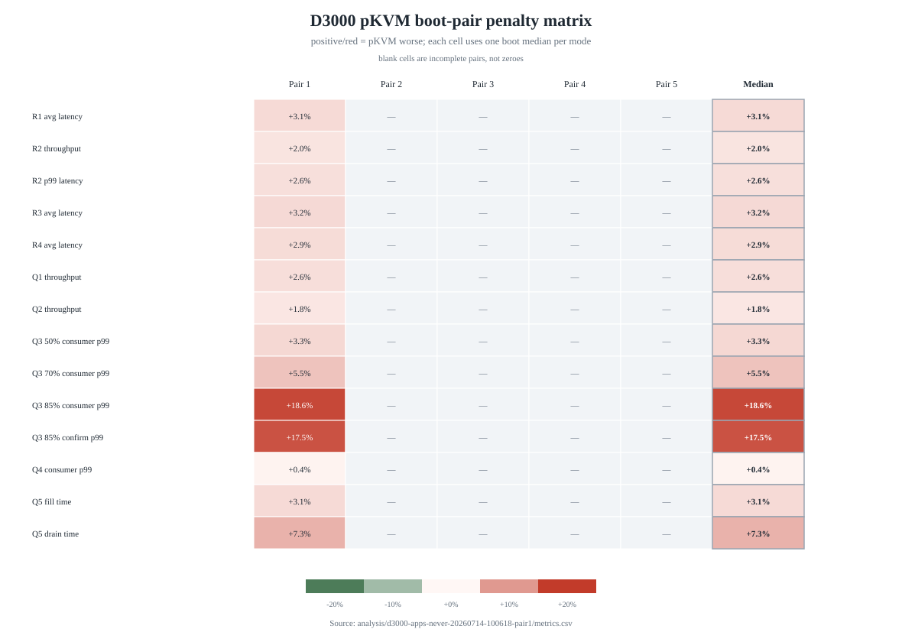

# D3000 pKVM 真实负载实验：THP=never Pair 1 初步对比

本文分析正式 campaign `d3000-apps-never-20260714-100618` 的 Pair 1，数据同步与分析日期为 2026-07-15。它是修复 RabbitMQ Q3/Q5 后从头开始的新 campaign，不是已经封存的旧 campaign `d3000-apps-20260713-111300`，两者不能混合统计。

本文的 `protected` 指内核启动参数为 `kvm-arm.mode=protected`、dmesg 确认启用 Protected KVM 的 pKVM 宿主机；`nVHE` 指启动参数为 `kvm-arm.mode=nvhe` 的对照宿主机。所有差值统一按 `protected / nVHE - 1` 计算，因此吞吐为负或延迟为正都表示 protected 较慢。

## 1. 当前进度与 Pair 2/nVHE 预计完成时间

截至 2026-07-15 08:48:34，D3000 在线，Pair 2/nVHE 从 08:37:03 开始执行，正在 Redis R1 的第 2 次正式 repetition。runner、memtier 进程均正常，当前没有停滞迹象。

前三个完成的正式 boot block 时长非常稳定：Pair 1/nVHE 为 6 小时 57 分 43 秒，Pair 1/protected 为 6 小时 58 分 01 秒，Pair 2/protected 为 6 小时 58 分 13 秒。按三者均值估算，Pair 2/nVHE 将在 2026-07-15 15:35 左右完成；考虑重启和单次应用抖动，可把正常范围看作约 15:20–15:50。

| boot block | 开始时间 | 完成时间 | 时长 |
|---|---|---|---:|
| Pair 1/nVHE | 2026-07-14 11:40:11 | 2026-07-14 18:37:54 | 6:57:43 |
| Pair 1/protected | 2026-07-14 18:38:53 | 2026-07-15 01:36:54 | 6:58:01 |
| Pair 2/protected | 2026-07-15 01:37:50 | 2026-07-15 08:36:03 | 6:58:13 |
| Pair 2/nVHE | 2026-07-15 08:37:03 | 预计 2026-07-15 15:35 | 预计约 6:58 |

## 2. Pair 1 数据是否可以比较

Pair 1 的原始结果现归档在 [`experiments/d3000-pkvm-apps/results/d3000-apps-never-20260714-100618/pair-1`](../../experiments/d3000-pkvm-apps/results/d3000-apps-never-20260714-100618/pair-1/)，共 2752 个文件。nVHE 和 protected 两侧均有 `BOOT_BLOCK_VALID`，内核均为 `6.6.30+ #2`，测试时 swap 关闭，ASLR=2，各项目的实际 THP 状态为 `always madvise [never]`。

模式判据也完整：nVHE 的 cmdline 为 `kvm-arm.mode=nvhe`，dmesg 有 `Hyp mode initialized successfully`；protected 的 cmdline 为 `kvm-arm.mode=protected`，dmesg 同时有 `Protected KVM` 和 `Kylin X Core initialized successfully`。

| 完整性检查 | nVHE | protected |
|---|---:|---:|
| `BOOT_BLOCK_VALID` | 1 | 1 |
| Redis 正式 repetition | 4 场景 × 5 次 | 4 场景 × 5 次 |
| RabbitMQ 正式 repetition | 7 场景 × 5 次 | 7 场景 × 5 次 |
| Geekbench 正式 repetition | 5 次 | 5 次 |
| boot 首尾 anchors | 2 组 | 2 组 |
| Q3 `rate-validation.env` | 15 | 15 |
| Q5 `QUEUE_COUNTS_VALID` | 10 | 10 |
| `Parsing failed` | 0 | 0 |

Q3 的 50%、70%、85% 三个点各有 5 次有效结果。每次都保留 301 个丢弃 warmup 后的速率样本，实测 published rate 相对目标的最大误差只有 0.135%，远小于 ±5% gate。Q5 的每一次 fill 都核验到恰好 1,000,000 条 ready、0 条 unacknowledged，每一次 drain 后都核验到 ready=0、unacknowledged=0。因此，本 campaign 的 Q3/Q5 已经修正并可用于分析，不存在旧 campaign 中“Q3 实际跑成饱和、Q5 解析失败却错误标 VALID”的问题。

## 3. 比较口径与统计边界

Redis 和 RabbitMQ 的每个场景都先在一个 boot 内运行 5 次，再取这 5 次的中位数作为该 boot 的代表值。RabbitMQ Q1–Q4 每次正式采集 360 秒，分析时丢弃前 60 秒；Q5 使用固定 1,000,000 条消息的 fill/drain wall time。Geekbench 先 warmup 一次，再运行 5 次正式 CPU suite。

当前只有一个完整 boot pair，所以真正独立的配对样本数是 1，而不是 5。同一个 boot 内的五次 repetition 可以说明短时稳定性、帮助抵抗单次异常值，但不能替代五次独立重启。本文因此只报告 boot 内中位数、五次最小值到最大值和初步差值，不报告跨 boot 置信区间，也不做等价性判定。自动分析器对单 pair 生成的退化 bootstrap 区间与点估计相同，没有统计推断意义，正式结论必须等待 5 个完整 boot pair。

Pair 1 的顺序固定为 nVHE 先、protected 后，两边项目顺序都为 Geekbench、Redis、RabbitMQ。相同项目顺序降低了项目间顺序差异，但两个 mode 相隔约 7 小时，仍可能混入时间漂移；后续 pair 会交替 mode 顺序并轮换项目顺序。

## 4. Redis

| 场景 | 吞吐：nVHE → protected | 平均延迟：nVHE → protected | p99：nVHE → protected |
|---|---:|---:|---:|
| R1 steady，受控速率 | 94,003.34 → 94,002.39 ops/s（-0.001%） | 0.685 → 0.706 ms（+3.07%） | 1.423 → 1.463 ms（+2.81%） |
| R2 pipeline=16，全速 | 633,948.74 → 621,034.77 ops/s（-2.04%） | 2.522 → 2.574 ms（+2.06%） | 3.743 → 3.839 ms（+2.56%） |
| R3 TTL/eviction，受控速率 | 93,942.70 → 93,846.99 ops/s（-0.10%） | 0.822 → 0.848 ms（+3.16%） | 1.687 → 1.743 ms（+3.32%） |
| R4 BGSAVE，受控速率 | 93,937.92 → 93,931.20 ops/s（-0.007%） | 0.718 → 0.739 ms（+2.92%） | 1.463 → 1.511 ms（+3.28%） |

R1、R3、R4 的吞吐由相同 offered rate 控制，吞吐接近相同是预期结果，主要应观察延迟。这三个场景的 protected 平均延迟均比 nVHE 高约 3%，而且五次区间分离：R1 为 0.683–0.688 ms 对 0.703–0.707 ms，R3 为 0.819–0.825 ms 对 0.846–0.850 ms，R4 为 0.717–0.720 ms 对 0.738–0.740 ms。这是一个稳定的单-pair 信号，但还不是跨 boot 结论。

R2 是全速容量场景。nVHE 的五次吞吐范围为 631,296–636,003 ops/s，protected 为 614,640–622,619 ops/s，两段没有重叠；boot 内中位数显示 protected 吞吐低 2.04%，平均延迟高 2.06%，p99 高 2.56%。Pair 1 因而没有支持“Redis 完全无影响”，更准确的初步表述是：THP=never 时，protected 在 Redis 上出现约 2% 的饱和容量损失，并在几个受控负载下出现约 3% 的延迟增加。

## 5. RabbitMQ

### 5.1 饱和与固定速率场景

| 场景 | published：nVHE → protected | consumer p99：nVHE → protected | confirm p99：nVHE → protected |
|---|---:|---:|---:|
| Q1 单 transient queue，全速 | 69,667 → 67,841 msg/s（-2.62%） | 16.822 → 17.760 ms（+5.58%） | 不适用 |
| Q2 durable+persistent+confirm，全速 | 51,459 → 50,532 msg/s（-1.80%） | 7.254 → 6.763 s（-6.77%） | 199.793 → 201.464 ms（+0.84%） |
| Q3 50%，目标 24,376 msg/s | 24,403 → 24,401 msg/s（-0.008%） | 0.926 → 0.957 ms（+3.35%） | 1.081 → 1.157 ms（+7.03%） |
| Q3 70%，目标 34,128 msg/s | 34,173 → 34,172 msg/s（-0.003%） | 1.444 → 1.524 ms（+5.54%） | 2.043 → 2.100 ms（+2.79%） |
| Q3 85%，目标 41,440 msg/s | 41,469 → 41,469 msg/s（0.00%） | 2.635 → 3.126 ms（+18.63%） | 3.493 → 4.105 ms（+17.52%） |
| Q4 固定 10,000 msg/s | 10,007 → 10,009 msg/s（+0.02%） | 0.673 → 0.676 ms（+0.45%） | 0.865 → 0.891 ms（+3.01%） |

Q1 的吞吐和 consumer p99 五次区间都有明显重叠，因此 -2.62% 和 +5.58% 目前是较弱信号。Q2 的 published 和 received 中位数分别低 1.80% 和 1.45%，confirm p99 高 0.84%；consumer p99 已经进入 5–9 秒的 backlog 排队区，离散很大，protected 的中位数更低不能解释成性能改善。

Q3 是本次 Pair 1 最值得继续观察的应用信号。两种 mode 接收到相同的 offered rate，因此 published throughput 基本一致是正确结果；随着负载从共同容量的 50% 增加到 85%，protected 的尾延迟差从几个百分点放大到约 18%。在 85% 点，nVHE consumer p99 的五次范围为 2.303–2.833 ms，protected 为 3.069–3.161 ms；nVHE confirm p99 为 3.079–3.703 ms，protected 为 4.008–4.183 ms。两个指标均表现为 protected 的最小值仍高于 nVHE 的最大值。

这个 18% 是相同实际请求速率下观察到的应用级尾延迟影响，但不应直接解释为“每条消息多了 18% 的 pKVM 固定开销”。容量校准中 protected 本身略低，因此在同一个公共 offered rate 下，protected 更接近自身饱和点，队列系统会非线性放大较小的容量差。这正是 Q3 需要覆盖不同负载水平的原因，也是后续 boot pair 必须验证的重点。

### 5.2 Q3 速率门禁

| mode | 目标 | 五次 observed mean 的中位数 | 最大目标误差 |
|---|---:|---:|---:|
| nVHE | 24,376 msg/s | 24,402.42 msg/s | 0.1104% |
| protected | 24,376 msg/s | 24,401.85 msg/s | 0.1076% |
| nVHE | 34,128 msg/s | 34,173.26 msg/s | 0.1349% |
| protected | 34,128 msg/s | 34,173.01 msg/s | 0.1348% |
| nVHE | 41,440 msg/s | 41,471.50 msg/s | 0.0806% |
| protected | 41,440 msg/s | 41,470.61 msg/s | 0.0753% |

### 5.3 Q5 一百万消息 backlog

| 阶段 | nVHE 五次中位数与范围 | protected 五次中位数与范围 | 差值 |
|---|---:|---:|---:|
| fill 1,000,000 条 | 17.16 s（17.09–17.33） | 17.69 s（17.52–17.93） | +3.09% |
| drain 1,000,000 条 | 13.80 s（12.78–14.21） | 14.81 s（12.82–15.83） | +7.32% |

fill 的五次区间分离，提示 protected 的批量写入时间约高 3%；drain 的区间大幅重叠，+7.32% 目前不稳定。队列计数闭环证明这些时间对应真实的一百万条消息，而不是命令解析失败或空跑。

## 6. Geekbench 6

nVHE 和 protected 都完成了 1 次 warmup 和 5 次正式 CPU suite。正式运行的 wall time 中位数分别为 398.15 秒和 398.93 秒，protected 高 0.20%；五次范围分别为 397.14–398.94 秒和 398.84–399.96 秒。wall time 可以作为执行链完整性和粗粒度辅助指标，但不能代替 Geekbench 官方单核、多核与子项分数。

10 个正式结果的 canonical URL 已保存，新的抓取清单见 [`pair1-never-20260714-geekbench-pages.csv`](../../experiments/d3000-pkvm-apps/pair1-never-20260714-geekbench-pages.csv)。当前本地还没有结果页 HTML，也没有 `scores.json`，因此本报告暂不报告官方分数。保存网页后可用 [`geekbench-pages.py`](../../experiments/d3000-pkvm-apps/geekbench-pages.py) 导入并重新运行统一分析器。

## 7. 机制 anchors

下表每个 anchor 值都是该 anchor group 内五次进程内测量的中位数。

| 阶段 | 指标 | nVHE | protected | 差值 |
|---|---|---:|---:|---:|
| boot 首 | 64 MiB `lat_mmap_precise` | 325.802 µs | 489.603 µs | +50.28% |
| boot 尾 | 64 MiB `lat_mmap_precise` | 324.773 µs | 475.811 µs | +46.51% |
| boot 首 | dense-1.9 `munmap` | 71.8 µs | 117.9 µs | +64.21% |
| boot 尾 | dense-1.9 `munmap` | 67.0 µs | 112.3 µs | +67.61% |
| boot 首 | sparse-6.4 `munmap` | 78.9 µs | 230.0 µs | +191.51% |
| boot 尾 | sparse-6.4 `munmap` | 71.7 µs | 223.3 µs | +211.44% |
| boot 首 | 64 MiB `lat_mem_rd` endpoint | 6.899 ns | 6.912 ns | +0.19% |
| boot 尾 | 64 MiB `lat_mem_rd` endpoint | 7.045 ns | 7.049 ns | +0.06% |

boot 首尾的 mmap/munmap 机制差异都很强，而稳态 `lat_mem_rd` 基本相同。这同时说明两个 boot 的 mode 判别有效，也说明真实负载中的差异不应简单归因于“protected 让所有内存访问都变慢”。当前更符合数据的解释是：pKVM 对映射管理路径有很大的机制税，但应用是否以及多大程度暴露这部分代价，取决于工作负载的内存生命周期、并发和距离饱和点的余量。

## 8. Pair 1 的阶段性判断

Pair 1 已经可以支持三个阶段性判断。第一，THP=never 没有消除 pKVM 的 mmap/munmap 机制开销。第二，Redis 的真实应用级影响远小于 anchors 的几十到数百个百分点，但也不是严格为零：当前信号约为 2% 的饱和吞吐损失和约 3% 的受控负载延迟增加。第三，RabbitMQ 的低负载差异较小，接近容量时的尾延迟却可能被明显放大；85% 公共负载下约 18% 的 consumer/confirm p99 是当前最强的应用级信号。

Pair 1 仍不能回答最终的“开启 pKVM 平均损失多少”。它只有一个独立 boot pair，且 mode 顺序固定。Pair 2 完成后首先要检查上述三个核心方向是否复现：Redis R2 吞吐是否继续约低 2%，受控 Redis 延迟是否继续约高 3%，RabbitMQ Q3 85% 尾延迟是否仍显著升高。最终报告仍以五个完整 boot pair 的 paired delta 为统计单位。

## 9. 复现与证据路径

- 本地原始 Pair 1：[`results/d3000-apps-never-20260714-100618/pair-1`](../../experiments/d3000-pkvm-apps/results/d3000-apps-never-20260714-100618/pair-1/)
- campaign 容量校准：[`capacity.json`](../../experiments/d3000-pkvm-apps/results/d3000-apps-never-20260714-100618/capacity.json)
- 统一分析输出：[`analysis/d3000-apps-never-20260714-100618-pair1`](../../analysis/d3000-apps-never-20260714-100618-pair1/)
- 统一分析器：[`analyze-results.py`](../../experiments/d3000-pkvm-apps/analyze-results.py)
- 绘图说明：[`PLOTTING.zh-CN.md`](../../experiments/d3000-pkvm-apps/PLOTTING.zh-CN.md)
- Geekbench 页面清单：[`pair1-never-20260714-geekbench-pages.csv`](../../experiments/d3000-pkvm-apps/pair1-never-20260714-geekbench-pages.csv)
- 完整实验设计与执行记录：[`d3000-pkvm-real-workload-experiment.zh-CN.md`](d3000-pkvm-real-workload-experiment.zh-CN.md)
- RabbitMQ Q3/Q5 修复核验：[`d3000-rabbitmq-q3-q5-fix-verification.zh-CN.md`](d3000-rabbitmq-q3-q5-fix-verification.zh-CN.md)
