# pKVM 宿主机 mmap 性能退化调查报告

| 项目 | 内容 |
|---|---|
| 调查对象 | pKVM（protected KVM）模式下宿主机侧 `lat_mmap` 的性能退化 |
| 测试平台 | N90、Kaitian、N80（均为 Phytium / Kylin V10 aarch64，内核 6.6.30 系列，Rust nVHE hypervisor） |
| 调查周期 | 2026-06-04 至 2026-06-15 |
| 状态 | 根因已判定，证据链完整；第 8 章进一步确认 +0.27 µs/slot 来自本地合成条目失效成本，而非跨核广播等待 |
| 代码仓库 | 内核：`common`（本仓库）；测试：`kylin-lmbench` |

**结论**：pKVM 为宿主机启用了 host stage-2 第二级地址翻译，使宿主机 `lat_mmap`（mmap → 写触摸 → munmap 的完整映射生命周期）在大尺寸下慢 42%～85%，而稳态内存访问（`lat_mem_rd`、`bw_mem`）几乎不受影响。逐层定位后，退化的来源被确定为单一机制：**munmap 拆除映射时，内核对小于 2 MB 的范围逐页发出 `TLBI` 指令，而 host stage-2 使每个 4K flush slot 对应的本地合成条目失效成本显著增加（由阈值扫描斜率折算，约 +0.27 µs/slot）**；当单次刷新批次达到 2 MB、内核改用整表刷新路径时，退化随之消失。核心缓解手段是硬件特性 FEAT_TLBIRANGE（飞腾D3000M平台不具备该特性，因而退化明显）。

本报告为自包含的完整记录：每个阶段均给出实验背景、设计依据、关键代码、完整数据与分析。调查过程中有三处早期或中间归因被后续更精细的实验推翻（first-touch 假设、嵌套页表遍历假设、广播等待假设），本报告如实保留这些修正及其论证过程。

---

## 目录

1. [摘要](#1-摘要)
2. [背景与预备知识](#2-背景与预备知识)
3. [阶段一：现象确认——四种 KVM 模式对照（N90）](#3-阶段一现象确认四种-kvm-模式对照n90)
4. [阶段二：生命周期拆分——定位到写触摸后的 munmap（Kaitian）](#4-阶段二生命周期拆分定位到写触摸后的-munmapkaitian)
5. [阶段三：EL2 判别——证明退化不发生在 hypervisor 内（N80）](#5-阶段三el2-判别证明退化不发生在-hypervisor-内n80)
6. [阶段四：宿主机侧成本分层——perf 事件分解（N80）](#6-阶段四宿主机侧成本分层perf-事件分解n80)
7. [阶段五：机制判定——从两个候选到唯一解释（N80）](#7-阶段五机制判定从两个候选到唯一解释n80)
8. [TLBI 微机制复查：广播假说的检验与否定（N80）](#8-tlbi-微机制复查广播假说的检验与否定n80)
9. [最终结论：证据闭环、边界条件与优化方向](#9-最终结论证据闭环边界条件与优化方向)
- [附录 A：测试平台一览](#附录-a测试平台一览)
- [附录 B：复现步骤](#附录-b复现步骤)
- [附录 C：代码、脚本与数据索引](#附录-c代码脚本与数据索引)
- [附录 D：阶段性详细文档](#附录-d阶段性详细文档)

---

## 1. 摘要

调查共经历五个阶段，每个阶段回答一个明确的问题：

```
阶段一（现象）   在同一块板、同一内核上对照四种 KVM 模式：
                KVM-off / VHE / NVHE 的 lat_mmap 彼此重合（差异 < 0.25%），
                唯独 pKVM 慢 +29%（0.5 MB）至 +85%（64 MB）；
                稳态内存访问（lat_mem_rd / bw_mem）四模式无差异。
                → 开销位于映射生命周期（建立/触摸/拆除），不在稳态访问。
                  早期假设：开销来自首次触摸时的 stage-2 缺页建表（后证伪）。

阶段二（细化）   把 lat_mmap 拆成 12 个子测试，逐段隔离计时：
                写触摸本身仅慢 +3.78%【修正一：first-touch 不是主因】；
                写触摸之后的 munmap 慢 +227%，可解释完整路径额外时间的 95.7%。
                → 退化集中于"写触摸后的 munmap 拆除"。

阶段三（判别）   munmap 的额外时间是否花费在 EL2（hypervisor）中？
                用仅统计 EL2 周期的 PMU 计数测量：ΔEL2 = 0
                （计数器经 1.68 亿周期的阳性对照验证有效）。
                → 退化不在 EL2 软件路径，在宿主机（EL1）侧。

阶段四（定层）   perf 事件分解：指令数、缺页数、页表遍历次数两模式完全相同，
                额外的 +39.8M 周期几乎全部为 +40.9M 后端（访存）停顿。
                → 不是软件多做了工作，是硬件访存等待变长。
                  候选机制收敛为两个：a-1（每条 TLBI 更贵）、a-2（每次页表遍历更贵）。

阶段五（定因）   host stage-2 粒度检查排除碎片化（99.5% 为 1G 块映射）；
                密集触摸对照实验中页表遍历工作量增至 40 倍而差距趋零
                【修正二：证伪 a-2】；内核源码定位 2 MB 整表刷新阈值；
                阈值扫描显示差距在 2 MB 处陡降至 5% 以内、2 MB 以下与
                逐页 flush slot 数成正比（约 0.27 µs/slot）。
                → 根因 = a-1：逐页 TLBI 在 host stage-2 下的硬件开销。
```

第 8 章进一步检验了 a-1 内部的"广播等待"子假说，并用在线核数、IS/NSH 直接计时、冷访存对照和 `perf`/mean 复核证明：上述 +0.27 µs/slot 是**本地**合成条目失效成本，而非**跨核广播**。最终证据闭环、边界条件与优化方向见第 9 章。

---

## 2. 背景与预备知识

### 2.1 四种 KVM 运行模式与 host stage-2

arm64 内核以 `kvm-arm.mode` 启动参数选择 KVM 运行模式，四种模式下宿主机的地址翻译结构不同，这是本调查所有对照实验的基础：

| 模式 | 启动参数 | 宿主机地址翻译 | 是否存在 host stage-2 |
|---|---|---|---|
| KVM-off | `kvm-arm.mode=none` | 纯 stage-1（EL2 未启用） | 否 |
| VHE | （默认，无显式参数） | 宿主机内核自身运行于 EL2，纯 stage-1 | 否 |
| NVHE | `kvm-arm.mode=nvhe` | EL2 有最小 hypervisor 存根，但不管理宿主机内存 | 否 |
| **pKVM** | `kvm-arm.mode=protected` | 宿主机运行于 EL1，物理内存受 **host stage-2** 页表（IPA→PA 第二级翻译）保护 | **是** |

pKVM（protected KVM）的设计目标是使 hypervisor（EL2）不必信任宿主机内核：宿主机对物理内存的访问全部经过 EL2 维护的 host stage-2 页表。本内核的 EL2 部分以 Rust 实现（`arch/arm64/kvm/hyp/nvhe/rust/`），与上游 C 实现语义一致（见 §3.4 的交叉验证）。

一处容易误读的命名需要先澄清：**"host stage-2" 中的 "host" 指这张表约束的对象，而非它的管理者**。该表由 hypervisor 在 EL2 独占管理：表本身存放于 hyp 私有内存（页表页来自启动时捐赠给 hyp 的 `HOST_S2_POOL` 内存池），宿主机既不可读也不可写，其控制寄存器（`VTTBR_EL2`、`HCR_EL2.VM` 等）EL1 也无法访问。宿主机只能间接促使它变化——触发一次 stage-2 缺页，或通过 hypercall 请求所有权转移，实际的表项修改全部由 EL2 代码完成。若宿主机能修改这张表，pKVM"宿主机被攻破仍保护 guest 内存"的设计目标就不成立了。由此，两级翻译的管理权是对偶分立的：

| | stage-1（VA→IPA） | host stage-2（IPA→PA） |
|---|---|---|
| 管理者 | 宿主机内核（EL1） | hypervisor（EL2） |
| 对另一方的可见性 | hyp 刻意不陷入、不跟踪（无 `TVM`/`TTLB`，§5.1） | 宿主机完全不可见（观测须经 §7.1 的 op=3 检查接口） |
| 记录的内容 | 各进程的虚拟地址映射 | 物理页的所有权与访问权 |

这一对偶是后文多处分析的背景：munmap 修改的是宿主机自管的 stage-1，hyp 管理的 stage-2 不受影响（§2.1 末尾详述）；而宿主机发出的 TLBI 作废的却是横跨两级的合成 TLB 条目（§2.3、§8）——管理权分立、TLB 条目却合成，正是本调查根因的结构性来源。

代码层面可以确认，仅 protected 模式维护 host stage-2：`arch/arm64/kvm/arm.c` 中所有 `host_stage2_*` 相关调用点均位于 `if (is_protected_kvm_enabled())` 条件之内；普通 NVHE 模式不进入这些分支，宿主机的内存访问与裸机 Linux 等价。这正是 KVM-off、VHE、NVHE 三种模式可以共同作为对照基线的原因。

pKVM 启动时，`prepopulate_host_stage2()`（`mem_protect/host.rs:414`）遍历全部内存块，以尽可能大的块粒度（1 GB / 2 MB）将宿主机物理内存在 host stage-2 中恒等映射。此后宿主机访问尚未映射的地址会触发一次 stage-2 缺页进入 EL2，由 `handle_host_mem_abort()`（host.rs:2068）→ `host_stage2_idmap()`（host.rs:1930）建立映射；`host_stage2_adjust_range()`（host.rs:1839）以贪心方式选取能够容纳目标地址的最大块级别：

```rust
// host.rs:1839 host_stage2_adjust_range（节选）：
// 自当前级别向上（向 1G 方向）尝试，范围能整块容纳且该级别支持块映射即停止
loop {
    let granule = kvm_granule_size(level);
    cur.start = align_down(addr as usize, granule as usize) as u64;
    cur.end = cur.start + granule;
    level += 1;
    if level > KVM_PGTABLE_LAST_LEVEL
        || (kvm_level_supports_block_mapping(level)
            && range_ref.range_included(&cur as *const _)) {
        break;
    }
}
```

只有当某子范围的权限偏离默认值时（例如该页被共享或捐赠给 guest/hyp），`host_stage2_force_pte()`（host.rs:521）才强制使用 4 KB 页粒度，将所在大块拆分：

```rust
// host.rs:521：权限偏离默认值的范围只能使用 4K 页映射
pub extern "C" fn host_stage2_force_pte(addr: u64, end: u64, prot: u64) -> bool {
    prot != default_host_prot(range_is_memory(addr, end))
}
```

这两段代码在阶段五（§7.1）的粒度检查中将再次出现。

**nvhe 与 protected：宿主机内存访问的运行时差异**

四种模式的差异不只是"有没有 host stage-2 这张表"，更体现在宿主机运行时的硬件配置上。决定性的开关有两个：`HCR_EL2.VM` 位（是否为 EL1 启用 stage-2 翻译）与 `VTTBR_EL2` 寄存器（stage-2 页表基址与 VMID）。

protected 模式在初始化收尾阶段由 `__pkvm_prot_finalize()`（host.rs:2249）把 host stage-2 接入硬件：

```rust
params.vttbr = kvm_get_vttbr(&host_mmu_ref.arch.mmu as *const _);
                                     /* :2261 host stage-2 页表基址 + VMID */
params.vtcr = host_mmu_ref.arch.vtcr;
params.hcr_el2 |= HCR_VM;            /* :2265 为宿主机 EL1 使能 stage-2 翻译 */
...
HCR_EL2.set(params.hcr_el2);         /* :2277 写入生效 */
__load_stage2(&host_mmu_ref.arch.mmu, &host_mmu_ref.arch);
```

此后每次从 guest 切回宿主机，`__load_host_stage2()`（host.rs:2521，调用点如 switch.rs:1250）按模式分叉：

```rust
pub fn __load_host_stage2() {
    if static_branch_likely!(kvm_protected_mode_initialized, ...) {
        __load_stage2(&host_mmu_ref.arch.mmu, &host_mmu_ref.arch);
                                     /* protected：装载 host stage-2 */
    } else {
        VTTBR_EL2.set(0);            /* nvhe：宿主机无 stage-2 */
    }
}
```

nvhe 模式下 `HCR_VM` 从不为宿主机置位、`VTTBR_EL2` 为 0，宿主机的访存与裸机 Linux 完全相同。两种模式下宿主机一次内存访问的差异汇总：

| | nvhe | protected |
|---|---|---|
| 地址翻译 | 一级（VA→PA） | 两级（VA→IPA→PA，IPA 经 host stage-2 恒等映射） |
| TLB 条目 | 纯 stage-1，仅 ASID 标记 | stage-1×stage-2 合成，ASID+VMID 双标记（§2.3） |
| TLB 命中时 | 直接得到 PA | 同左（合成条目一次命中，无额外成本） |
| TLB 未命中时 | 单级页表遍历 | 嵌套遍历：stage-1 各级描述符地址还需经 stage-2 翻译（host RAM 为 1G 块映射时增量很小，§7.1） |
| 首次访问未映射的物理页 | 不存在此事件 | 至多一次 stage-2 缺页进入 EL2 建块映射（见下） |
| TLB 维护（TLBI） | 作废 stage-1 条目 | 作废带 VMID 的合成条目，本地失效成本更高（§8，本调查的根因所在） |

这张表预示了全文的格局：TLB 命中主导的稳态访问两模式无差异（§3.3），差异集中在低频但代价被放大的 TLB 维护操作上（§7）。

**host stage-2 映射为何一经建立即长期有效**

§2.2 与 §5 将依赖一个事实：不创建虚拟机、不共享内存的宿主机，只有在 host stage-2 对相关 Host-owned 物理地址范围尚无映射时，首次访问才会因 stage-2 缺页进入 EL2；一旦这些范围已由启动阶段预填充或首次 stage-2 缺页补建完成，后续普通访存不再进入 EL2。其根源是 host stage-2 的语义——**它记录的是"每个物理页归谁所有、宿主机能否访问"，与宿主机自己如何在虚拟地址空间中映射这些页无关**。具体由三点构成：

1. **建立只发生一次，且以物理地址为对象**。启动时 `prepopulate_host_stage2()`（host.rs:414）已将全部物理内存以 1G/2M 块恒等映射；个别未覆盖的范围在首次访问时经 `handle_host_mem_abort()` → `host_stage2_idmap()`（见上文）建立尽量大的块。映射覆盖的是**物理地址区间**——此后无论哪个进程、经哪个虚拟地址访问该物理页，stage-2 这一级都直接命中，与 stage-1 映射如何变动无关。
2. **宿主机的 stage-1 活动不会拆除它**。能修改 host stage-2 的途径是一张封闭的清单：缺页建表（`host_mem_abort`），以及所有权转移 hypercall（`__pkvm_host_share_hyp` / `__pkvm_host_donate_hyp` / share_guest / relinquish 等，最终落到 `__host_stage2_set_owner_locked()`（host.rs:789）与 `host_stage2_force_pte()`（host.rs:521））。munmap 不在清单上：它只清除宿主机自己的 stage-1 页表项，全程不发 hypercall（§5.1）；物理页释放回伙伴系统、将来再分配给其他进程，其所有权始终是"宿主机拥有"，host stage-2 没有任何需要更新的内容。
3. **hyp 对宿主机的 stage-1 活动刻意不可见**。宿主机的 HCR 配置（§5.1）不含 `TVM`（陷页表寄存器写）、`TTLB`（陷 TLB 维护）等位——EL2 既不拦截也不需要知道宿主机何时建立或拆除自己的虚拟映射。pKVM 的隔离对象是物理内存的所有权，按所有权粒度管理即可，无须跟踪宿主机的 VA 映射。

三点合起来：基准反复 mmap/触摸/munmap 同一个后备文件，文件页在页缓存中常驻、所有权从未转移；相关 Host-owned 物理页的 host stage-2 映射要么在启动阶段已经由 `prepopulate_host_stage2()` 建好，要么在第一次访问时补建一次。完成这一步后，测量窗口内的后续宿主机访存不会产生任何 EL2 进入。这正是阶段三 gate 实验测得 ΔEL2 = 0（§5.5）的体系结构原因——零不是测量误差，而是设计的直接推论。

### 2.2 mmap 的内核实现：映射生命周期的三个阶段

`lat_mmap` 的一次迭代（mmap → 写触摸 → munmap）在内核中对应三段性质完全不同的工作。理解每一段"做什么、不做什么"，是读懂后文拆分实验（§4）与机制分析（§7）的前提。本节按本仓库源码梳理这条路径（行号以当前代码树为准）。

**预备概念：VMA——内核对一段虚拟地址区间的描述**

后文反复出现的 VMA（Virtual Memory Area，虚拟内存区域）是内核管理进程虚拟地址空间的基本单位，对应数据结构 `struct vm_area_struct`（`include/linux/mm_types.h:597`）。一个 VMA 描述一段连续且属性一致的虚拟地址区间——进程的代码段、数据段、堆、栈，以及每一次 mmap 建立的映射，各自都是一个 VMA（`cat /proc/<pid>/maps` 输出的每一行对应一个 VMA）。与本报告相关的字段：

```c
/* include/linux/mm_types.h:597（节选，省略锁、匿名映射等成员） */
struct vm_area_struct {
    unsigned long vm_start;        /* :603  区间起始地址（含） */
    unsigned long vm_end;          /* :604  区间结束地址（不含） */
    struct mm_struct *vm_mm;       /* :611  所属的进程地址空间 */
    pgprot_t vm_page_prot;         /* :612  该区间页表项的访问权限 */
    vm_flags_t vm_flags;           /* :619  VM_READ/VM_WRITE/VM_SHARED 等属性位 */
    const struct vm_operations_struct *vm_ops;
                                   /* :666  回调函数表（本节稍后详述） */
    unsigned long vm_pgoff;        /* :669  映射起点在后备文件中的页偏移 */
    struct file *vm_file;          /* :671  后备文件（匿名映射为 NULL） */
    ...
};
```

进程的全部 VMA 由其地址空间描述符 `mm_struct`（mm_types.h:710）以 maple tree（`mm_mt` 字段，:727）组织，支持按虚拟地址快速查找。

VMA 的职责可以概括为：它是内核记录"这段地址**应该**映射到什么、以什么权限映射" 的**意图层**；而页表是硬件实际查询的**翻译层**。两层的分工贯穿映射的整个生命周期，正对应本节的三个阶段：

- **mmap** 只在意图层登记（创建 VMA），翻译层留空——见下文（1）；
- 访问留空的翻译层触发**缺页**，内核拿 fault address（触发缺页的虚拟地址）查 VMA（`do_page_fault()` 中的 `lock_mm_and_find_vma()`，`arch/arm64/mm/fault.c:648`）：查不到 VMA 或权限不符即发出 SIGSEGV；合法则按 VMA 的记载（`vm_file`、`vm_pgoff`、`vm_ops`）补齐页表——见（2）；
- **munmap** 须把两层都清理：删除 VMA、清除页表项并作废 TLB（§2.3）——见（3）。

内核能把"非法访问"与"合法但尚未建表"区分开，依据正是 VMA。这也是按需分页（mmap 时不建表、推迟到首次访问）得以成立的前提。

**（1）mmap 系统调用：只登记 VMA，不建立页表**

arm64 上 `mmap` 系统调用的内核路径：

```
sys_mmap            arch/arm64/kernel/sys.c:21
  → ksys_mmap_pgoff   mm/mmap.c:1405      文件映射：由 fd 取得 struct file
  → vm_mmap_pgoff     mm/util.c:549       获取 mmap_lock 写锁
  → do_mmap           mm/mmap.c:1217      选定虚拟地址区间、检查权限与标志
  → mmap_region       mm/mmap.c:2688      创建 VMA 并插入地址空间
```

`mmap_region()` 的核心动作（mm/mmap.c:2786，节选）：

```c
vma->vm_start = addr;
vma->vm_end = end;
vm_flags_init(vma, vm_flags);
...
vma->vm_file = get_file(file);
error = call_mmap(file, vma);   /* 调用文件系统的 mmap 方法，作用见下文 */
```

其中 `call_mmap()` 本身只有一行（`include/linux/fs.h:2016`）：

```c
static inline int call_mmap(struct file *file, struct vm_area_struct *vma)
{
    return file->f_op->mmap(file, vma);
}
```

即把 VMA 交给该文件所属的文件系统处理一次。要理解这一步做了什么，需要先了解 VMA 上的 `vm_ops` 字段：它指向一张回调函数表（`struct vm_operations_struct`，定义于 `include/linux/mm.h:575`），mm 核心代码在这个 VMA 上发生特定事件时，会调用表中登记的函数。与本报告相关的两个回调是：

- `fault`（声明于 mm.h:592）——该 VMA 内发生缺页时调用，职责是找到（或准备出）对应的物理页。调用点：`__do_fault()`（`mm/memory.c:4573`），其中 :4599 行 `ret = vma->vm_ops->fault(vmf);`
- `page_mkwrite`（声明于 mm.h:600）——共享文件映射中的页**即将被写脏**时调用，给文件系统记账（预留磁盘空间、关联日志等）的机会。调用点：`do_page_mkwrite()`（`mm/memory.c:3096`），其中 :3107 行 `ret = vmf->vma->vm_ops->page_mkwrite(vmf);`

这里"文件系统的 mmap 方法"指 `struct file_operations` 中的 `.mmap` 成员。文件在 `open()` 时，`file->f_op` 就已指向其所属文件系统的文件操作表；对 ext4 上的普通文件（本调查的后备文件即属此类），这张表是 `ext4_file_operations`（`fs/ext4/file.c:931`），其中注册了 mmap 方法：

```c
/* fs/ext4/file.c:931 */
const struct file_operations ext4_file_operations = {
    .llseek         = ext4_llseek,            /* :932 */
    .read_iter      = ext4_file_read_iter,    /* :933 */
    .write_iter     = ext4_file_write_iter,   /* :934 */
    ...
    .mmap           = ext4_file_mmap,         /* :940 —— call_mmap() 实际调用的函数 */
    ...
};
```

因此 `call_mmap()` 中的 `file->f_op->mmap(file, vma)` 在本调查场景下解析为 `ext4_file_mmap()`。该函数很短，完整逻辑如下（`fs/ext4/file.c:782`）：

```c
static int ext4_file_mmap(struct file *file, struct vm_area_struct *vma)
{
    struct inode *inode = file->f_mapping->host;
    struct dax_device *dax_dev = EXT4_SB(inode->i_sb)->s_daxdev;

    if (unlikely(ext4_forced_shutdown(inode->i_sb)))
        return -EIO;                        /* 文件系统已强制下线：拒绝 */

    /* MAP_SYNC 同步映射仅 DAX 设备支持，不满足则拒绝 */
    if (!daxdev_mapping_supported(vma, dax_dev))
        return -EOPNOTSUPP;

    file_accessed(file);                    /* 更新访问时间 */
    if (IS_DAX(file_inode(file))) {
        vma->vm_ops = &ext4_dax_vm_ops;     /* DAX（持久内存直接访问）路径 */
        vm_flags_set(vma, VM_HUGEPAGE);
    } else {
        vma->vm_ops = &ext4_file_vm_ops;    /* 普通文件：安装回调表
                                               ← 本调查的后备文件走此分支 */
    }
    return 0;
}
```

可见除两项合法性检查与一次访问时间更新外，它唯一的实质动作就是末尾那条赋值——把 ext4 的回调表安装到 VMA 上（普通磁盘文件不是 DAX 设备，走 else 分支）。被安装的表定义在 `fs/ext4/file.c:776`：

```c
/* fs/ext4/file.c:776 */
static const struct vm_operations_struct ext4_file_vm_ops = {
    .fault          = filemap_fault,        /* :777  缺页：走通用页缓存路径 */
    .map_pages      = filemap_map_pages,    /* :778 */
    .page_mkwrite   = ext4_page_mkwrite,    /* :779  写脏前通知文件系统 */
};
```

表中登记的三个函数分别是：

- **`filemap_fault()`**（`mm/filemap.c:3292`）——文件页缺页的通用处理函数。ext4 未做任何包装，直接复用 mm 层的公共实现。其核心骨架：

  ```c
  folio = filemap_get_folio(mapping, index);       /* :3311 按文件偏移查页缓存 */
  if (likely(!IS_ERR(folio))) {
      fpin = do_async_mmap_readahead(vmf, folio);  /* :3318 命中：按需异步预读 */
  } else {
      ret = VM_FAULT_MAJOR;                        /* :3327 未命中：记为主缺页 */
      fpin = do_sync_mmap_readahead(vmf);          /* :3328 同步预读，发起磁盘读 */
      folio = __filemap_get_folio(mapping, index, FGP_CREAT | ..., ...); /* :3338 */
  }
  ...
  vmf->page = folio_file_page(folio, index);       /* :3402 把页交还 mm 核心 */
  ```

  即：在页缓存（该文件已驻留内存的页面集合）中按文件偏移查找目标页，命中则直接返回，未命中才发起磁盘读入。本调查的后备文件预先填充且驻留页缓存，正式测量期间走的均为命中分支，不含磁盘 I/O。

- **`filemap_map_pages()`**（`mm/filemap.c:3595`）——"缺页周边批量填 PTE"优化：处理一次**读**缺页时，顺带把页缓存中已就绪的相邻页一并填入页表，减少后续缺页次数。该优化只在读缺页路径（`do_read_fault()` → `do_fault_around()`）生效；本调查的基准是写触摸，走 `do_shared_fault()`，不经过此优化——因此 "每个被触摸的页对应一次缺页"的计数模型（§2.2 第（2）阶段、§4 拆分实验）不受它干扰。

- **`ext4_page_mkwrite()`**（`fs/ext4/inode.c:6067`）——ext4 对"共享映射页即将被写脏"的处理：`sb_start_pagefault()` 进入文件系统缺页临界区，必要时经 `block_page_mkwrite()` 为该页分配磁盘块，日志模式下通过 `ext4_journal_start()` 将修改纳入日志事务，最后锁页返回（`VM_FAULT_LOCKED`）。这一步保证页被写脏之后，将来的回写一定有磁盘空间可落、有日志可依。

换言之，mmap 阶段对文件内容唯一做的事，是在 VMA 上登记"这段地址日后缺页该由谁处理"。这张回调表真正被使用的时刻在下文第（2）阶段：`__do_fault()`（`mm/memory.c:4573`）调用 `vma->vm_ops->fault`，`do_page_mkwrite()`（`mm/memory.c:3096`）调用 `vma->vm_ops->page_mkwrite`。

整条路径只创建并登记一个 VMA，把虚拟地址区间与文件偏移、访问权限关联起来（即填好上文所列的 `vm_start`/`vm_end`/`vm_flags`/`vm_file`/`vm_pgoff`/`vm_ops` 各字段）；**不为任何页面建立页表项，也不读入任何文件页**。这是按需分页（demand paging）的设计：页表项推迟到首次访问时才建立。其直接推论是 mmap 系统调用本身的成本与映射大小基本无关——§4.3 的 `mmap_unmap` 子测试中，仅建立/删除 VMA 的开销在两种模式下均约 3 µs 且不随尺寸增长，正是这一设计的体现。

**（2）首次访问：缺页异常按需建立页表项**

先定义一个贯穿全文的概念。本报告（以及 lmbench 与拆分基准的子测试命名）中反复出现的"**触摸**"（touch），指对映射区间内某一页的**首次实际访问**——读或写该页内的任意一个字节。在按需分页之下，mmap 返回时页表是空的（见（1）），**真正决定 "哪些页拥有页表项"的是触摸，而不是 mmap**。理解触摸的三个性质，后文的实验设计才可读：

- **以页为单位生效**。地址翻译以 4 KB 页为粒度：触摸一页内的任意一个字节，就为整页建立页表项；同一页内的后续访问不再缺页。因此基准只需按页步长各写一个字节，即可精确控制"实际建表的页数"——这是 §4 与 §7.5 所有实验控制工作量的手段。
- **读触摸与写触摸走不同的内核路径，副作用不同**。读触摸走 `do_read_fault()`：建立的页表项初始为只读（共享文件页须保持"干净态"，之后的首次写入会再触发一次权限缺页）。此外，读缺页可能先经 `do_fault_around()` 调用文件映射的 `filemap_map_pages()`，把 fault address 附近已经在页缓存中且状态可用的相邻页一并填入页表，以减少后续读缺页次数；这只是批量填 PTE，不会扩大 VMA，也不会把尚未就绪的页强行读入。写触摸（对共享文件映射）走 `do_shared_fault()`：除建表外还要执行 `page_mkwrite` 记账，并把对应页记为 dirty（脏页），这些脏页在之后的回写与回收中有额外处理。两条路径成本与副作用不同，这是 §4 拆分实验把读、写触摸分设子测试的原因；本调查以行为更确定的写路径为主线。
- **触摸的范围与分布决定 munmap 的工作量**。只有被触摸过的页才有页表项可清、有页可释放、有 TLB 条目需作废；munmap 的 TLB 刷新范围就是实际建表区间的跨度。这解释了"未触摸映射的 munmap 接近零成本"（§4.3），也使"控制触摸范围与步长" 成为阶段五阈值扫描（§7.5）中精确控制逐页 flush slot 数的实验手段——稀疏触摸与密集触摸正是本调查区分两个候选机制的关键自变量。

真实负载中触摸无处不在：读取 mmap 进来的数据库页或模型权重文件是读触摸，向新映射写入数据是写触摸，程序加载后首次执行某个代码页是执行触摸；`MAP_POPULATE` 标志则让内核在 mmap 阶段代为预先触摸全部页面（拆分实验的 `mmap_populate_unmap` 子测试覆盖此路径）。

回到本阶段的主题。用户态首次写触摸映射中的某一页时，stage-1 页表中尚无对应表项，硬件触发数据异常，进入内核缺页处理路径：

```
do_mem_abort            arch/arm64/mm/fault.c:875   异常入口分发
  → do_translation_fault  fault.c:731
  → do_page_fault         fault.c:549               查找 VMA、检查访问权限
  → __do_page_fault       fault.c:519 → handle_mm_fault（mm/memory.c）
  → __handle_mm_fault                               逐级分配/定位 pgd/p4d/pud/pmd
  → handle_pte_fault      memory.c:5330             按表项状态分发
  → do_pte_missing        memory.c:3893             表项为空 + 文件映射 → do_fault
  → do_fault              memory.c:5062             按访问类型与映射类型三路分发
  → do_shared_fault       memory.c:5012             本基准写触摸的处理函数（见下）
```

链中最后一步分发的依据是 `do_fault()` 末尾的三路选择（mm/memory.c:5091）：

```c
} else if (!(vmf->flags & FAULT_FLAG_WRITE))
    ret = do_read_fault(vmf);       /* :5092 读触摸 → 读缺页（可触发周边批量填 PTE） */
else if (!(vma->vm_flags & VM_SHARED))
    ret = do_cow_fault(vmf);        /* :5094 私有映射的写 → 写时复制 */
else
    ret = do_shared_fault(vmf);     /* :5096 共享映射的写 → 本基准的路径 */
```

对 `lat_mmap` 而言，这两个判断条件为何成立，可以沿代码完整追溯——它们分别由 mmap 阶段和硬件异常记录留下：

**条件一：`vma->vm_flags & VM_SHARED` 成立——来自 mmap 时的标志转换。** `lat_mmap` 的调用是 `mmap(0, size, PROT_READ|PROT_WRITE, MAP_FILE|MAP_SHARED, fd, 0)`（`src/lat_mmap.c:157`）。`do_mmap()` 中，先把 `prot` 参数翻译为 VMA 属性位（mm/mmap.c:1287，其中 `calc_vm_prot_bits()` 把 `PROT_WRITE` 转换为 `VM_WRITE`，见 `include/linux/mman.h:145`），随后按 `flags & MAP_TYPE` 分支处理映射类型（mm/mmap.c:1309）：

```c
case MAP_SHARED:
    flags &= LEGACY_MAP_MASK;
    fallthrough;                              /* 与 MAP_SHARED_VALIDATE 合流 */
case MAP_SHARED_VALIDATE:
    if (prot & PROT_WRITE) {
        if (!(file->f_mode & FMODE_WRITE))    /* :1325 可写共享映射要求文件以写打开 */
            return -EACCES;
        ...
    }
    ...
    vm_flags |= VM_SHARED | VM_MAYSHARE;      /* :1336 ← VM_SHARED 在此置位 */
    if (!(file->f_mode & FMODE_WRITE))
        vm_flags &= ~(VM_MAYWRITE | VM_SHARED);  /* :1337 只读打开的文件则收回 */
```

基准的后备文件以读写方式（`O_RDWR`）打开，`FMODE_WRITE` 成立，`VM_SHARED` 得以保留。这份 `vm_flags` 随后在 `mmap_region()` 中经 `vm_flags_init(vma, vm_flags)`（:2788，见（1）的代码节选）固化到 VMA 上。缺页发生时 `do_fault()` 读取的 `vma->vm_flags & VM_SHARED`，正是这一位。

**条件二：`vmf->flags & FAULT_FLAG_WRITE` 成立——来自硬件对异常原因的记录。** 触摸循环执行的是写入（`*p = c`，`src/lat_mmap.c:172`，一条 store 指令）。store 触发数据异常时，硬件在异常综合征寄存器 ESR_EL1 的 WnR 位（Write not Read，bit 6，`arch/arm64/include/asm/esr.h:86`）记录"该访问是写"。`do_page_fault()` 据此设置缺页标志（`arch/arm64/mm/fault.c:583`）：

```c
} else if (is_write_abort(esr)) {   /* :544 即 (esr & ESR_ELx_WNR) && !(esr & ESR_ELx_CM) */
    /* It was write fault */
    vm_flags = VM_WRITE;            /* :585 校验用：VMA 必须允许写 */
    mm_flags |= FAULT_FLAG_WRITE;   /* :586 ← FAULT_FLAG_WRITE 在此置位 */
}
```

`mm_flags` 经 `handle_mm_fault()` 进入 `vmf->flags`，即 `do_fault()` 读取的 `FAULT_FLAG_WRITE`。同一处设置的 `vm_flags = VM_WRITE` 则用于权限校验：它会与 VMA 的属性位求交（即条件一链路中由 `PROT_READ|PROT_WRITE` 转换出的位），权限不符直接判为非法访问——两条链路在此交汇。

两个条件就位后，`do_fault()` 的三路分发必然落入第三个分支，`do_shared_fault()` 因此成为本基准缺页处理的终点。

`do_shared_fault()`（mm/memory.c:5012，节选）完成一页的建立：

```c
ret = __do_fault(vmf);               /* vm_ops->fault（filemap_fault，mm/filemap.c:3292）：
                                        在页缓存中查找文件页，未命中则发起读入 */
...
if (vma->vm_ops->page_mkwrite)
    tmp = do_page_mkwrite(vmf, folio);   /* 通知文件系统该页即将被写脏 */
ret |= finish_fault(vmf);            /* set_pte_range（memory.c:4722）：
                                        将物理页号与权限写入 stage-1 PTE */
ret |= fault_dirty_shared_page(vmf); /* 标记脏页 */
```

每个被触摸的 4 KB 页对应一次上述完整流程。按 `lat_mmap` 的触摸方式（只触摸前 1/10、步长 16 KB，见 §2.4），一次 64 MB 迭代发生约 410 次缺页。后备文件预先填充并驻留页缓存后，该路径不含磁盘 I/O。

pKVM 维度的补充：protected 模式下，若缺页装入的物理页尚未在 host stage-2 中建立映射，对它的首次访问还会叠加一次 stage-2 缺页进入 EL2 建表。但 host stage-2 的映射以物理页为对象，一经建立即长期有效（机制论证见 §2.1"host stage-2 映射为何一经建立即长期有效"）；基准反复映射同一个后备文件，其物理页在最初的迭代后已全部映射完毕，稳态测量窗口内不再触发该路径（阶段三的实测 ΔEL2 = 0 从测量层面证实了这一点，§5.5）。

**（3）munmap：工作量与已建立的页表项数量成正比**

```
__vm_munmap → do_vmi_munmap → unmap_region   mm/mmap.c:2346
  → unmap_vmas → … → zap_pte_range             mm/memory.c:1577   逐项清除 PTE
  → free_pgtables                                                  释放中间级页表页
  → tlb_finish_mmu → flush_tlb_range                               TLB 失效（§7.4 详述）
```

zap 路径对范围内每个有效表项执行（`zap_present_ptes()`，mm/memory.c:1530，节选）：

```c
ptep_get_and_clear_full(mm, addr, pte, tlb->fullmm); /* 原子读出并清零 PTE */
tlb_remove_tlb_entry(tlb, pte, addr);                /* 将地址登记入 mmu_gather，
                                                        留待统一 TLB 失效 */
```

对写触摸过的文件页，还须经 `folio_mark_dirty()` 将对应 folio 标记为 dirty（脏页），并归还页缓存、更新引用计数。全部表项清除后，`tlb_finish_mmu()` 对 mmu_gather 累计的地址范围执行一次 TLB 失效——该步骤的两条路径（逐页 TLBI 与整表刷新）在 §7.4 中详细分析，是本调查最终定位的退化所在。

**三个阶段的工作量来源汇总**：

| 阶段 | 工作量 | 与映射尺寸的关系 |
|---|---|---|
| mmap | 创建一个 VMA | O(1)，与尺寸无关 |
| 写触摸 | 每页一次缺页（查页缓存 + 填写 PTE） | ∝ 触摸页数 |
| munmap | 清除 PTE、释放页、TLB 失效 | 清除/释放 ∝ 已建表项数；TLB 失效条数取决于范围与刷新策略 |

这张表预告了后文的两个观测：`lat_mmap` 的三段成本必须分别计时才能定位（§4）；未触摸映射的 munmap 没有页表项可拆，成本接近于零（§4.3 的 `munmap_after_no_touch`）。

### 2.3 TLB、ASID、VMID 与 TLBI：地址翻译缓存及其失效

§2.2 的结尾提到，munmap 清除页表项后必须"作废 TLB"。本节先解释 TLB、ASID 与虚拟化引入的 VMID，再解释 TLBI 指令族如何按这些键作废缓存条目。后文的 perf 事件分析（§6）、2 MB 阈值（§7.4）与 TLBI 微机制复查（§8）都建立在这组概念之上。

**TLB：地址翻译的缓存**

每次访存的虚拟地址都须经页表翻译为物理地址。为避免每次访问都遍历多级页表，MMU 将近期的翻译结果缓存在 TLB（Translation Lookaside Buffer）中：命中则直接得到物理地址；未命中则由硬件自动遍历页表并回填（这一硬件遍历正是 §6 中 perf 事件 `dtlb_walk` 统计的对象）。

**ASID：让多个地址空间的条目在 TLB 中共存**

每个进程有独立的页表，同一个虚拟地址在不同进程中翻译结果不同。若 TLB 条目不带任何归属标记，每次进程切换都必须清空整个 TLB，代价过高。arm64 的解决方案是 ASID（Address Space Identifier，地址空间标识符）：

- 内核为每个用户地址空间（`mm_struct`）分配一个 ASID（分配器位于 `arch/arm64/mm/context.c`，宽度 8 或 16 位，用尽后翻代回收）：

  ```c
  /* arch/arm64/include/asm/mmu.h:56 */
  #define ASID(mm)  (atomic64_read(&(mm)->context.id) & 0xffff)
  ```

- 切换地址空间时，ASID 随页表基址一起写入 TTBR 的高 16 位（`arch/arm64/include/asm/mmu_context.h:224`；寄存器位域定义见手册 D24.2.208 TTBR0_EL1：ASID 占 [63:48]，宽度 8 或 16 位由 TCR_ELx.AS 选择，内核经 `get_cpu_asid_bits()` 探测——代码中的 `<< 48` 即对应该字段）：

  ```c
  ttbr = phys_to_ttbr(virt_to_phys(mm->pgd)) | ASID(mm) << 48;
  ```

  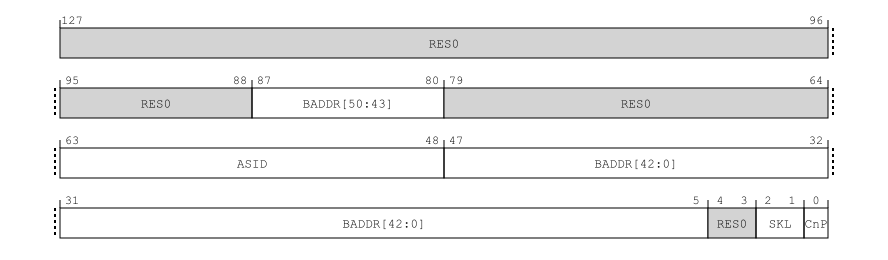

  *图：TTBR0_EL1 位域（手册 D24.2.208；图为 FEAT_D128 实现下的 128 位格式，经典 64 位格式中 ASID 同样位于 [63:48]）。*

- 此后硬件为该地址空间填入的每条 TLB 条目都带上此 ASID 标签，查找时只命中 "当前 ASID"的条目。用户页的页表项置 nG 位（not Global，`arch/arm64/include/asm/pgtable-hwdef.h:151` 的 `PTE_NG`）表示"按 ASID 匹配"；内核自身的全局映射不置 nG，对所有 ASID 可见。

效果：进程切换不再需要清空 TLB，多个进程的翻译条目可同时驻留，互不干扰。ASID 同时也成为 TLB 维护操作的一个"作用域键"——可以只作废某一个地址空间的全部条目，而不影响其他进程。

一个有助于理解"ASID 服务于谁"的细节：EL2 的页表基址寄存器 TTBR0_EL2 同样有 ASID 字段（手册 D24.2.209），但其描述明确规定该字段仅在实现 FEAT_VHE 且 `HCR_EL2.E2H = 1` 时生效，否则为 RES0。原因在于 ASID 只对**支持两个特权级**的翻译域有意义（D8.16.3）：VHE 模式下宿主机内核运行于 EL2、用户进程运行于 EL0，构成 EL2&0 双特权级翻译域，进程切换同样需要按 ASID 区分条目——这是 §2.1 中 VHE 宿主机行为与裸机一致的寄存器级基础。而本内核的 pKVM hypervisor 运行于 nVHE（E2H = 0），EL2 是单特权级翻译域：hypervisor 自身只有一个地址空间，其全部映射均为全局，该字段不生效——hyp 自身的 TLB 维护因此从不涉及 ASID。


*图：TTBR0_EL2 位域（手册 D24.2.209）。ASID 字段仅在 VHE（E2H=1）下生效，nVHE 下为 RES0。*

**VMID：stage-2 维度的"ASID"**

虚拟化引入第二级翻译后，TLB 条目还需要区分"属于哪个虚拟机的 stage-2 上下文"。这个标签是 VMID（Virtual Machine Identifier），由 VTTBR_EL2 寄存器携带，与 ASID 的关系是平行类比：**ASID 区分进程（stage-1 上下文），VMID 区分虚拟机或宿主机的 stage-2 上下文**。在 pKVM protected 模式下，宿主机自身也运行在一个 host stage-2 下，因此宿主机 TLB 条目会同时带 ASID 与 VMID 两类归属标签。

**一条 TLB 条目里存的不只是一对地址**。需要先说明：TLB 条目的真实格式属于 CPU 内部实现，软件看不到，内核里也没有任何代码定义它——ARM 体系结构手册明文规定 "架构不规定 TLB 的任何结构，仅要求其行为满足本节的约束"（DDI 0487 M.b，D8.16《Translation Lookaside Buffers》，规则 IZVNKM）。这与内存中页表描述符的格式（D8.3，精确规定到每一个比特，因为软件要亲手填写）形成对照：TLB 是硬件对遍历结果的私有缓存，架构只约束行为。下面的描述综合自 D8.16/D8.17 的行为约束，以及指令集留给软件的接口——"作废一条条目需要提供哪些键、漏了哪个键就清不干净"，反过来就说明条目登记了哪些信息。一条条目至少记录：

```
条目类型（单级还是两级合成，见下文）
归属标签（ASID 与 VMID）
输入地址及其覆盖范围、输出地址
页粒度与页表级别
访问权限与内存属性
```

这些字段不是凭空推测，内核发 TLBI 时必须把对应的"匹配键"重新编码出来：

1. **ASID/VMID 是匹配键**。按 VA 作废时，内核不会只传一个虚拟地址，而是把虚拟页号和 ASID 合成到同一个 TLBI 操作数里：

   ```c
   /* arch/arm64/include/asm/tlbflush.h:58 */
   #define __TLBI_VADDR(addr, asid)        \
   ({                                      \
       unsigned long __ta = (addr) >> 12;  \
       __ta &= GENMASK_ULL(43, 0);         \
       __ta |= (unsigned long)(asid) << 48;\
       __ta;                               \
   })
   ```

   `flush_tlb_mm()` 用 `ASID(mm)` 生成 `aside1is` 的操作数，`__flush_tlb_range_op()` 也先取 `ASID(vma->vm_mm)` 再发 `vae1is`。这和手册 D8.16 的上下文匹配规则一致：TLB 条目不是只按 VA 命中，还必须属于相同 ASID/VMID 的翻译上下文。

2. **页表级别和粒度可作为 TLBI hint**。arm64 支持 FEAT_TTL 时，内核会把"翻译粒度 + 页表级别"写入 TLBI 操作数的 TTL 字段：

   ```c
   /* arch/arm64/include/asm/tlbflush.h:105 */
   if (cpus_have_const_cap(ARM64_HAS_ARMv8_4_TTL) && level) {
       u64 ttl = level & 3;
       ttl |= get_trans_granule() << 2;    /* 4K/16K/64K 粒度 */
       arg &= ~TLBI_TTL_MASK;
       arg |= FIELD_PREP(TLBI_TTL_MASK, ttl);
   }
   __tlbi(op, arg);
   ```

   `mmu_gather` 在拆页时记录 `cleared_ptes/cleared_pmds/...`，arm64 的 `tlb_get_level()` 再把它转成 level hint。手册 D8.17 规定 TTL 级别不正确时架构不保证作废目标条目；这说明硬件条目至少按"哪一级、什么粒度"参与维护匹配。

3. **权限/属性也缓存在条目里**。`mprotect` 改权限时，内核先清旧 PTE、构造新 PTE，再在需要时登记一次 PTE 级 TLB flush：

   ```c
   /* mm/mprotect.c:166 */
   oldpte = ptep_modify_prot_start(vma, addr, pte);
   ptent = pte_modify(oldpte, newprot);
   ptep_modify_prot_commit(vma, addr, pte, oldpte, ptent);
   if (pte_needs_flush(oldpte, ptent))
       tlb_flush_pte_range(tlb, addr, PAGE_SIZE);
   ```

   在本 arm64 代码中，`ptep_modify_prot_start()` 会先移除旧 PTE：普通路径走 `ptep_get_and_clear()`，受特定 erratum 影响的 executable→non-executable 权限变化则走 `ptep_clear_flush()`（`arch/arm64/mm/mmu.c:1470-1482`）。`pte_needs_flush()` 使用 generic 默认实现（`include/asm-generic/tlb.h:737`，返回 true），因此权限修改会纳入 `mmu_gather` 的 TLB 刷新范围。若 TLB 条目没有缓存访问权限/内存属性，修改 PTE 权限后就不需要这一步；实际代码恰恰说明旧条目必须作废，硬件才会重新取到新权限。

**虚拟化下的三类条目，以及硬件如何区分 IPA 与 PA**。stage-2 开启后，翻译变成两级（VA→IPA→PA），TLB 相应可以缓存三类条目（手册原文即按"仅含 stage-1 信息的条目"与"合并 stage-1 与 stage-2 信息的条目"区分，见 D8.16.3.4；维护规则也按 stage-1 结构 / stage-2 结构 / 两级合并结构三类分别规定作用范围，见 D8.17）：

| 条目类型 | 内容 | 用途 |
|---|---|---|
| 合成（combined） | VA→PA，两级折叠后的最终结果 | CPU 访存的主路径，一次命中直接得到 PA |
| stage-1 单级 | VA→IPA | 中间结果 |
| stage-2 单级 | IPA→PA | 页表遍历器翻译描述符地址时使用 |

典型实现中，访存快路径上的 TLB 只存放合成条目——一次命中直接出 PA，两级翻译的存在对命中路径没有额外成本。这是 §3.3"稳态访问两模式无差异"的微架构原因。

一个自然的疑问：条目里既有 VA→PA 也可能有 VA→IPA，查询命中后返回的地址，硬件怎么知道它是终点（PA）还是中间值（IPA）？答案分两半。其一，**查询返回的不是一个裸地址，而是整条条目**，条目类型就写在条目里：命中合成条目，输出即 PA，直接发往内存系统；命中 stage-1 单级条目，输出是 IPA，MMU 接着对它做 stage-2 查找，拿到 PA 才放行。其二，**每次查找也声明自己要找什么**：CPU 访存发起的是 "VA 查找"，只匹配合成/stage-1 条目；页表遍历器读取描述符时发起的是"IPA 查找"，只匹配 stage-2 条目。地址数值本身从不自我描述，类型既在条目里、也在查找请求里，数值相同的 VA 与 IPA 不会互相误命中。

这个"条目分类型"的设计在指令集上留有直接证据：作废指令按条目类型分设。可以用一个例子理解：

```
进程访问 VA A
  stage-1: A -> IPA X
  stage-2: X -> PA Y

硬件可能缓存两类结果：
  combined 条目：A -> Y   （给 CPU 访存快路径用，按 VA/ASID/VMID 这类 stage-1 上下文匹配）
  stage-2 条目：X -> Y    （给页表遍历器等 stage-2 查询使用，按 IPA/VMID 匹配）
```

如果 EL2 修改了 stage-2 页表，把 `IPA X -> PA Y` 改掉，单发 `ipas2e1is X` 只能可靠清掉按 IPA 匹配的 stage-2 条目。它不能被当作"把所有用过 IPA X 的 combined 条目也找出来"的保证，因为 combined 条目是 VA 侧快路径缓存，可能有很多 VA/ASID 都曾经经由 `IPA X` 合成出最终 PA。手册 D8.17 对此给出的规则也正是这个边界：仅作用于 stage-2 条目的维护操作，不要求作用于合并 stage-1 与 stage-2 信息的结构。

这两个指令名本身就说明了作用范围：

| 指令 | 助记符拆解 | 作用对象 |
|---|---|---|
| `ipas2e1is` | `IPA` = Intermediate Physical Address，`S2` = stage-2，`E1` = EL1&0 翻译域，`IS` = Inner Shareable | 按 IPA 作废当前 VMID 下的 stage-2-only 条目 |
| `vmalle1is` | `VMALL` = 当前 VMID 下全部，`E1` = EL1&0 翻译域，`IS` = Inner Shareable | 作废当前 VMID 下 EL1 相关的 stage-1/combined 条目 |

所以本内核 hypervisor 修改 stage-2 页表后的作废序列（`tlb.rs:305-312`）是两步：

```rust
__tlbi_level!(ipas2e1is, ipa, level);  // 先按 IPA 清 stage-2-only 条目
dsb(ISH);
__tlbi!(vmalle1is);                    // 再按当前 VMID 清 EL1 stage-1/combined 条目
```

第二步比"只清某个 IPA"更粗，但它是安全兜底：既然没有 VA 列表可用，就把当前 VMID 下可能依赖旧 stage-2 结果的 stage-1/combined 条目一起作废。换句话说，combined 条目让访存命中路径很快（一次命中直接得到 PA），但当底层 stage-2 映射变化而软件又只有 IPA 信息时，作废就必须扩大作用域。§8 中 pKVM 下逐页 TLBI 变贵，也是在这个"合成条目参与维护"的背景下发生的。

与本报告直接相关的推论：pKVM 的 protected 模式下，宿主机自身也运行在一个 host stage-2 之下，于是宿主机的 TLB 条目从 nvhe 模式的"纯 stage-1、仅 ASID 标记"，变为"stage-1 与 stage-2 **合成**（即上文三类条目中的 combined）、同时带 ASID 与 VMID 标记"。同一条 `tlbi vae1is` 指令，在两种模式下需要查找并作废的条目种类因此不同——这是 §8 解释"每条 TLBI 为何更昂贵"的体系结构基础。

**TLBI：按不同的键作废 TLB 条目**

页表项被修改或删除后，TLB 中缓存的旧翻译必须作废，否则硬件会继续使用过时的映射——这由 TLBI（TLB Invalidate）指令族完成。与本报告相关的三条，按作废范围从小到大：

| 指令 | 作废范围 | 典型用途 |
|---|---|---|
| `tlbi vae1is, <VA\|ASID>` | 指定虚拟地址、且 ASID 匹配的条目 | 逐页精确作废 |
| `tlbi aside1is, <ASID>` | 该 ASID 的**全部**条目 | 一次作废整个地址空间（大范围 munmap、进程退出） |
| `tlbi vmalle1is` | 当前 VMID 下 EL1 的全部 stage-1/combined 条目 | 更大范围的维护操作 |

操作数的编码由 `__TLBI_VADDR`（`tlbflush.h:58`）完成：虚拟页号占低 44 位，ASID 占 [63:48]。两点补充：

- 指令助记符中的 `is` 后缀表示 Inner Shareable：作废请求可经 DVM（Distributed Virtual Memory）传播到内部共享域，其他核心若缓存了匹配条目也必须被失效；发出一批 TLBI 后须以 `dsb ish` 屏障等待这些失效对共享域可见。因此，从体系结构接口看，"跨核广播等待"是一个自然候选解释。但 §8 的复查证明，在本平台上 +0.27 µs/slot 并不随在线核数或 IS/NSH 作用域变化，主要是本地合成条目失效成本。
- 运行时实际启用 KPTI（内核页表隔离）时，同一进程的内核态与用户态使用一对 ASID，`__tlbi_user()`（`tlbflush.h:52`）会在 `arm64_kernel_unmapped_at_el0()` 为真时对用户 ASID 追加一条同类 TLBI，基础作废序列随之翻倍。仅有内核配置支持 KPTI 并不等同于运行时一定开启。

内核实现上还隔着一层批量化：清 PTE 的地方通常只调用 `tlb_remove_tlb_entry(s)` 把被拆除的地址范围登记到 `mmu_gather`，并不立即发 TLBI；真正的作废在 `tlb_flush_mmu_tlbonly()` / `tlb_finish_mmu()` 阶段统一执行。这个分层解释了为什么 §7.4 讨论"单次 `flush_tlb_range` 覆盖的范围"：阈值判断用的不是单个 PTE，而是 `mmu_gather` 累积后的 `start/end`。完整调用链与源码见 §7.4。

**与本报告的衔接**：munmap 是"修改页表后必须作废 TLB"的典型场景。内核在 "逐页精确作废（N 个 4K flush slot，每个 slot 触发基础 `vae1is` 序列）"与"按 ASID 全部作废（1 条基础 `aside1is` 序列，代价是连未拆除区域的条目也一并失效、事后需重新填充）"之间的选择策略——2 MB 阈值——在 §7.4 分析；这一选择在 pKVM 下的成本差异正是本调查的核心。

### 2.4 测试对象：lmbench lat_mmap

`lat_mmap` 是 lmbench 中测量文件映射建立与拆除延迟的基准。原版程序的用法为：

```bash
lat_mmap [-r] [-C] [-P <parallelism>] [-W <warmup>] [-N <repetitions>] <size> <file>
```

各参数含义如下：

| 参数 | 含义 | 本文使用情况 |
|---|---|---|
| `<size>` | 每次 `mmap()` 和 `munmap()` 的映射长度。lmbench 用 `bytes()` 解析，支持 `512k`、`1m`、`64m` 等写法。本文表格中的 0.5 MB、1 MB、2 MB、...、64 MB 指的就是这个映射长度。 | 重点测试 0.5、1、2、4、8、16、64 MB |
| `<file>` | 后备文件路径。程序以 `O_RDWR` 打开，并要求文件大小不小于 `<size>`；正式计时中只对该文件做 `MAP_SHARED` 映射，不把文件创建或填充计入。 | 测试脚本预先用 `lmdd` 写满，避免稀疏文件与首次磁盘 I/O 干扰 |
| `-N <repetitions>` | 交给 lmbench harness 的重复次数控制。一次 repetition 内执行若干次 `mmap → touch → munmap`，最终报告每次迭代的平均延迟。 | 原版 lmbench 由脚本/框架控制；精测版显式指定每个 size 的迭代数 |
| `-W <warmup>` | lmbench harness 的预热次数。 | 不作为本文分析变量 |
| `-P <parallelism>` | 并行进程数。多个进程会同时运行同一基准。 | 本文宿主机侧定位实验固定为单进程，并用 `taskset` 绑到固定 CPU |
| `-C` | 为每个进程复制一份后备文件，避免并行进程共享同一个文件。 | 未使用 |
| `-r` | 切换到另一种触摸几何：按 `STRIDE = 10 * PSIZE = 160 KB` 在整段映射内触摸。 | 未使用；本文关注默认路径 |

本文讨论的都是默认路径，即不带 `-r`、不带 `-C`、单进程运行的 `lat_mmap`。在这一路径中，`lat_mmap` 每次迭代并不会触摸整个 `<size>`，而是只写触摸映射开头的 `size / 10` 字节，触摸步长固定为 `PSIZE = 16 KB`。因此需要区分三个量：

| 名称 | 含义 | 以 `size = 64 MB` 为例 |
|---|---|---:|
| `size` | `mmap()` / `munmap()` 的完整映射长度 | 64 MB |
| `size / N` | 实际写触摸的前缀范围，`N = 10` | 6.4 MB |
| `PSIZE` | 触摸步长，固定为 16 KB | 约 410 次触摸 |

其核心计时循环（`src/lat_mmap.c:145`，`domapping()`，kylin-lmbench 仓库）如下：

```c
while (iterations-- > 0) {
    where = mmap(0, size, PROT_READ|PROT_WRITE, MAP_FILE|MAP_SHARED, fd, 0);
    ...
    end = where + (size / N);              /* N = 10：只触摸前 1/10 */
    for (p = where; p < end; p += PSIZE)   /* PSIZE = 16 KB：触摸步长 */
        *p = c;
    munmap(where, size);
}
```

原版 lmbench 的计时由通用 harness 完成，而不是在 `lat_mmap.c` 里直接调用 `clock_gettime()`。`lat_mmap.c` 将 `domapping()` 交给 `benchmp()`，最后用 `micromb()` 输出每次迭代耗时：

```c
benchmp(init, domapping, cleanup, 0, parallel, warmup, repetitions, &state);

if (gettime() > 0) {
    micromb(state.size, get_n());
}
```

`benchmp()` 在每个 timing interval 前调用 `start(0)`，随后执行 `domapping(iterations, cookie)`；下一次进入 interval 时再用 `stop(0,0)` 结束上一段计时。`start()` / `stop()` 位于 `src/lib_timing.c`，实际使用 `gettimeofday()` 记录真实经过时间；`micromb(sz, n)` 再把总耗时除以迭代次数 `n`，输出每次 `mmap → touch → munmap` 的平均微秒数。大尺寸下 `micromb()` 使用 `%.0f` 输出，因此原版 `lat_mmap` 结果是整数微秒。

三点对理解全文至关重要：

1. **计时区覆盖完整生命周期**：一次迭代包含 `mmap(size)`、写触摸、`munmap(size)` 三段。`lat_mmap` 报告的是三段之和，单看总时间无法知道开销位于哪一段——这是阶段二拆分实验的动机。
2. **映射长度、触摸跨度与触摸密度不同**：表格中的 `size` 是完整映射长度，但默认路径只在起始 `size/10` 字节的地址范围内触摸，并且步长是 16 KB。64 MB 测试点会建立并拆除 64 MB 的 VMA；实际触摸跨度是起始 6.4 MB，但不是连续触摸这 6.4 MB，而是每 16 KB 触摸一次，约 410 个 4 KB 页。
3. **后备文件是共享文件映射**：程序使用 `MAP_FILE | MAP_SHARED`、`PROT_READ | PROT_WRITE`，并要求后备文件已存在且至少与 `size` 一样大。测试脚本预先填充该文件，正式测量期间排除稀疏文件扩展和磁盘读写的影响。

为避免原版 `micromb()` 在大尺寸下只输出整数微秒，仓库提供了语义等价的纳秒精度复测工具 `src/lat_mmap_precise.c`。其用法为：

```bash
lat_mmap_precise <size_mb> <iterations> <backing_file>
```

其中 `size_mb` 对应原版的 `<size>`，表示每次 `mmap()` / `munmap()` 的映射长度；`iterations` 是显式执行的 `mmap → touch → munmap` 次数；`backing_file` 同样要求预先填充且大小不小于 `size_mb`。精测脚本使用的尺寸为 0.5、1、2、4、8、16、64 MB，每个尺寸运行 10 轮，并按尺寸调整迭代数。除计时方式改为 `clock_gettime(CLOCK_MONOTONIC)`、输出纳秒精度外，`MAP_SHARED`、`PSIZE = 16 KB`、`N = 10` 和触摸方式均与原版一致。两者结果方向一致（§3.2），本报告以精测数据为主。

### 2.5 测试平台与环境控制

调查先后使用三款设备（详表见附录 A）：N90（现象确认）、Kaitian（拆分实验与应用级验证）、N80（EL2 判别与机制判定）。三块板均为 Phytium aarch64 / Kylin V10，现象方向一致，量级随平台不同。

为控制噪声，正式对照实验统一执行以下环境控制（`prepare-host.sh` 及其 V10 变体）：

- CPU governor 设为 performance，全部核心锁定同一频率（N90 为 2.1 GHz，N80 为 1.8 GHz）；
- 关闭透明大页（THP=never）与地址空间随机化（ASLR=0）；
- 关闭深度 cpuidle 状态（PSCI idle 经 SMC 进入 EL2，会污染 EL2 周期计数）；
- 基准进程以 `taskset` 绑定到固定核心（cpu0）；
- 停止桌面、更新、打印等无关后台服务，保留网络与 SSH（`quiet-host.sh`）。

统计口径：每组配置重复 10 轮取中位数，以 MAD%（中位数绝对偏差相对中位数的百分比）衡量稳定性。后文关键数据的 MAD% 大多低于 1%。

---

## 3. 阶段一：现象确认——四种 KVM 模式对照（N90）

### 3.1 实验设计

整套 lmbench 初测显示，pKVM 模式下最异常的不是持续内存访问带宽或访问延迟，而是 `lat_mmap`：这个包含 mmap、触摸和 munmap 的生命周期测试在 protected 模式下明显偏慢。为了避免把一次异常读数误判为机制问题，阶段一先做最小变量对照。

因此，要回答的问题是：**宿主机 `lat_mmap` 的退化是否由 pKVM 模式本身引入？**

针对这个问题，确保实验公平性，设计如下：在同一平台（飞腾D3000M）、同一个内核镜像上（bug930分支），仅改变 `kvm-arm.mode` 启动参数，分别以四种模式启动并运行同一套宿主机侧测试。这样四组数据之间唯一的系统性差异就是 KVM 模式，凡是四种模式共有的因素（CPU、内存、内核版本、文件系统、后台负载控制）都被对照设计消去。每种模式的启动状态以 cmdline 与 dmesg 双重确认。

测试项包括 `lat_mmap`（原版与精测版）与两类稳态访问对照项：`bw_mmap_rd`（已建立映射上的顺序读带宽）以及早期数据集中的 `lat_mem_rd` / `bw_mem`。稳态对照项的作用是判别开销的位置：若 pKVM 的开销发生在"每次内存访问"上，稳态项应同步退化；若只发生在"映射生命周期"上，稳态项应不受影响。

### 3.2 结果：lat_mmap 的退化

`lat_mmap_precise`，N=10 中位数，单位 µs（内核 `6.6.30+ #4`，2026-06-09，原始数据 `results/n90-v10-mmap-4mode-summary.txt`）：

| size | KVM-off | VHE | NVHE | pKVM | pKVM vs NVHE |
|---:|---:|---:|---:|---:|---:|
| 0.5 MB | 10.356 | 10.430 | 10.363 | 13.438 | +29.68% |
| 1 MB | 13.787 | 13.699 | 13.761 | 19.649 | +42.79% |
| 2 MB | 20.526 | 20.296 | 20.554 | 31.348 | +52.51% |
| 4 MB | 33.100 | 33.382 | 32.925 | 56.237 | +70.80% |
| 8 MB | 59.623 | 59.363 | 59.851 | 106.872 | +78.56% |
| 16 MB | 110.992 | 110.677 | 110.545 | 205.056 | +85.50% |
| 64 MB | 443.084 | 441.221 | 441.187 | **816.318** | **+85.03%** |

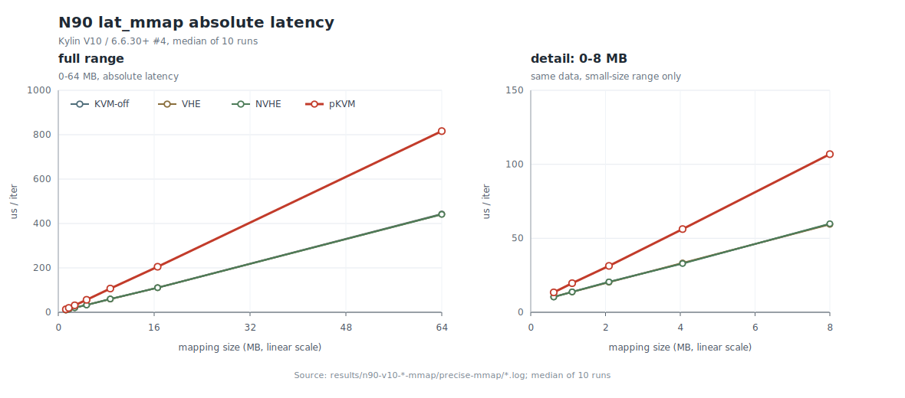

*图 3-1：N90 / Kylin V10 / `6.6.30+ #4` 下的 `lat_mmap_precise` median 延迟。左图为 0-64 MB 全范围，横轴按真实映射尺寸（MB）线性比例排布；右图为同一组数据中 8 MB 及以下部分的线性放大，用于看清小尺寸区间。图中数据由 `docs/mmap/scripts/plot-n90-v10-lat-mmap.py` 从 `results/n90-v10-*-mmap/precise-mmap/*.log` 复算生成。*

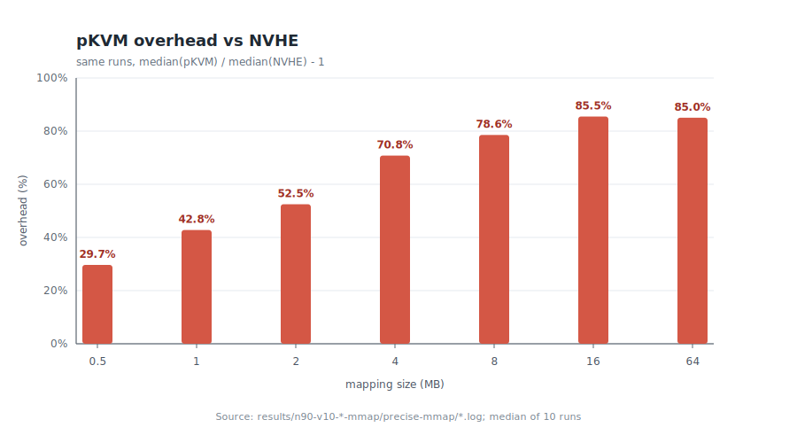

*图 3-2：同一组数据中 pKVM 相对 NVHE 的退化比例。该图用于比较各 size 档位的相对退化，横轴采用等距档位以保留每个测点的可读性。*

表与两幅图共同显示：三个非 pKVM 基线彼此差异小于 0.25%，而 pKVM 单独显著偏离；相对退化在 0.5 MB 至 16 MB 范围内随映射尺寸增大，并在大尺寸下接近约 85% 的平台。64 MB 各列 MAD% 均不超过 0.254%，数据稳定。原版 lmbench `lat_mmap` 给出同向结果：在 64 MB 下，NVHE 为 429 µs，pKVM protected 为 807 µs。

更早（2026-06-04）在 N90 / Kylin V11 / `6.6.0-73` 环境下的一组独立四模式数据显示同向退化，但幅度较小（64 MB 约 +42%）。两组数据共同说明：退化方向稳定存在，幅度与内核版本和系统环境相关。

### 3.3 对照结果：稳态内存访问不受影响

与 `lat_mmap` 形成鲜明对比，已建立映射上的访问在四种模式下没有可比量级的差异。

本轮（V10）`bw_mmap_rd` 67.11 MB 顺序读带宽：

| 模式 | 带宽 | MAD% |
|---|---:|---:|
| KVM-off | 15919.6 MB/s | 0.408% |
| VHE | 15157.3 MB/s | 0.231% |
| NVHE | 14910.6 MB/s | 0.244% |
| pKVM | 14958.0 MB/s | 0.345% |

早期数据集（V11）中的稳态项同样如此：`lat_mem_rd` 64 MB（DRAM 区）四模式均约 10.3 ns/访问（差异 ≤ ±3.5%）；`bw_mem` 峰值带宽四模式差异小于 0.5%。

两类测试的差别在于计时区内容：`lat_mem_rd` / `bw_mem` 在计时开始前已把工作集全部触摸完毕（页表已建好），计时区内只有纯粹的访存；`lat_mmap` 则把映射的建立、首次触摸与拆除全部计入。稳态项无差异、生命周期项大幅退化，说明 **pKVM 的开销集中在映射生命周期操作中，而不是分摊在每次内存访问上**。

### 3.4 交叉验证：C 实现 pKVM 内核复测

本内核的 EL2 部分为 Rust 实现，需排除"退化由 Rust 实现引入"的可能。在同一台 N90 上换装原 C 实现 pKVM 的内核（`6.6.30-pkvm-c+ #6`），以完全相同的条件补齐四模式：

| size | C KVM-off | C VHE | C NVHE | C pKVM | C pKVM vs C NVHE |
|---:|---:|---:|---:|---:|---:|
| 64 MB | 442.237 | 442.533 | 440.190 | 814.996 | +85.15% |

C pKVM 与 Rust pKVM 的 64 MB 精测仅差 −0.16%，非 pKVM 基线亦与 Rust 内核重合（±0.3%）。**退化是 pKVM protected 模式路径本身的代价，与具体实现语言无关。**

### 3.5 阶段一结论与初期机制假设

阶段一确立的事实：退化由 host stage-2 的存在引入（四模式中唯一的结构性差异，见 §2.1 表），且位于映射生命周期内。

当时对机制的推测是 **first-touch 建表开销**：写触摸每碰到一个尚未在 host stage-2 中映射的页，硬件触发 stage-2 缺页陷入 EL2，由 `handle_host_mem_abort()` 建立映射后返回。该假设有一项定量支持：早期数据集中，pKVM 相对基线的额外时间与触摸页数高度线性——按 `lat_mmap` 的触摸方式（每次迭代触摸 `size/(10×16KB)` 页）折算，每次缺页的摊销成本自 1 MB 起稳定在 505±10 ns，与一次完整"异常进入 → 读取 ESR/HPFAR/FAR → 加锁 → 页表遍历 → 建表 → TLBI/DSB → 异常返回"流程的量级估算相符。

线性关系本身是真实的，但"线性 ∝ 触摸页数"并不能区分"开销发生在触摸时"还是 "开销发生在拆除已触摸页时"——两者都与触摸页数成正比。区分它们需要把生命周期拆开计时，这就是阶段二。该假设在阶段二被修正。

### 3.6 应用级旁证：LMDB（Kaitian）

为确认微基准信号是否传导到真实应用，在 Kaitian 上以 LMDB（典型的 mmap 型嵌入式数据库）做了 NVHE 对 pKVM 的对照（5 轮中位数，`NOSYNC` 模式以排除存储设备同步延迟的干扰）：

| 指标 | NVHE | pKVM | pKVM 相对变化 |
|---|---:|---:|---:|
| openclose（反复打开/关闭环境） | 85.981 µs/op | 116.336 µs/op | **+35.30%** |
| read（长期映射上的随机读） | 1220.0 ns/op | 1237.2 ns/op | +1.41% |
| write（追加写事务） | 560.0 ns/op | 559.5 ns/op | −0.10% |

LMDB 在 `mdb_env_open` 时建立映射、长期复用、关闭时拆除。结果与微基准的结论完全一致：**频繁建立/拆除映射的路径（openclose）受到明显影响，长期复用映射后的常规读写几乎不受影响。** 这也界定了该退化的实际影响范围（详见 §8.2）。

---

## 4. 阶段二：生命周期拆分——定位到写触摸后的 munmap（Kaitian）

### 4.1 实验设计

阶段一已经把现象限定在映射生命周期内：64 MB 精测中，NVHE 约 441 µs，pKVM 约 816 µs，pKVM 多出的约 375 µs 不来自稳态内存访问，而是来自 `mmap` → 写触摸 → `munmap` 这条生命周期路径。接下来需要回答的不是“pKVM 是否慢”，而是这条路径中的哪一段在慢：建立映射、写触摸、还是拆除映射？

原始 `lat_mmap` 的计时区是三段之和，单看 816 µs 的总时间无法区分。为此编写了拆分基准 `experiments/mmap-split/mmap_split_bench.c`，将生命周期拆成 12 个子测试，每个子测试只把一段操作放入计时区，其余作为不计时的准备工作。设计原则：

- **触摸范围与步长和 `lat_mmap` 完全一致**（`touch_divisor=10`、`stride=16KB`），保证子测试之和能对应回原始现象；
- **计时实现与 §2.4 的精测版一致，而不是逐行复用 lmbench 原版计时框架**：拆分基准计时方式和 `lat_mmap_precise` 一样，使用 `clock_gettime(CLOCK_MONOTONIC)` 在需要计时区的两端取总时间，再除以 `iters` 得到每迭代耗时。原版 lmbench 与它们一致的是被测循环语义（同样的 `mmap → touch → munmap`），但原版使用 lmbench 自身计时框架并通过 `micromb()` 输出整数微秒；
- **重复与统计口径一致**：每个子测试、每个尺寸跑 10 轮取中位数，正式计时前先跑 1 轮不计时 warmup。拆分实验选择 `CLOCK_MONOTONIC` 是为了和精测数据保持同一时钟与纳秒精度；
- 在 Kaitian 上以 NVHE 与 pKVM 两种模式启动，使用同一命令口径：

```bash
MODE=<nvhe|pkvm> CORE=0 RUNS=10 REFILL=1 WARMUPS=1 scripts/mmap-split-bench.sh
python3 scripts/analyze-mmap-split.py nvhe pkvm
```

12 个子测试中与结论直接相关的 5 个：

| 子测试 | 计时区 | 隔离的对象 |
|---|---|---|
| `mmap_unmap` | mmap → munmap（无触摸） | VMA 的建立与删除 |
| `write_touch_cold` | 仅首次写触摸（mmap/munmap 不计时） | 缺页、建表、首次写入 |
| `munmap_after_no_touch` | 仅 munmap（之前未触摸） | 未触摸映射的拆除 |
| `munmap_after_write_touch` | 仅 munmap（之前已写触摸） | **写触摸后的映射拆除** |
| `mmap_write_touch_unmap` | 全程（≈ 原版 lat_mmap） | 完整写路径，作为对照锚点 |

### 4.2 测试代码与计时边界

拆分实验是否可信，取决于计时窗口能否只覆盖目标阶段，而不把前置准备动作混入结果。以最重要的 `munmap_after_write_touch` 为例（`mmap_split_bench.c:231`，`bench_munmap_only()`）：

```c
static double bench_munmap_only(const struct cfg *c, int touch_kind)
{
    int fd = open_checked(c->path, c->size);
    double total = 0.0;
    for (int i = 0; i < c->iters; ++i) {
        char *p = map_checked(fd, c, 0);
        if (touch_kind == 1)
            write_touch(p, c);          /* 写触摸：不计时 */

        double t0 = now_ns();
        unmap_checked(p, c->size);      /* 仅 munmap 计时 */
        total += now_ns() - t0;
    }
    close(fd);
    return total;
}
```

`write_touch()` 按 `stride`（16 KB）写前 `touch_bytes`（`size/10`）字节，与 `lat_mmap` 的触摸循环逐字对应。其余子测试同理，仅计时边界不同。

### 4.3 结果

Kaitian，NVHE 对 pKVM，10 轮中位数，单位 µs/iteration（完整数据见 `results/mmap-split-kaitian/{nvhe,pkvm}.csv`）。64 MB 行：

| 子测试 | NVHE | pKVM | Δ | Δ% |
|---|---:|---:|---:|---:|
| `mmap_unmap` | 3.210 | 3.247 | +0.037 | +1.15% |
| `write_touch_cold` | 333.541 | 346.159 | +12.618 | **+3.78%** |
| `munmap_after_no_touch` | 1.521 | 1.515 | −0.005 | −0.35% |
| **`munmap_after_write_touch`** | **90.215** | **295.219** | **+205.003** | **+227.24%** |
| `mmap_write_touch_unmap`（全程） | 428.058 | 642.383 | +214.325 | +50.07% |

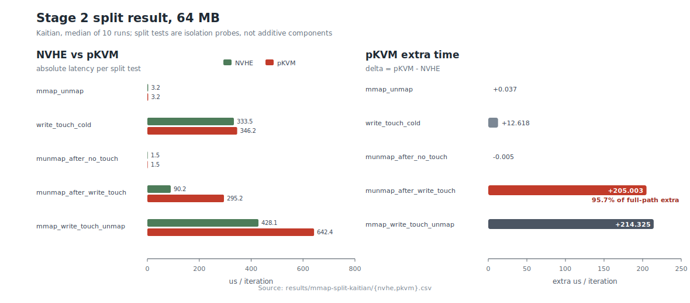

*图 4-1：Kaitian 上 64 MB 写路径拆分结果。左图比较各子测试在 NVHE 与 pKVM 下的绝对耗时；右图只画 `pKVM - NVHE` 的额外时间。注意这些子测试是阶段隔离实验，不是严格可加的总时间组成；`mmap_write_touch_unmap` 是完整路径锚点。`munmap_after_write_touch` 的 +205.003 µs 可解释完整路径 +214.325 µs 额外时间的约 95.7%。图中数据由 `docs/mmap/scripts/plot-mmap-split-stage2.py` 从 `results/mmap-split-kaitian/{nvhe,pkvm}.csv` 复算生成。*

`munmap_after_write_touch` 的退化随尺寸单调放大，且各尺寸 MAD% 均较低：

| size | NVHE µs | pKVM µs | Δ µs | Δ% |
|---:|---:|---:|---:|---:|
| 0.5 MB | 3.065 | 4.498 | +1.433 | +46.77% |
| 1 MB | 4.308 | 7.216 | +2.907 | +67.48% |
| 2 MB | 6.581 | 12.923 | +6.342 | +96.37% |
| 4 MB | 9.284 | 22.424 | +13.140 | +141.53% |
| 8 MB | 14.759 | 40.977 | +26.218 | +177.64% |
| 16 MB | 25.838 | 77.434 | +51.597 | +199.70% |
| 64 MB | 90.215 | 295.219 | +205.003 | +227.24% |

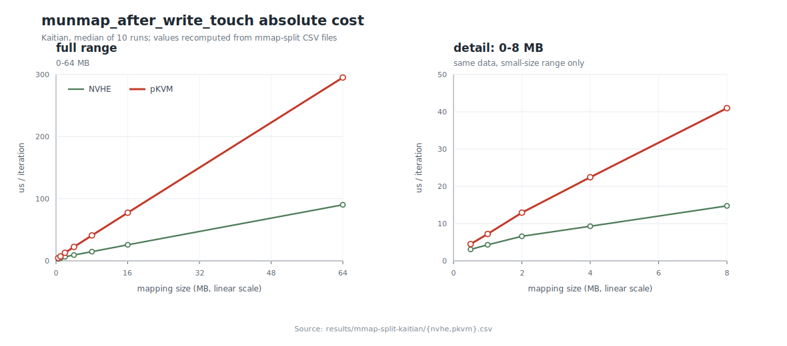

*图 4-2：`munmap_after_write_touch` 的绝对耗时随映射尺寸变化的趋势。左图为 0-64 MB 全范围，右图为同一组数据中 8 MB 及以下部分的线性放大；两张子图的横轴均按真实映射尺寸（MB）线性比例排布。图中数据由 `docs/mmap/scripts/plot-mmap-split-scaling.py` 从 `results/mmap-split-kaitian/{nvhe,pkvm}.csv` 复算生成。*

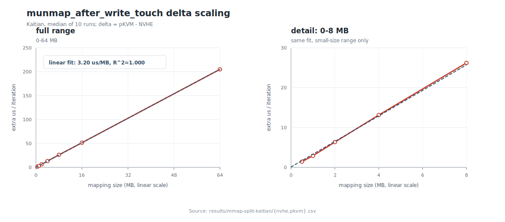

*图 4-3：`munmap_after_write_touch` 的额外耗时 Δ（pKVM − NVHE）随映射尺寸变化的趋势。左图为 0-64 MB 全范围及线性拟合；右图为 8 MB 及以下部分的线性放大。Δ 与 size 近似线性，拟合斜率约为 3.20 µs/MB，`R² = 0.99998`。*

注：图 4-3 所示的线性增长（包括触摸跨度已达 6.4 MB、超过 2 MB 的 64 MB 行），与后文 §7.4 的"2 MB 整表刷新阈值"并不矛盾。64 MB 行看起来是大映射，但内核并不是一次刷新 64 MB，也不是一次刷新实际触摸的 6.4 MB；写触摸产生的脏页使刷新按 PMD 分批，16 KB 稀疏步长又让每批约为 `2 MB - 12 KB`，恰好低于整表阈值，所以这些小批次仍然逐页刷新并不断累加。定量解释见 §7.5 末尾的补充分析"阈值作用的真实粒度"。

其余子测试（openclose、`MAP_POPULATE` 变体、热触摸、读路径等）的完整数据与分析见附录 D 所列拆分实验详报；要点是：文件打开/关闭、VMA 建删、稳定映射上的反复读写在两模式下均基本持平；读触摸路径方向一致，但其 64 MB 行差距反常消失（−1.88%）——该现象的机制（干净页不强制分批、刷新范围累积越过阈值改走整表路径）同样见 §7.5 末尾的补充分析，故结论以行为更确定的写路径为准。

### 4.4 分析：第一次结论修正

把 64 MB 行作为锚点看，完整写路径 `mmap_write_touch_unmap` 的额外时间是 +214.3 µs。拆分结果说明这 +214.3 µs 并不平均分布在生命周期三段中，而是高度集中：

- `mmap_unmap` 只差 +0.037 µs，说明单纯 VMA 建立/删除不是瓶颈；
- `munmap_after_no_touch` 基本持平（−0.005 µs），说明"调用一次 munmap"本身也不是瓶颈；
- `write_touch_cold` 虽然包含缺页、建表和首次写入，但只差 +12.6 µs（+3.78%），只能解释完整路径额外时间的约 5.9%；
- `munmap_after_write_touch` 单项差 +205.0 µs，已经覆盖完整路径额外时间的 95.7%。

因此阶段一的 first-touch 假设需要修正：pKVM 下首次写触摸确实可能有少量额外成本，但它不是主因。若"每个触摸页触发一次昂贵 stage-2 first-touch 建表"是主要机制，64 MB 默认触摸约 410 个页，按早期估算的约 500 ns/页应在 `write_touch_cold` 中看到约 205 µs 级别的差距；实际只有 +12.6 µs，量级不匹配。

真正决定退化的是"触摸之后再拆除"。只有写触摸建立了有效页表项之后，后续 `munmap` 才需要清理这些 PTE 并做相应的 TLB 维护；未触摸的映射没有这些工作量，所以 `munmap_after_no_touch` 不慢。图 4-3 中 `munmap_after_write_touch` 的 Δ 又随 size 近似线性增长，说明额外成本随着要拆除的已触摸映射规模累积。早期观察到的"额外开销与触摸页数线性相关"仍然是真实现象，只是它不能证明开销发生在 first-touch 当下；触摸页数同时决定了后续 munmap 要拆多少页表项，这才是阶段二数据支持的解释。

### 4.5 引出的问题：munmap 的额外时间从何而来

阶段二已经把主要差距定位到"触摸后的 `munmap`"。这里先不要直接跳到机制猜想，而是回到 `~/common` 中的内核源码看这条路径到底做了什么。

宿主机侧的 `munmap` 入口是 `SYSCALL_DEFINE2(munmap)`（`mm/mmap.c:2970`），进入 `__vm_munmap()`（`:2946`）后调用 `do_vmi_munmap()`（`:2956`）。VMA 从 maple tree 中摘除后，真正清页表的入口是 `unmap_region()`（`:2601`），其主体非常集中：

```
unmap_region()
  -> tlb_gather_mmu(&tlb, mm)
  -> unmap_vmas(&tlb, ...)
  -> free_pgtables(&tlb, ...)
  -> tlb_finish_mmu(&tlb)
```

`tlb_finish_mmu()` 再进入 `tlb_flush_mmu()`（`mm/mmu_gather.c:437,465`），最终落到 arm64 的 `tlb_flush()`（`arch/arm64/include/asm/tlb.h:53`）。对非 fullmm 的普通 `munmap`，`tlb_flush()` 调用 `__flush_tlb_range()`；后者在 `tlbflush.h:432-450` 执行 `dsb(ishst)`、`tlbi vale1is/vae1is`（或范围过大时退化为 `flush_tlb_mm()` 中的 `tlbi aside1is`）、最后 `dsb(ish)`。也就是说，当前实验命中的主体路径是 EL1 mm 代码清理 stage-1 页表、释放页表页并发出架构 TLBI/DSB；这条调用链中没有 `kvm_call_hyp*`、`arm_smccc_*_hvc()` 或 pKVM 专用 hypercall。

pKVM 侧也能从代码上解释为什么"正常路径不应进入 EL2"。protected finalize 时，host stage-2 的打开动作是给每 CPU init params 写入 `vttbr/vtcr`，把 `HCR_VM` 置位，然后写 `HCR_EL2` 并 `__load_stage2()`（Rust 实现见 `hyp/nvhe/rust/src/mem_protect/host.rs:2160-2194`，C 版本同样见 `hyp/nvhe/mem_protect.c:458-478`）。host 的 HCR 配置为：

```c
#define HCR_HOST_NVHE_FLAGS           (HCR_RW | HCR_API | HCR_APK | HCR_ATA)
#define HCR_HOST_NVHE_PROTECTED_FLAGS (HCR_HOST_NVHE_FLAGS | HCR_TSC)
```

也就是说，protected host 相比普通 nvhe 主要多了 `HCR_TSC`（SMC trap），并没有置 `HCR_TTLB` / `HCR_TTLBIS` / `HCR_TTLBOS` 这类会把 EL1 TLBI 指令陷入 EL2 的位。EL2 的 host trap 分发（`hyp_main.rs:2975`）也只处理 HVC、SMC、FP/SVE/SME lazy restore、以及 host stage-2 指令/数据 abort；若发生 host stage-2 abort，才会进入 `handle_host_mem_abort()` 并尝试 `host_stage2_idmap()`（`mem_protect/host.rs:1979-2028`）。而本基准的 `munmap` 只是拆除进程 stage-1 映射，不改变页面所有权；后备页也已经在 host stage-2 中以 host-owned/idmap 方式可达，因此正常情况下不会走这个 abort handler。

于是 +205 µs 的来源是由代码路径限定出的两个候选方向：

```
(a) 同一条 EL1 munmap 路径的硬件代价变高：
    host stage-2 使能后，TLBI/DSB 等同步点、TLB 失效后的页表遍历、
    页表页访存或缓存一致性等待的单位成本增加，但软件执行仍留在 EL1；
(b) 代码审查遗漏了某条进入 EL2 的路径：
    例如实际运行时 HCR/FGT 被其他模块改写、host stage-2 出现未预期
    的缺页/权限故障，或存在未被注意的 hypercall/SMC。
```

两者的优化方向完全不同：(a) 应分析宿主机侧硬件行为，尤其是 TLBI 后的翻译重填和访存停顿；(b) 则应在 hypervisor 内部插桩，沿 `handle_trap()` / `handle_host_mem_abort()` 继续追。先用一个判别实验确认是否真的进入 EL2，避免在错误的一侧投入——这就是阶段三。

---

## 5. 阶段三：EL2 判别——证明退化不发生在 hypervisor 内（N80）

自本阶段起，实验平台换为 N80（1.8 GHz，Kylin V10 SP1，内核 `6.6.30xcore-stat+`）。N80 上该退化的复现幅度更大：`munmap_after_write_touch` 64 MB 下 protected 比 NVHE 慢 1.81 倍（+447 µs/iter，见 §6.2），适合作为判别与定因的平台。

### 5.1 体系结构分析：host munmap 理论上不进入 EL2

先从代码上确认"理论上不进 EL2"的依据。NVHE/protected 模式下，宿主机 EL1 进入 EL2 的主要入口直接体现在 EL2 异常分发函数 `handle_trap()`（`hyp_main.rs:2975`）的分支上：

```rust
match ec {
    HVC64 => host_ctxt.handle_host_hcall(),                  // 显式 hypercall
    SMC64 => host_ctxt.handle_host_smc(),                    // SMC（protected 下陷入）
    TrappedFP | TrappedSve | TrappedSME => fpsimd_host_restore(), // FP/SVE 惰性恢复
    InstrAbortLowerEL | DataAbortLowerEL =>
        host_ctxt.handle_host_mem_abort(),                   // host stage-2 缺页
    _ => { /* 默认处理，否则 bug_on */ }
}
```

普通 munmap 不触发其中任何一类：

- **不发起 hypercall**：munmap 走通用 mm 路径，其 TLB 失效由 arm64 的 `__tlbi()` 宏直接展开为 `tlbi` 指令（`arch/arm64/include/asm/tlbflush.h:40`，`asm("tlbi " #op ", %0")`），在 EL1 直接执行，不是 HVC。
- **TLBI/DSB 不被陷入**：要使 EL1 发起的 TLB 维护指令陷入 EL2，须在 `HCR_EL2` 中置 `TTLB`/`TTLBIS`/`TTLBOS` 位。而宿主机的 HCR 配置（`arch/arm64/include/asm/kvm_arm.h:101`）不含这些位：

  ```c
  #define HCR_HOST_NVHE_FLAGS           (HCR_RW | HCR_API | HCR_APK | HCR_ATA)
  #define HCR_HOST_NVHE_PROTECTED_FLAGS (HCR_HOST_NVHE_FLAGS | HCR_TSC)
  ```

  protected 相比 nvhe 仅多陷入 SMC（`HCR_TSC`），TLB 维护指令均不被拦截。
- **不触发 stage-2 缺页**：宿主机内存在 host stage-2 中按"宿主机拥有 + 恒等映射" 管理，首次访问后映射常驻；munmap 是 stage-1 操作，不改变页的所有权，不会使 host stage-2 产生缺页（所有权语义与映射长期有效性的完整论证见 §2.1）。（§5.5 的实测进一步佐证：连首次触摸路径的 ΔEL2 也为 0，因为基准的后备文件页早已驻留。）

体系结构分析支持"不进 EL2"，但分析不能代替测量——隐藏路径假设 (b) 正是要靠测量排除的。

### 5.2 测量方法：仅统计 EL2 的周期计数

arm64 PMU 的周期计数器 `PMCCNTR_EL0` 默认统计所有异常级的周期；过滤寄存器 `PMCCFILTR_EL0` 可以让它只在指定异常级递增。本文把它配置成 **只在 EL2 执行时计数**，所以前后两次读数之差表示：被测窗口内，这个 CPU 一共在 EL2 花了多少周期。

这不是 HVC 计数器，也不能告诉我们 EL2 是由 HVC、SMC、host stage-2 abort 还是其他入口触发的。它回答的是一个更直接的问题：`munmap_after_write_touch` 多出来的几百微秒，是否真的对应了同量级的隐藏 EL2 执行时间。如果 EL2-only cycles 几乎不变，就说明主要开销不在 EL2 handler 里。

先说明 `xcore_stats` 原本是什么。`~/common` 中已经有一条调试/统计通道，分为三层：

```
host EL1: /proc/xcore_stats
  echo <op> 写入命令，cat 读取最近一次命令缓存的结果
        |
        | HVC: __pkvm_xcore_stats（op=0/1/2）
        v
hyp EL2: arch/arm64/kvm/hyp/nvhe/rust/src/stats.rs
  op=0: xcore_disable_pmu_el2()
  op=1: xcore_enable_pmu_el2()
  op=2: 读取 pKVM 内存状态
```

原始 `xcore_stats` 实现只在 protected 模式下创建 `/proc/xcore_stats`，在 nVHE 模式下则无该接口（后文解释 patch-a 为什么放宽这一点）。这个文件是一个"写命令、读结果"的 procfs 接口：`echo <op> > /proc/xcore_stats` 触发一次操作，随后 `cat /proc/xcore_stats` 才把最近一次操作缓存下来的结果打印出来。与 gate 实验相关的原始命令语义是：

| 命令 | 含义 | 是否进入 EL2 |
|---|---|---|
| `echo 0 > /proc/xcore_stats` | 结束 `/proc/xcore_stats` 对 EL2 PMU 的使用：对每个在线 CPU 发 HVC，让 EL2 执行 `xcore_disable_pmu_el2()`；原始实现会关闭 EL2 PMU 相关开关，patch-a 后改为恢复 enable 前保存的 PMU 现场 | 是，发 HVC |
| `echo 1 > /proc/xcore_stats` | read CPU cycles：若 PMU 尚未 enable，则先按 CPU 调用 `xcore_enable_pmu_el2()`；随后按 CPU 读取 `PMCCNTR_EL0` 并缓存到 `global_cpu_stats` | 第一次会发 enable HVC；之后只做 EL1 读数 |
| `echo 2 > /proc/xcore_stats` | 读取 pKVM 内存统计 | 是，发 HVC |

`echo 0` 在 gate 实验中是收尾命令，不是单个样本的计时边界。原始代码把它当作"禁用 EL2 PMU"处理；patch-a 后它的语义更接近"释放 PMU"：恢复 `MDCR_EL2`、`PMCCFILTR_EL0`、`PMCR_EL0` 和 cycle counter enable 状态，并把 host 侧 `pmu_enabled` 置回 false。

`echo 1` 不是"输出 1"，而是对 `/proc/xcore_stats` 写入 op=1，要求内核刷新一次 per-CPU cycle counter 快照。host 侧实现如下：

```c
case 1:
    if (!pmu_enabled) {
        ret = xcore_call_on_all_cpus(1);   // HVC: xcore_enable_pmu_el2()
    }

    ret = xcore_call_on_all_cpus(2);       // EL1: read_sysreg(PMCCNTR_EL0)
    last_operation = 1;
    break;
```

`cat /proc/xcore_stats` 随后根据 `last_operation == 1` 打印 `global_cpu_stats` 中的 `CPU / Cycles / Timestamp` 表，脚本再用 `awk` 取目标 CPU 那一行。

本文从这条通道读取的原始值很单一：目标 CPU 上 `PMCCNTR_EL0` 的累计快照。这个累计值的起点是本轮 gate 实验首次 enable 时对 cycle counter 的清零，而不是单次被测负载的开始；因此真正用于判读的不是累计值本身，而是测试窗口两端的差值。一次样本的读数流程是：先 `echo 1` 刷新并读出 `c0`，运行被测负载，再 `echo 1` 刷新并读出 `c1`，用 `c1 - c0` 得到负载窗口内新增的 EL2-only cycles。`echo 0` 不参与这个 delta 差值；它只在 gate 实验结束后释放 PMU。空窗扣噪和脚本细节见 §5.3。

以上是原始设计提供的基础能力；本实验实际使用的是叠加 `docs/mmap/patch-a-xcore-instrumentation.diff` 后的内核。原始 `xcore_stats` 能提供通道雏形，但直接用于 gate 实验有两类可靠性问题：第一，EL2 侧 PMU enable/disable 会污染原有 PMU 状态；第二，host 侧接口范围和错误处理过于粗糙，后续阳性对照和普通 nVHE 辅助对照都不够稳。patch-a 的改造就是围绕这两点展开。

**第一处：PMU 现场管理。** 这里涉及一对容易误用的 PMU 计数器开关寄存器：

- `PMCNTENSET_EL0` 是 **Performance Monitors Count Enable Set register**。读它可以看到哪些计数器已启用；写 1 表示启用对应计数器；写 0 **没有效果**。
- bit 31 是 `C` 位，对应 cycle counter `PMCCNTR_EL0`；bit 0..30 是普通事件计数器 `PMEVCNTR<n>_EL0` 的开关。
- 因为 `PMCNTENSET_EL0` 是 set 寄存器，不是普通的可读写 bitmap，所以不能通过"读出、清 bit、写回"来关闭计数器。关闭 cycle counter 应写配对的 clear 寄存器 `PMCNTENCLR_EL0.C`。

原始 `stats.rs` 的 disable 路径尝试通过写 `PMCNTENSET_EL0 & ~bit(31)` 清 cycle counter，并在随后清掉全局 PMU enable：

```rust
// ~/common 原始 stats.rs
pub fn xcore_disable_pmu_el2() {
    let mdcr_el2_value = MDCR_EL2.get();
    if mdcr_el2_value & bit!(7) != 0 {
        MDCR_EL2.set(mdcr_el2_value & !bit!(7));
    }

    let pmcntenset_el0_value = PMCNTENSET_EL0.get();
    if pmcntenset_el0_value & bit!(31) != 0 {
        PMCNTENSET_EL0.set(pmcntenset_el0_value & !bit!(31));
    }

    let pmcr_el0_value = PMCR_EL0.get();
    if pmcr_el0_value & bit!(0) != 0 {
        PMCR_EL0.set(pmcr_el0_value & !bit!(0));
    }
}
```

这对本文的测量不合适，原因有两层：

1. `PMCNTENSET_EL0.set(pmcntenset_el0_value & !bit(31))` 不能关闭 `PMCCNTR_EL0`。如果原来 `C=1`，写回时 bit 31 变成 0，而对 `PMCNTENSET_EL0` 来说"写 0"就是无操作；正确的关闭方式是向 `PMCNTENCLR_EL0` 写 `bit(31)`。
2. 后面的 `PMCR_EL0.set(pmcr_el0_value & !bit(0))` 会清 `PMCR.E`，也就是关闭 PMU 的全局 enable。这虽然会让计数停下来，但会改变系统原有 PMU 状态，影响后面阶段四要用的 host perf。

patch-a 因此把这次 EL2 gate 测量设计成对 PMU 的一次**临时借用**，而不是永久改写系统 PMU 状态。目的有三个：

1. 当前 gate 实验需要临时接管 cycle counter：打开 `MDCR_EL2.HPME`、把 `PMCCFILTR_EL0` 改成 EL2-only、打开 `PMCNTENSET_EL0.C`，并通过 `PMCR_EL0` 打开/清零计数器；
2. 这些寄存器都是每个 CPU 的 PMU 状态。测量结束后，如果不恢复，宿主机后续 perf 看到的就不再是原来的 PMU 配置，甚至可能继续沿用 EL2-only filter；
3. 原始状态中 cycle counter 可能本来就是开着的，也可能本来是关着的。disable 时不能一律关闭或一律打开，而应恢复到 enable 前的状态。

所以 patch-a 的策略是：第一次 enable 时在本 CPU 保存 `PMCR_EL0`、`PMCCFILTR_EL0`、`MDCR_EL2`，以及 `PMCNTENSET_EL0.C` 当时是否置位；disable 时按这些保存值恢复。这样 gate 实验只在自己的测量窗口内改变 PMU，窗口结束后把 PMU 交还给宿主机原有使用者：

```diff
+use crate::percpu::this_cpu_ptr;
+use crate::{bit, define_per_cpu, ptr_wrapper_const, write_sysreg};
+
+struct PmuSavedState {
+    saved: bool,
+    pmcr: u64,
+    pmccfiltr: u64,
+    mdcr: u64,
+    cycle_cnten: bool,
+}
+
+define_per_cpu!(PMU_SAVED: PmuSavedState = PmuSavedState::new());
+
 pub fn xcore_enable_pmu_el2() {
+    let st = unsafe { &mut *this_cpu_ptr(&raw mut PMU_SAVED) };
+    if !st.saved {
+        st.pmcr = PMCR_EL0.get();
+        st.pmccfiltr = PMCCFILTR_EL0.get();
+        st.mdcr = MDCR_EL2.get();
+        st.cycle_cnten = PMCNTENSET_EL0.get() & bit!(31) != 0;
+        st.saved = true;
+    }
     ...
 }

 pub fn xcore_disable_pmu_el2() {
+    let st = unsafe { &mut *this_cpu_ptr(&raw mut PMU_SAVED) };
+    if st.saved {
+        MDCR_EL2.set(st.mdcr);
+        PMCCFILTR_EL0.set(st.pmccfiltr);
+        if st.cycle_cnten {
+            PMCNTENSET_EL0.set(bit!(31));
+        } else {
+            write_sysreg!(pmcntenclr_el0, bit!(31));
+        }
+        PMCR_EL0.set(st.pmcr);
+        st.saved = false;
+        return;
+    }
+    write_sysreg!(pmcntenclr_el0, bit!(31));
 }
```

EL2-only 计数本身仍由 `xcore_enable_pmu_el2()` 中的 PMU 过滤配置完成：

```rust
const PMCCFILTR_EL2_ONLY: u64 = bit!(31) | bit!(30) | bit!(27) | bit!(26);
// bit31/30 屏蔽 EL1/EL0 计数，bit27/26 放行非安全 EL2 —— 净效果为仅统计 EL2 周期

MDCR_EL2 |= bit!(7);                  // HPME：使能 EL2 的 PMU
PMCCFILTR_EL0.set(PMCCFILTR_EL2_ONLY);
PMCNTENSET_EL0 |= bit!(31);           // 打开周期计数器
// PMCR_EL0：置 E（使能）、LC（64 位防溢出）、C（一次性清零），清 D（÷64 分频）
```

**第二处：host 侧接口范围和防御性检查。** 原始 `xcore_stats.c` 只在 protected 模式下创建 `/proc/xcore_stats`：

```c
// ~/common 原始 xcore_stats.c
int xcore_stats_init(void)
{
    if (!is_protected_kvm_enabled()) {
        return 0;
    }
    proc_create(XCORE_STATS_PROC_NAME, 0666, NULL, &xcore_stats_proc_ops);
}
```

patch-a 放宽了 procfs 创建条件：只要是可达的 nVHE hyp（排除 VHE、`kvm-arm.mode=none` 和没有 EL2 的启动状态），就暴露 `/proc/xcore_stats`，使 PMU op（0/1）可作为普通 nVHE 下的辅助对照；需要 pKVM 页表语义的 op=2，以及同一补丁为 §7.1 新增的 op=3，继续 protected-only：

```diff
-    if (!is_protected_kvm_enabled()) {
+    // PMU op（0/1）在 protected 与普通 nvhe 模式下都可用；
+    // 仅在没有 nvhe hyp 可达时不创建接口。
+    if (!is_hyp_mode_available() || is_kernel_in_hyp_mode() ||
+        kvm_get_mode() == KVM_MODE_NONE) {
         return 0;
     }
```

这一步在普通 nVHE 下并非本文主结论的必要条件。hyp 侧 host hcall 分发在未进入 protected 时 `hcall_min = 0`，进入 protected 后才屏蔽 `__pkvm_prot_finalize` 之前的早期调用；`__pkvm_xcore_stats` 位于其后，因此 procfs 放开后 op=0/1 技术上可以到达 hyp 侧入口：

```rust
// ~/common arch/arm64/kvm/hyp/nvhe/rust/src/hyp_main.rs
let mut hcall_min = 0u64;
if static_branch_unlikely!(kvm_protected_mode_initialized, static_key_false, key) {
    hcall_min = __kvm_host_smccc_func___KVM_HOST_SMCCC_FUNC___pkvm_prot_finalize as u64;
}

if unlikely(id < hcall_min || (id as usize) >= HOST_HCALL.len()) {
    self.regs.regs[0] = SMCCC_RET_NOT_SUPPORTED as u64;
    return;
}
```

但普通 nVHE 没有 host stage-2，也不是 `lat_mmap` 退化出现的模式；它最多用于确认 PMU gate 自身可读、噪声可控。本文真正依赖的是 protected 模式下的 op=1 前后差，以及 protected-only op=2 阳性对照。

同一个补丁还给 op=2 加了 host 侧 protected-only 检查，并把失败判断改成 SMCCC 负值错误码：

```diff
-    if (res.a0 == 0) {
-        pr_err("Failed to get memory stats: SMCCC returned %ld\n", res.a0);
+    if ((long)res.a0 < 0) {
+        pr_err("Failed to get memory stats: SMCCC returned %ld\n", (long)res.a0);
         return -ENOTSUPP;
     }

 case 2:
+    if (!is_protected_kvm_enabled()) {
+        pr_err("Memory statistics require protected KVM (pKVM) mode\n");
+        return -EOPNOTSUPP;
+    }
     ret = xcore_get_mem_stats();
```

最终方法学约束：

- **读数语义为累计值**，脚本须自行取前后差；
- **PMU 为物理资源**，本计数与宿主机 perf（阶段四）不能同窗使用，测量顺序上先 gate 后 perf，中间 `echo 0` 释放；
- **判定只依赖 protected 侧读数**，普通 nVHE 下的 op=0/1 只是可选基线，不参与"隐藏 EL2 路径是否存在"的核心判断。

### 5.3 测量脚本与噪声控制

`scripts/el2-gate-bench.sh` 的核心流程：

```bash
read_el2_cycles() { echo 1 > /proc/xcore_stats; awk -v c=$CORE '$1==c{print $2}' /proc/xcore_stats; }
# 绑核；关闭 cpuidle（PSCI idle 经 SMC 进入 EL2，会计入计数）；锁频 performance
for size in $SIZES; do
  c0=$(read_el2_cycles); t0=$(date +%s.%N)
  taskset -c $CORE $BENCH munmap_after_write_touch $size $ITERS $FILE ...
  t1=$(date +%s.%N); c1=$(read_el2_cycles)
  wall=$(awk -v a="$t0" -v b="$t1" 'BEGIN { printf "%.3f", b - a }')
  delta=$((c1-c0))                                  # 负载窗口的 EL2 周期
  e0=$(read_el2_cycles); sleep $wall; e1=$(read_el2_cycles)
  empty=$((e1-e0)); net=$((delta-empty))            # 扣除等时长空窗的背景噪声
done
```

空窗扣噪的原因：`PMCCNTR_EL0` 只按异常级过滤，不按"是不是当前 benchmark"过滤。只要目标 CPU 在 `c0 → c1` 之间进入 EL2，不论原因是被测 `munmap`、定时器/IPI 相关路径、PSCI idle SMC，还是其他后台活动，都会被计入 `delta`。因此 `delta` 是"负载窗口内目标 CPU 的全部 EL2 周期"，不是天然的"benchmark 自身 EL2 周期"。

脚本变量 `wall` 表示基准窗口的实际耗时（`t1 - t0`）。`sleep $wall` 的目的，是在不运行 benchmark 的情况下，构造一个与基准窗口等长的对照窗口：

```
benchmark 窗口：c0 --[运行 benchmark，耗时 wall]--> c1   delta = c1 - c0
空窗对照窗口： e0 --[只等待同样的 wall]---------> e1   empty = e1 - e0
净值估计：net = delta - empty
```

这样做的关键是"等时长"：背景 EL2 活动通常随经过的时间累积，64 MB 测试运行时间比 8 MB 长，如果用固定睡眠时间或不扣空窗，长测试点会更容易被背景活动污染。`empty` 估计的是同等时长内、没有 benchmark 时目标 CPU 自然产生的 EL2 周期；`net` 则是扣除这部分背景后的保守估计。脚本同时关闭目标 CPU 的 cpuidle，是为了减少 PSCI idle SMC 这类本来就与 benchmark 无关、但会被 EL2-only PMU 计入的背景来源。

判读标尺：将"protected 比 nvhe 每次迭代多花的时间 × CPU 频率"作为该额外时间 **若全部花费在 EL2** 所对应的周期数上限。N80 下为 +447 µs × 1.8 GHz ≈ 80 万周期/迭代。实测净值远小于该上限的 5% 即可判定 EL2 解释不了这笔退化。

### 5.4 计数器有效性验证

gate 判别实验的预期结果本来就是 0：如果 `munmap_after_write_touch` 没有隐藏 EL2 路径，`c1 - c0` 就应该为 0。问题在于，"真实没有 EL2 执行"和"计数器配置错了、永远不涨"都会表现为 0。因此正式 gate 之前必须做阳性对照：选一个确定进入 EL2、且不会再次改 PMU 开关的负载，证明同一套读数链路在真实 EL2 工作发生时会变成非零。

选择的阳性负载是 `echo 2 > /proc/xcore_stats`。op=2 是 pKVM 内存统计 hypercall：host 侧发 `__pkvm_xcore_stats` HVC，EL2 侧进入 `xcore_stats_entry()` 的 op=2 分支并遍历 pKVM 页表/内存状态。它满足三个条件：

1. **确定进入 EL2**：op=2 本身就是 HVC，不是 EL1 读寄存器；
2. **EL2 工作量足够大**：遍历页表/内存状态会产生明显 EL2 周期，不会被背景噪声淹没；
3. **不触碰 PMU enable/disable**：op=2 不调用 `xcore_enable_pmu_el2()` / `xcore_disable_pmu_el2()`，所以不会在阳性负载中途重置 cycle counter。

实测流程（N80 protected，CPU0；完整记录见 `docs/mmap/n80-gate-c0-results.zh-CN.md` 的 §4.2 / §6.1）：

```bash
CORE=0

# 首次 echo 1：enable EL2-only PMU，并清零一次 cycle counter
echo 1 > /proc/xcore_stats

# 读取 CPU0 的阳性对照起点 A
echo 1 > /proc/xcore_stats
A=$(awk -v c="$CORE" '$1 == c { print $2 }' /proc/xcore_stats)

# 在同一目标 CPU 上连续触发 200 次确定进入 EL2 的 op=2 HVC
taskset -c "$CORE" bash -c \
    'for i in $(seq 1 200); do echo 2 > /proc/xcore_stats; done'

# 再次刷新并读取 CPU0 的终点 B
echo 1 > /proc/xcore_stats
B=$(awk -v c="$CORE" '$1 == c { print $2 }' /proc/xcore_stats)
```

记录到的读数为：

| 项目 | cycles |
|---|---:|
| 起点 A | 57 |
| 终点 B | 168,083,716 |
| ΔEL2 = B − A | **168,083,659** |
| 平均每次 op=2 | 约 840,418 |

这个结果说明三件事：

1. **EL2-only PMU 配置有效**：真实 EL2 工作发生时，`PMCCNTR_EL0` 明显累加，不是永远读 0。
2. **读数链路有效**：`echo 1` 刷新、`cat/awk` 读取目标 CPU 行、前后差分这一整套路径能观测到 EL2 周期变化。
3. **"每次读数都会清零"的疑点被排除**：如果后续每次 `echo 1` 都重新执行 enable 并置 `PMCR.C` 清零，那么 A 到 B 之间即使打了 200 次 op=2，最后读数也会在终点刷新时被清掉，差值不会达到 1.68 亿周期。复查补丁后的 `xcore_stats.c` 也与实测一致：enable 受 `if (!pmu_enabled)` 门控，只在首次执行；后续 `echo 1` 只读 `PMCCNTR_EL0`。

因此，后文 `munmap_after_write_touch` 的 ΔEL2 = 0 不是计数器失效造成的假阴性，而是在一个已由阳性对照验证过的计数器上得到的阴性结果。

### 5.5 结果

N80，protected 模式，ITERS=100（原始数据 `results/n80-munmap-gate-c0/protected/gate-out/el2-gate-protected.csv`）：

| size | el2_cycles_delta | el2_cycles_empty | net | 实际耗时 (s) |
|---:|---:|---:|---:|---:|
| 8 MB | 0 | 0 | **0** | 0.015 |
| 16 MB | 0 | 0 | **0** | 0.026 |
| 64 MB | 0 | 0 | **0** | 0.097 |

补充判别（ITERS=20）：`mmap_write_touch_unmap`、`write_touch_cold`、`munmap_after_write_touch` 的净值均为 0——不仅 munmap，整个触页路径都不进入 EL2。

### 5.6 阶段结论

计数器经 1.68 亿周期的阳性对照验证有效，而被测项 ΔEL2 = 0（上限约 80 万周期/迭代，实测 0）。**假设 (b) 被排除：退化不发生在 EL2 软件路径中，宿主机 munmap 全程在 EL1 完成。** 后续分析转向宿主机侧硬件成本（假设 (a)），同时省去了在 hypervisor 内部做细粒度插桩的整条路线——那些插桩点的读数必然为 0。

---

## 6. 阶段四：宿主机侧成本分层——perf 事件分解（N80）

### 6.1 事件选择的依据

阶段三已经排除了"隐藏 EL2 软件路径"：`munmap_after_write_touch` 的额外时间没有以 EL2-only cycles 的形式出现。因此，分析重心从 hypervisor 侧转回宿主机侧。此时还不能直接断言根因是 TLBI；宿主机 `munmap` 拆除路径里仍有清 PTE、释放页表页、TLB 失效、失效后的重填等多个可能层次。

阶段四要做的是把这笔额外成本先分层：protected 相比 nvhe 多出的约 +447 µs/iter，是来自"软件多执行了指令"，还是来自"同样的指令在硬件上等待更久"？为此使用宿主机 perf 对 `munmap_after_write_touch`（64 MB × 50 次迭代，绑定 cpu0）做事件计数。事件不是随意罗列的，每个事件对应一个需要确认或排除的具体猜想：

```bash
perf stat -e cycles,instructions,page-faults,l1d_tlb_refill,l2d_tlb_refill,r34,stall_backend \
  -- taskset -c $CORE mmap_split_bench munmap_after_write_touch 64 50 ...
```

| 事件 | 对应的问题 |
|---|---|
| `cycles` + `instructions` | 两模式是否执行同样多的指令？若指令数不同，差异属于"软件多做了工作"，无需讨论硬件 |
| `page-faults` | 负载锚点：两模式缺页数必须相同，否则比较的不是同一负载 |
| `r34`（DTLB_WALK，0x34） | stage-1 页表遍历的**次数**：直接检验"遍历更多次"类解释 |
| `l1d_tlb_refill` / `l2d_tlb_refill` | TLB 重填量：TLBI 活动的旁证 |
| `stall_backend` | 后端（访存）停顿周期：把"慢"定位到访存等待还是其他环节 |

这里的 `r34` 不是从实验结果里反推出来的名称。`rNN` 是 perf 的 raw hardware event 语法，`r34`/`r0034` 表示直接选择 PMU 事件号 `0x34`。在 ARM PMUv3 事件定义中，`0x34` 对应 `DTLB_WALK`；本地内核源码 `~/common/include/linux/perf/arm_pmuv3.h` 也有同一条定义：

```c
#define ARMV8_PMUV3_PERFCTR_DTLB_WALK 0x0034
```

perf 自身的 ARM64 通用事件表 `~/common/tools/perf/pmu-events/arch/arm64/common-and-microarch.json` 也把 `EventCode: 0x34` 命名为 `DTLB_WALK`。Kaitian/FTC862 上 `dtlb_walk` 没有通过 sysfs 暴露成 perf 可直接使用的命名事件，因此命令行和输出里保留 raw 名称 `r34`。这只影响事件的写法，不改变计数对象；若换到其他 CPU 或 PMU，必须重新核对该平台的 PMU 事件表，不能机械沿用这个 raw 编码。

### 6.2 结果

在 N80 上，阶段四沿用前面定位出的关键子测试：`munmap_after_write_touch 64 50`。也就是说，每轮先建立 64 MB 映射并按 `lat_mmap` 的触摸方式写触摸，再只把 `munmap()` 放入被测循环，连续执行 50 次，并固定在 CPU0 上。下面比较普通 nVHE 与 protected 两种启动模式；表中 PMU 计数和实际耗时均来自同一组 `perf stat` 输出（原始文件：`results/n80-munmap-gate-c0/{nvhe,protected}/c0-*/perf-*.txt`）。

| 指标 | nvhe | protected | Δ（protected − nvhe） |
|---|---:|---:|---:|
| 整轮实际耗时 (s) | 0.027650 | 0.049980 | **×1.81（+447 µs/iter）** |
| cycles | 49,032,232 | 88,812,432 | **+39,780,200（+81%）** |
| instructions | 81,894,221 | 81,942,093 | +0.06%（相同） |
| IPC | 1.67 | 0.92 | −45% |
| **stall_backend** | 18,167,855 | 59,061,228 | **+40,893,373（+225%）** |
| page-faults | 21,013 | 21,011 | ≈0 |
| l1d_tlb_refill | 47,702 | 55,870 | +17% |
| l2d_tlb_refill | 21,658 | 21,614 | ≈0 |
| dtlb_walk (r34) | 21,453 | 21,371 | ≈0 |

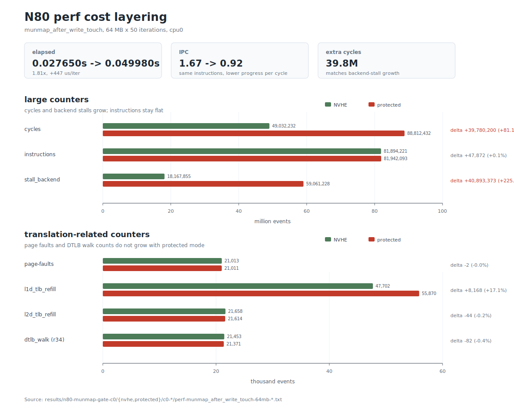

*图 6-1：N80 上 `munmap_after_write_touch` 64 MB × 50 的 host-side perf 计数分解。上半部分绘制 cycles、instructions、`stall_backend` 这类大计数；下半部分绘制 page-faults、TLB refill、DTLB walk 这类翻译相关计数。图中数据由 `docs/mmap/scripts/plot-n80-perf-cost-layering.py` 从 `results/n80-munmap-gate-c0/{nvhe,protected}/c0-*/perf-munmap_after_write_touch-64mb-*.txt` 解析生成。*

为避免 perf 只给出计数、看不到调用结构，阶段四还单独跑了一次 `function_graph` 辅助 trace。这个实验的目的很窄：确认 `munmap_after_write_touch` 的被测时间确实落在宿主机 `__vm_munmap` 的拆除子树内，并观察 `unmap_vmas`、`free_pgtables`、`tlb_finish_mmu` 等关键子树的大致位置；它不是用来重新测 protected/NVHE 的退化幅度。

实验由 `docs/mmap/scripts/host-mm-trace.sh funcgraph` 驱动。当前脚本的复现实验口径如下：

```bash
sudo CORE=0 SIZE=64 FG_ITERS=5 \
  docs/mmap/scripts/host-mm-trace.sh funcgraph <outdir>
```

脚本先做三类准备。第一，检查必须以 root 运行、tracefs 存在、当前内核支持 `function_graph`；第二，准备与 perf 相同的后备文件和 benchmark 参数（`munmap_after_write_touch`、64 MB、`touch_divisor=10`、`stride=16KB`、CPU0）；第三，按当前内核实际导出的函数名选择 graph 入口，优先使用 `__vm_munmap`，否则回退到 `do_vmi_munmap` / `__do_sys_munmap`：

```bash
[ "$(id -u)" = 0 ] || exit 1
grep -q function_graph "$T/available_tracers" || exit 1
prep_file

for f in __vm_munmap do_vmi_munmap __do_sys_munmap; do
    if grep -qx "$f" "$T/available_filter_functions"; then
        entry=$f
        break
    fi
done
```

选定入口后，脚本只打开这棵调用树，而不是全内核跟踪。核心 ftrace 配置如下：

```bash
echo nop > "$T/current_tracer"
echo 0 > "$T/tracing_on"
echo "$entry" > "$T/set_graph_function"
echo "$MAXDEPTH" > "$T/max_graph_depth"          # 默认 12
[ -e "$T/options/function-fork" ] && echo 1 > "$T/options/function-fork"
[ -e "$T/options/funcgraph-tail" ] && echo 1 > "$T/options/funcgraph-tail"
echo $$ > "$T/set_ftrace_pid"
echo function_graph > "$T/current_tracer"
```

几个设置的含义：

- `set_graph_function=__vm_munmap`：只抓 `munmap` 入口以下的调用树，避免把 mmap/touch 准备阶段混进来；
- `max_graph_depth=12`：深度要覆盖到 `unmap_region`、`unmap_vmas`、`free_pgtables`、`tlb_finish_mmu` 以及更深的 `tlb_flush_mmu`；
- `function-fork=1` 与 `set_ftrace_pid=$$`：脚本本身被写入 `set_ftrace_pid`，同时允许跟随它 fork/exec 出来的 `taskset` 与 benchmark 子进程；
- `funcgraph-tail=1`：让非叶函数的闭合行带上函数名，否则只能汇总叶子函数，无法按 `unmap_vmas` 这类子树归集；
- `current_tracer=function_graph`：启用函数调用图跟踪；测试结束后脚本通过 `trap` 恢复为 `nop` 并清空过滤条件，避免污染后续实验。

function_graph 的事件量很大。64 MB × 50 的完整 perf 负载会产生海量函数进入/返回记录，默认每 CPU 约 1.4 MB 的 trace ring buffer 会被覆盖，且插桩开销会进一步放大。因此脚本对 function_graph 使用单独的采样口径：默认只跑 `FG_ITERS=5`，临时把目标 CPU 的 per-cpu buffer 调大到 64 MB，只读取 CPU0 的 trace。归档数据里这一步也保留了调试期的痕迹：NVHE 的 `bench-funcgraph-nvhe.log` 是 5 次迭代，protected 的 `bench-funcgraph-protected.log` 是早期 50 次迭代采样；因此下面两列不能当作严格同口径的耗时对照，只能用来确认调用树结构。

```bash
fg_iters=${FG_ITERS:-5}
pcbuf="$T/per_cpu/cpu$CORE/buffer_size_kb"
orig_buf=$(cat "$pcbuf" 2>/dev/null)
echo "${FG_BUF_KB:-65536}" > "$pcbuf" 2>/dev/null || true
echo > "$T/trace"

echo 1 > "$T/tracing_on"
taskset -c "$CORE" "$BENCH" "$MODE_ARG" "$SIZE" "$fg_iters" "$FILE" \
    "$TOUCH_DIV" "$STRIDE_KB" "$WARMUPS" > "$OUT/bench-funcgraph-$KVM_MODE.log" 2>&1
echo 0 > "$T/tracing_on"

cat "$T/per_cpu/cpu$CORE/trace" > "$OUT/funcgraph-$MODE_ARG-${SIZE}mb-$KVM_MODE.txt"
[ -n "$orig_buf" ] && echo "$orig_buf" > "$pcbuf" 2>/dev/null || true
```

最后，脚本不是人工读完整 trace，而是对关键函数做固定汇总。function_graph 的叶子函数形如 `fn();`，非叶函数的总耗时在 `} /* fn */` 闭合行；这也是前面必须打开 `funcgraph-tail` 的原因。汇总逻辑如下：

```bash
for fn in "$entry" unmap_region unmap_vmas free_pgtables tlb_finish_mmu \
          zap_pte_range zap_pmd_range tlb_flush_mmu __flush_tlb_range_nosync; do
    grep -E "(\} /\* ${fn} \*/|[ (]${fn}\(\);)" "$trace" | \
    awk -v fn="$fn" '{
        for (i = 1; i <= NF; i++) if ($i == "us") { d = $(i-1); sub(/^\+/, "", d) }
        if (d != "") { n++; s += d; if (d > mx) mx = d }
    } END {
        if (n) printf "%-28s calls=%-8d total=%.1f us  avg=%.2f us  max=%.1f us\n",
                      fn, n, s, s/n, mx
    }'
done
```

原始 trace 与汇总文件分别位于 `results/n80-munmap-gate-c0/{nvhe,protected}/c0-*/funcgraph-munmap_after_write_touch-64mb-*.txt` 和 `funcgraph-summary-*.txt`。下面摘录的关键行只用于说明两种模式都落在同一条 `__vm_munmap` 拆除路径里，不用于比较两列谁更慢：

| 函数 | NVHE trace 摘录 | protected trace 摘录 | 观察 |
|---|---:|---:|---|
| `__vm_munmap` | 25,679.4 µs / 2,139.95 µs | 22,532.2 µs / 1,877.69 µs | trace 下 protected 反而更短，不能用于判退化幅度 |
| `unmap_vmas` | 25,015.5 µs / 2,084.62 µs | 21,864.7 µs / 1,822.06 µs | 约占 `__vm_munmap` 的 97%，说明主体在页表拆除子树 |
| `free_pgtables` | 179.6 µs / 14.97 µs | 194.5 µs / 16.21 µs | 占比很小 |
| `tlb_finish_mmu` | 109.0 µs / 9.09 µs | 108.3 µs / 9.02 µs | 最终收尾 flush 在该 trace 口径下很小 |
| `tlb_flush_mmu` | 4,204.9 µs / 9.89 µs（425 次） | 1,609.4 µs / 67.06 µs（24 次） | 出现在拆除过程中的批量 flush；受插桩影响，不作定量归因 |

这张表只用来回答一个问题：被测时间是否确实落在 `__vm_munmap -> unmap_region -> unmap_vmas` 这条宿主机拆除路径里。它不能回答 protected 比 NVHE 慢多少，因为 function_graph 会在每个函数进入/返回处插桩，深层且高频的 `zap`/flush 子树会被插桩开销显著扰动；上表中 `__vm_munmap` 的绝对耗时方向已经与 perf 的 1.81× 退化相反。因此，后文关于退化幅度和硬件瓶颈的判断一律以 perf 数据为准，function_graph 只作为调用结构旁证。

### 6.3 分析：候选机制收敛为两个

到这里，阶段三和阶段四各自回答了一个分层问题。阶段三用 EL2-only PMU 说明：这笔额外时间不是隐藏 hypervisor 路径。阶段四的 function_graph 只确认被测代码确实在宿主机 `munmap` 拆除路径内，不能判幅度；真正用来解释 +447 µs/iter 的，是 §6.2 的 perf 计数。

这组 perf 数据的判读顺序如下。首先，protected 与 NVHE 的 `instructions` 只差 +0.06%，`page-faults` 也几乎相同，说明两边执行的是同一类工作，而不是 protected 模式多跑了一大段软件逻辑、或多触发了一批缺页。其次，阶段三已经证明被测窗口的 ΔEL2 为 0，因此这条宿主机拆除路径没有把额外时间转移到 EL2 中消耗。再次，`dtlb_walk (r34)` 与 `l2d_tlb_refill` 基本不变，说明 protected 并没有发生更多次 stage-1 页表遍历；如果问题是"走了更多 walk"，这里应当明显放大。

剩下最突出的变化只有两项：`cycles` 多了 +39.8M，`stall_backend` 多了 +40.9M，二者量级几乎一一对应；同时 IPC 从 1.67 降到 0.92。也就是说，protected 模式没有明显多执行指令、没有多缺页、没有更多 DTLB walk、也没有进入 EL2；它慢在同一条 EL1 指令流执行期间，后端等待显著增加。

因此阶段四把问题收敛为一个更具体的判断：退化不是"多做了什么软件工作"，而是 host stage-2 使能后，宿主机拆除路径中的某类硬件操作单位成本变高。仅凭这组 perf 数据，还不能区分是哪一种硬件操作变贵；在剩余候选中，最直接的两个解释是：

| 候选 | 机制 | 若成立，可观测的特征 |
|---|---|---|
| **a-1** | 每条宿主机 `TLBI` 指令更昂贵（需失效带 VMID 的两级合成 TLB 条目；具体是本地成本还是广播等待由 §8 继续判别） | 退化应与逐页 flush slot 数（基础 TLBI 序列数）成正比，与页表项数量无关 |
| **a-2** | 每次 stage-1 页表遍历更昂贵（遍历中的描述符地址需经 stage-2 嵌套翻译） | 退化应与页表遍历工作量（页表项数量）成正比 |

阶段五的全部工作就是把这两个候选分开。

---

## 7. 阶段五：机制判定——从两个候选到唯一解释（N80）

### 7.1 host stage-2 映射粒度检查（op=3）

阶段四留下的两个候选中，a-2 还有一个很具体、也最容易误判的变体：宿主机物理内存在 host stage-2 中可能已经被大量拆成 4 KB 页。若确实如此，stage-1 walk 访问各级描述符时，第二级翻译也要走更深的 stage-2 页表，walk cache/TLB 压力随之增大，a-2 就有了明确的优化杠杆：恢复或保持 1 GB / 2 MB block 映射。

这个问题不能靠宿主机侧工具回答。perf 只能看到 stage-1 侧的 `dtlb_walk` 次数，看不到每次 walk 背后的 stage-2 映射粒度；function_graph 只能看到 EL1 调用树，也读不到 EL2 私有的 host stage-2 页表。host stage-2 的管理权在 hypervisor，页表对象是 EL2 里的 `host_mmu.pgt`，所以这里必须做一次只读的 EL2 侧检查。

op=3 的实验目标因此被限定得很窄：**统计当前 protected 模式下 host stage-2 叶子映射的粒度分布**。它不回答 TLBI 是否更贵，也不直接回答 a-1/a-2 谁成立；它只回答一个前置问题：host 内存是否已经严重 4 KB 碎片化。

#### 7.1.1 检查接口设计

这次没有另起一套 hypercall，而是复用 §5.2 已经介绍过的 `__pkvm_xcore_stats` 通道，在其中新增只读操作 `op=3`。这样做有三个原因：

1. **沿用现有通道，改动面最小**：`xcore_stats` 已经有 host 侧 `/proc/xcore_stats`、hyp 侧 `xcore_stats_entry()` 分发、以及 protected 模式门控；op=3 只是在这条实验通道上增加一种只读查询。
2. **返回全局直方图，而不是查单个地址**：要判别"host stage-2 是否碎片化"，全局 1G/2M/4K 覆盖比例已经足够；单地址查询还需要先拿到 benchmark 页的物理地址，路径更长，也更容易引入额外变量。
3. **遍历对象必须是 `host_mmu.pgt`**：op=2 原本遍历的是 `PKVM_PGTABLE`，也就是 hypervisor 自身的 stage-1 页表；它能回答 hyp 私有内存统计，但与宿主机物理内存在 host stage-2 中的映射粒度无关。op=3 必须遍历 `host_mmu.pgt`，否则测到的是另一张表。

安全边界也比较清楚：op=3 只读页表，不修改映射；遍历期间持有 host 组件锁，避免与所有权转移/映射调整并发；host 侧和 hyp 侧都做 protected 模式门控，因为普通 nVHE 下 `host_mmu` 没有 protected host stage-2 语义。

#### 7.1.2 EL2 侧实现

patch-a 在 `mem_protect/host.rs` 中新增 `HostS2LevelHist`、一个叶子回调，以及 `host_stage2_level_histogram()`。这里先明确页表遍历的对象：AArch64 的 stage-2 页表是一棵多级基数树，上层条目要么是 table descriptor，指向下一层页表；要么是 block/page descriptor，直接给出一段 IPA→PA 映射并终止翻译。只有后一类叶子条目真正代表"某段物理地址空间被多大粒度映射"：在 4 KB granule 下，典型叶子粒度是 1 GB block、2 MB block 或 4 KB page。非叶子 table descriptor 只是页表结构本身，统计它们不能回答映射粒度问题。

因此核心逻辑是：只遍历 leaf PTE，用 `kvm_granule_size(level)` 得到该叶子条目的覆盖粒度，再把覆盖页数累加到 4K / 2M / 1G 三个桶里：

```rust
pub struct HostS2LevelHist {
    pub pages_4k: u64,
    pub pages_2m: u64,
    pub pages_1g: u64,
    pub total: u64,
}

unsafe extern "C" fn host_s2_level_walker(
    ctx: *const kvm_pgtable_visit_ctx,
    _visit: kvm_pgtable_walk_flags,
) -> i32 {
    ...
    let granule = kvm_granule_size(ctx_ref.level);
    let pages = granule >> PAGE_SHIFT;
    hist.total += pages;

    if granule == 1u64 << PAGE_SHIFT {
        hist.pages_4k += pages;
    } else if granule == 0x20_0000 {
        hist.pages_2m += pages;
    } else if granule == 0x4000_0000 {
        hist.pages_1g += pages;
    }
    0
}
```

遍历函数本身持 host 组件锁，walk 的范围是 `0 .. 1 << host_mmu.pgt.ia_bits`，目标页表明确是 `host_mmu.pgt`：

```rust
pub fn host_stage2_level_histogram() -> HostS2LevelHist {
    let mut hist = HostS2LevelHist { ... };
    let mut walker = kvm_pgtable_walker {
        cb: Some(host_s2_level_walker),
        arg: &mut hist as *mut _ as *mut core::ffi::c_void,
        flags: KVM_PGTABLE_WALK_LEAF,
    };

    host_lock_component();
    let ret = unsafe {
        let ia_bits = host_mmu.pgt.ia_bits;
        kvm_pgtable_walk(&raw mut host_mmu.pgt, 0, 1u64 << ia_bits, &mut walker)
    };
    host_unlock_component();
    ...
    hist
}
```

`hyp_main.rs` 的 `xcore_stats_entry()` 增加 op=3 分支。这里不信任 host 侧已经做过门控，hyp 侧再次检查 `kvm_protected_mode_initialized`；未进入 protected 时直接返回 `SMCCC_RET_NOT_SUPPORTED`：

```rust
3 => {
    if !unsafe { static_branch_unlikely!(kvm_protected_mode_initialized, ...) } {
        host_ctxt.set_cpu_reg(0, SMCCC_RET_NOT_SUPPORTED as u64);
        return;
    }
    let hist = host_stage2_level_histogram();
    host_ctxt.set_cpu_reg(0, hist.pages_4k);
    host_ctxt.set_cpu_reg(1, hist.pages_2m);
    host_ctxt.set_cpu_reg(2, hist.pages_1g);
    host_ctxt.set_cpu_reg(3, hist.total);
}
```

返回寄存器约定为：`a0 = 4K 覆盖页数`，`a1 = 2M 覆盖页数`，`a2 = 1G 覆盖页数`，`a3 = 总覆盖页数`。

#### 7.1.3 宿主机侧接口与执行方式

host 侧 `xcore_stats.c` 增加 `XCORE_STATS_GET_S2_LEVELS = 3`、`struct xcore_s2_levels`、`xcore_get_s2_levels()`，并在 `/proc/xcore_stats` 的 write 分发中新增 `case 3`。host 侧也先检查 protected 模式，避免普通 nVHE 下误用：

```c
case 3:
    if (!is_protected_kvm_enabled()) {
        pr_err("S2 level stats require protected KVM (pKVM) mode\n");
        return -EOPNOTSUPP;
    }
    ret = xcore_get_s2_levels();
    ...
    last_operation = 3;
    break;
```

读取时把页数同时打印为块数与覆盖页数。2M 块数由 `pages_2m >> 9` 得到，1G 块数由 `pages_1g >> 18` 得到：

```c
seq_printf(m, "host stage-2 mapping granularity:\n");
seq_printf(m, "4K  pages : %llu\n", global_s2_levels.pages_4k);
seq_printf(m, "2M  blocks: %llu  (%llu pages)\n",
           global_s2_levels.pages_2m >> 9, global_s2_levels.pages_2m);
seq_printf(m, "1G  blocks: %llu  (%llu pages)\n",
           global_s2_levels.pages_1g >> 18, global_s2_levels.pages_1g);
seq_printf(m, "Total     : %llu pages (%llu MB)\n", t, (t << 2) >> 10);
```

实际执行只需要在 protected 模式下触发一次 op=3，然后读取 procfs 输出：

```bash
echo 3 > /proc/xcore_stats
cat /proc/xcore_stats
```

#### 7.1.4 结果与判读

N80 protected 模式下执行 op=3 的输出如下：

```
host stage-2 mapping granularity:
4K  pages : 8046
2M  blocks: 2486  (1272832 pages)
1G  blocks: 1019  (267124736 pages)
Total     : 268405614 pages (1048459 MB)
```

| 粒度 | 叶子条目数 | 覆盖页数 | 占比 |
|---|---:|---:|---:|
| 1G 块 | 1019 | 267,124,736 | **99.52%** |
| 2M 块 | 2486 | 1,272,832 | 0.474% |
| 4K 页 | 8046 | 8,046 | 0.003%（约 31 MB） |

（总量约 1 TB，为 host stage-2 覆盖的完整宿主机物理地址空间，含 RAM 与 MMIO 区，绝大部分以 1G 块恒等映射。）

从结果看，host stage-2 覆盖空间中 99.5% 以上为 1G 块映射，4K 页全系统仅 8046 个。基准的 64 MB 工作集对应 16,384 个 4K 页，已经大于全系统所有 4K stage-2 映射页数；因此该工作集不可能整体落在 4K stage-2 映射区，绝大部分访问必然经过 1G/2M 大块映射。这 8046 个 4K 页来自启动期 hypervisor 初始化捐赠、IOMMU 恒等映射等触发 `force_pte` 的静态场景；`munmap` 是 stage-1 操作，不改变页的所有权，不会拆分 host stage-2 的块。**"碎片化导致深层嵌套遍历"的变体被排除。**

### 7.2 第二次误判及其修正

op=3 的数据是正确的，但当时据此做出的机制结论是错误的，有必要完整记录。

当时的推理是："既然不是碎片化，那么退化就是嵌套遍历的固有成本（a-2）"。这是一次过度外推：op=3 回答的问题是"宿主机内存是否被拆成 4K"，它只能排除 a-2 的碎片化变体，**并不能在 a-1 与 a-2 之间做判别**。更重要的是，这条数据的正确读法恰恰相反：宿主机内存以 1G 块映射意味着一条两级合成的 TLB 条目可覆盖 1 GB、stage-2 方向的遍历极浅——**"大块映射"是削弱 a-2 的证据，而非支持它的证据**。

这次误判由随后的两个对照实验（§7.3 密集触摸对照、§7.5 阈值扫描）直接推翻并修正。教训在于：一项测量只能回答它实际测量的问题；把"内存是否碎片化"的答案当作 "成本在遍历还是在 TLBI"的答案，是这次反转的根源。

### 7.3 密集触摸对照实验：证伪 a-2

这里先把 a-2 重新展开：a-2 指"额外成本来自页表遍历本身"的假设，即 protected 模式打开 host stage-2 后，munmap 清 PTE、释放页表时执行的同一批 stage-1 页表访问，需要额外经过 stage-2 翻译，导致每次遍历/访存等待更久。它的直接预期是：页表项越多、遍历工作量越大，nvhe 与 protected 的差距越应放大。与之相对，a-1 指"额外成本来自逐页 TLBI/DSB"；如果实验能显著增加遍历工作量、同时消除逐页 TLBI，就可以把两种机制区分开。

**设计**：mmap 一个 64 MB 文件映射 → **以 4 KB 步长写触摸全部页面**（区别于原基准的稀疏触摸）→ 仅对 munmap 计时（计时口径与 `bench_munmap_only` 一致）。

这个对照点的设计意图需要完整说明，因为它同时对两个候选机制施加了**方向相反**的条件，单次实验即可形成判别：

1. **为何必须触摸**：munmap 的工作量取决于映射中实际建立的页表项。不触摸则没有页表项可拆、没有页可释放、没有 TLB 条目可失效，munmap 接近空操作，什么也测不到。
2. **为何全量触摸——对 a-2 施加最大压力**：触摸全部 16,384 页使页表被完全填充（32 个 PTE 页），这是 munmap 可能遇到的最大遍历与释放工作量，是原基准稀疏触摸（约 410 页）的 **40 倍**。若 a-2 成立（每次遍历更贵），此处差距应达到最大。
3. **同时对 a-1 施加消除条件**：全量触摸后，每个 PMD 子范围内都达到 2 MB 整表刷新阈值（§7.4），内核改走整表刷新路径，**不再发出逐 4K slot 的 TLBI 循环**。若 a-1 成立（逐页 TLBI 更贵），此处差距应当消失。

**结果**（N80，仅 `munmap()` 计时，单位 µs/iteration）：

这一表先只看密集对照本身。`mmap` 和 4 KB 全量写触摸属于 setup，不进入计时区；计时区只覆盖最后一次 `munmap()`。因此这里的重点不是 `munmap` 绝对时间达到约 2.8 ms，而是 protected 是否比 nvhe 多出与 pKVM 相关的额外时间。

| 场景 | mmap 大小 | 写触摸范围 / 步长 | 已建立 PTE 数 | 预计 TLB 刷新路径 | nvhe µs/iter | protected µs/iter | Δ µs/iter |
|---|---:|---:|---:|---|---:|---:|---:|
| 密集触摸后 `munmap` | 64 MB | 64 MB / 4 KB | 16,384 | ≥ 2 MB，整表 flush | 2828 | 2785 | −43（≈0） |

这个单点已经形成了对 a-2 很强的反证：和原始稀疏触摸相比，页表项数量从约 410 个增加到 16,384 个，遍历/释放工作量约为 **40 倍**；如果 a-2 成立，protected 在这里应该更慢，至少不应让差距消失。实测结果相反：两模式都花约 2.8 ms，说明大量 PTE 清理和页释放本身主要是两模式共有成本，不是 pKVM 的额外税。

把它与 C0 中原基准口径的 `munmap_after_write_touch` 对照，差异更清楚（C0 原始日志：`results/n80-munmap-gate-c0/{nvhe,protected}/c0-*/bench-perf-*.log`）。这里的 "6.4 MB" 指 `size/10` 得到的地址跨度，不是连续触摸 6.4 MB；循环在这个跨度内每 16 KB 写一次，因此 64 MB case 实际触摸并建立约 410 个 PTE：

| 口径 | 写触摸模式 | 已建立 PTE 数 | TLB 刷新形态（根据代码推测） | nvhe µs/iter | protected µs/iter | Δ µs/iter |
|---|---|---:|---|---:|---:|---:|
| 原基准稀疏触摸 | 起始 6.4 MB 内每 16 KB 触摸一次 | ~410 | 按 PMD 分批，仍落在逐页 TLBI 路径 | 113.180 | 548.108 | **+434.928（4.84×）** |
| 密集对照 | 全量 64 MB / 4 KB | 16,384 | 超过 2 MB 阈值，整表 flush | 2828 | 2785 | **≈0** |

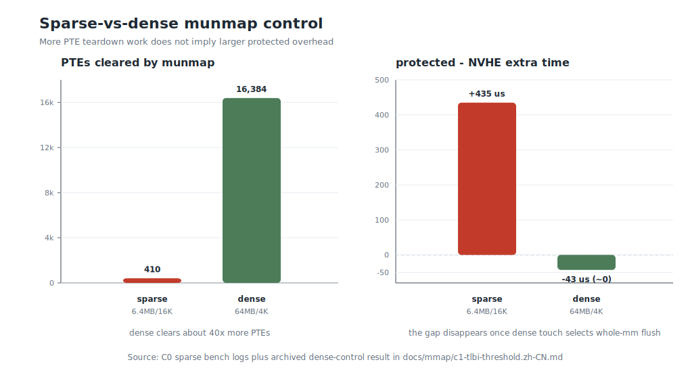

*图 7-1：N80 上稀疏原基准与密集对照的并排可视化。左图显示密集对照建立并拆除的 PTE 数约为稀疏原基准的 40 倍；右图显示 protected−NVHE 额外时间反而从 +434.928 µs 降到约 0。该图由 `docs/mmap/scripts/plot-n80-mechanism-controls.py` 从 C0 稀疏日志 `results/n80-munmap-gate-c0/{nvhe,protected}/c0-*/bench-perf-*.log` 以及阶段性密集对照记录 `docs/mmap/c1-tlbi-threshold.zh-CN.md` 解析生成。*

这张对照表的读法是：稀疏场景页表项少，却有 +435 µs 的 protected 额外时间；密集场景页表项多 40 倍，却没有可见额外时间。两者真正不同的不是页表遍历量，而是 TLB 失效路径：稀疏触摸会保留大量逐页 TLBI，密集全量触摸跨过 2 MB 阈值后改走整表 flush。由此，a-2（遍历更贵）被证伪；a-1（逐页 TLBI 更贵）则与现象完全一致。下一节用内核源码解释这个 2 MB 分界点从何而来。

### 7.4 内核源码分析：munmap TLB 失效的 2 MB 阈值

这节要解释的是 §7.3 的反直觉现象：稀疏触摸只拆约 410 个 PTE，却有 +435 µs 的 protected 额外时间；密集触摸拆 16,384 个 PTE，差距反而消失。源码给出的答案不是"munmap 有没有遍历页表"，而是 **TLB 失效阶段到底走逐 4K slot，还是走整表路径**。

先看入口。用户态 `munmap()` 进入 `~/common/mm/mmap.c` 后，路径是：

```c
SYSCALL_DEFINE2(munmap, unsigned long, addr, size_t, len)
{
    ...
    return __vm_munmap(addr, len, true);
}

static int __vm_munmap(unsigned long start, size_t len, bool unlock)
{
    ...
    ret = do_vmi_munmap(&vmi, mm, start, len, &uf, unlock);
    ...
}
```

`do_vmi_munmap()` 找到并拆分覆盖目标区间的 VMA，真正删除映射时在 `do_vmi_align_munmap()` 中调用 `unmap_region()`：

```c
/* mm/mmap.c:2601 */
unmap_region(mm, &mas_detach, vma, prev, next, start, end, count, !unlock);
```

`unmap_region()` 是后面所有现象的主干：

```c
static void unmap_region(...)
{
    struct mmu_gather tlb;

    lru_add_drain();
    tlb_gather_mmu(&tlb, mm);
    unmap_vmas(&tlb, mas, vma, start, end, tree_end, mm_wr_locked);
    free_pgtables(&tlb, mas, vma, ...);
    tlb_finish_mmu(&tlb);
}
```

这里分成两层：`unmap_vmas()` / `free_pgtables()` 清页表、收集待释放对象；`mmu_gather` 负责把"哪些地址范围需要失效 TLB"攒起来。真正执行 TLBI 的地方不是 `tlb_remove_tlb_entry(s)`，而是后续的 `tlb_flush_mmu_tlbonly()` / `tlb_finish_mmu()` 所触发的 arm64 `tlb_flush()`。

在 `unmap_vmas()` 内部，普通 4 KB 页走 `unmap_page_range()` → `zap_pmd_range()` → `zap_pte_range()`。`zap_pmd_range()` 每次把范围切到 PMD 边界：

```c
/* mm/memory.c:1716 */
next = pmd_addr_end(addr, end);
...
addr = zap_pte_range(tlb, vma, pmd, addr, next, details);
```

这点对 `lat_mmap` 很关键：后备是 `MAP_SHARED` 文件映射，而且触摸方式是写触摸。清除 dirty 的文件页 PTE 时，`zap_present_folio_ptes()` 会把对应 folio 标记为 dirty（脏页），并在 SMP 上设置 `force_flush`：

```c
/* mm/memory.c:1488 */
ptent = get_and_clear_full_ptes(mm, addr, pte, nr, tlb->fullmm);
if (pte_dirty(ptent)) {
    folio_mark_dirty(folio);
    if (tlb_delay_rmap(tlb)) {
        delay_rmap = true;
        *force_flush = true;
    }
}
...
tlb_remove_tlb_entries(tlb, pte, nr, addr);
```

`zap_pte_range()` 末尾看到 `force_flush` 后，会在离开 PTE 锁前先刷新一次已经收集的 TLB 范围：

```c
/* mm/memory.c:1687 */
if (force_flush) {
    tlb_flush_mmu_tlbonly(tlb);
    tlb_flush_rmaps(tlb, vma);
}
pte_unmap_unlock(start_pte, ptl);

if (force_flush)
    tlb_flush_mmu(tlb);
```

所以，原始稀疏写触摸的刷新不是"等 6.4 MB 全部处理完后一次性刷新"。它会在 `zap_pte_range()` 的 PMD 子范围内分批刷新；每批的范围由该 PMD 内实际被清除的 PTE 决定。

再看 `tlb_remove_tlb_entries()` 到底做什么。名字里有 `tlb_remove`，但它不发 TLBI，只更新 `mmu_gather` 的范围和层级标记：

```c
/* include/asm-generic/tlb.h:628 */
static inline void tlb_remove_tlb_entries(struct mmu_gather *tlb,
        pte_t *ptep, unsigned int nr, unsigned long address)
{
    tlb_flush_pte_range(tlb, address, PAGE_SIZE * nr);
    ...
}

static inline void tlb_flush_pte_range(struct mmu_gather *tlb,
        unsigned long address, unsigned long size)
{
    __tlb_adjust_range(tlb, address, size);
    tlb->cleared_ptes = 1;
}
```

到这里为止，内核只知道两件事：本批次被清过 PTE，所以 `cleared_ptes=1`；本批次需要失效的虚拟地址范围是 `tlb->start .. tlb->end`。arm64 在真正刷新时用这两项做决策：

```c
/* arch/arm64/include/asm/tlb.h:53 */
static inline void tlb_flush(struct mmu_gather *tlb)
{
    struct vm_area_struct vma = TLB_FLUSH_VMA(tlb->mm, 0);
    bool last_level = !tlb->freed_tables;
    unsigned long stride = tlb_get_unmap_size(tlb); /* cleared_ptes => 4 KB */
    int tlb_level = tlb_get_level(tlb);             /* only PTE => level 3 */

    ...
    __flush_tlb_range(&vma, tlb->start, tlb->end, stride,
                      last_level, tlb_level);
}
```

`__flush_tlb_range()` 自身只是一个很薄的同步封装：先调用 `__flush_tlb_range_nosync()` 决定并发出具体 TLBI，随后用 `dsb(ish)` 等待这些失效完成：

```c
static inline void __flush_tlb_range(struct vm_area_struct *vma,
        unsigned long start, unsigned long end,
        unsigned long stride, bool last_level, int tlb_level)
{
    __flush_tlb_range_nosync(vma, start, end, stride,
                             last_level, tlb_level);
    dsb(ish);
}
```

因此，真正决定"逐 slot 还是整表"的是 `__flush_tlb_range_nosync()` 里的分支。这里就是 2 MB 阈值的来源：

```c
#define MAX_DVM_OPS  PTRS_PER_PTE    /* 4 KB 页表下为 512 */

if ((!system_supports_tlb_range() &&
     (end - start) >= (MAX_DVM_OPS * stride)) ||
    pages >= MAX_TLBI_RANGE_PAGES) {
    flush_tlb_mm(vma->vm_mm);
    return;
}

dsb(ishst);
asid = ASID(vma->vm_mm);

if (last_level)
    __flush_tlb_range_op(vale1is, start, pages, stride, asid, tlb_level, true);
else
    __flush_tlb_range_op(vae1is, start, pages, stride, asid, tlb_level, true);
```

在本实验平台上，`ID_AA64ISAR0_EL1 = 0x0000111110212120`，TLB 字段 [59:56] = 0，说明 **N80 不支持 FEAT_TLBIRANGE**。因此 `system_supports_tlb_range()` 为假；`stride=4 KB` 时，`MAX_DVM_OPS * stride = 512 * 4 KB = 2 MB`。于是：

| 本批次待刷新范围 | arm64 路径 | 指令形态 |
|---|---|---|
| **< 2 MB** | `__flush_tlb_range_op(...)` | 本平台无 FEAT_TLBIRANGE，循环对范围内每个 4 KB slot 发 `vale1is/vae1is`，最后 `dsb ish` |
| **≥ 2 MB** | `flush_tlb_mm(mm)` | 按 ASID 走整表路径：`aside1is` / `__tlbi_user(aside1is, ...)`，最后 `dsb ish` |

逐 slot 路径的循环在 `__flush_tlb_range_op` 中：

```c
while (pages > 0) {
    if (!system_supports_tlb_range() || pages == 1) {
        addr = __TLBI_VADDR(start, asid);
        __tlbi_level(op, addr, tlb_level);
        if (tlbi_user)
            __tlbi_user_level(op, addr, tlb_level);
        start += stride;
        pages -= stride >> PAGE_SHIFT;
        continue;
    }
    ...
}
```

整表路径则是：

```c
static inline void flush_tlb_mm(struct mm_struct *mm)
{
    dsb(ishst);
    asid = __TLBI_VADDR(0, ASID(mm));
    __tlbi(aside1is, asid);
    __tlbi_user(aside1is, asid);
    dsb(ish);
    ...
}
```

把这条源码路径代回 §7.3 的两个实验点，就能解释为什么它们方向相反：

1. **原基准稀疏触摸**：64 MB 映射只在起始 6.4 MB 地址跨度内每 16 KB 写一次。`zap_pmd_range()` 按 2 MB PMD 子范围处理；在一个完整 PMD 内，最后一个被触摸的 PTE 距 PMD 末尾还差 16 KB，因此本批次 `tlb->start .. tlb->end` 约为 `2 MB - 12 KB`，低于阈值。结果是：虽然只清了约 410 个 PTE，但每个 PMD 子范围仍走逐 4 KB slot 的 TLBI 循环；slot 数由连续刷新跨度决定，不等于实际触摸 PTE 数，protected 的逐 slot 成本因此被放大。
2. **密集全量触摸**：每个 PMD 内 512 个 4 KB PTE 都被建立并清除，本批次待刷新范围正好达到 2 MB。由于判断条件是 `>= MAX_DVM_OPS * stride`，这些批次改走 `flush_tlb_mm()` 的整表路径，不再执行逐 4 KB slot 的 TLBI 循环。页表清理和页释放仍然很多，所以绝对时间约 2.8 ms；但这部分主要是两模式共有成本，protected 不再出现 +400 µs 级别的额外时间。

因此，源码给出的可证伪预言是：**只要刷新批次小于 2 MB，protected 与 nvhe 的差距应随逐 4 KB slot 数增长；一旦单个刷新批次达到 2 MB 并改走整表路径，这个差距应骤降**。这不是 a-2（页表遍历更贵）能解释的突变，因为 1.9 MB 与 2.0 MB 的页表清理工作量几乎相同，发生突变的只有 TLBI 发出方式。下一节的扫描实验直接检验这个预言。

### 7.5 阈值扫描实验：证实 a-1

§7.4 的源码分析把 a-1 变成了一个可以直接检验的预言：如果额外时间来自逐 4 KB slot 的 TLBI，那么小于 2 MB 的刷新批次中，protected 与 nvhe 的差距应随 slot 数线性增长；一旦单次刷新批次达到 2 MB，arm64 代码改走整表刷新路径，这个差距应在阈值处明显塌缩。a-2（页表遍历或页表访存更贵）则不应在 1.9 MB 与 2.0 MB 之间产生这种断崖式变化，因为两点之间清理的 PTE 数只从约 487 个增加到 512 个。

因此本节的主实验**刻意不使用 `lat_mmap` 默认的 16 KB 稀疏触摸**。阈值扫描要做的是连续密集触摸：从映射起始地址开始，以 4 KB 页大小为步长，把前 N MB 的每个页都写一次。这样才能让 N 成为一个干净的自变量，用来控制单个刷新批次是否跨过 2 MB 阈值。`lat_mmap` 的原始稀疏形态（起始 6.4 MB / 16 KB 步长）只作为参考点保留，用来把阈值扫描结果对回原始现象。

#### 7.5.1 微基准如何控制刷新范围

阈值扫描使用专用工具 `experiments/munmap-tlbi/munmap_only.c`，目的不是复刻完整 `lat_mmap`，而是把计时窗口收窄到 `munmap()` 本身，并把前置触摸范围做成可控自变量：

```c
for (int it = 0; it < iters; it++) {
    char *p = mmap(NULL, sz, PROT_READ | PROT_WRITE, MAP_SHARED, fd, 0);
    for (size_t i = 0; i < tb; i += stride)
        ((volatile char *)p)[i] = 1;     /* setup：触摸前 touch_mb MB，步长可控 */

    double t0 = now_ns();
    munmap(p, sz);                       /* 正式计时只覆盖 munmap */
    double d = now_ns() - t0;
    ...
}
```

这里的关键是 `touch_mb` 和 `stride_kb` 两个参数。主扫描固定 `stride_kb=4`，即以 4 KB 页大小连续密集触摸前 N MB；被建立的 PTE 因此集中在映射起始的连续区间内。当 N 小于 2 MB 时，单个 PMD 内的刷新范围约等于 N MB；当 N 达到或超过 2 MB 时，每个满 PMD 批次正好达到 2 MB，触发整表刷新路径。这样，扫描的自变量就是"单个刷新批次是否跨过 2 MB 阈值"，而不是完整映射大小。

与之相对，`lat_mmap` 默认的 16 KB 稀疏触摸会把"触摸页数"和"刷新跨度"纠缠在一起，不适合用来定位 2 MB 阈值；因此它只作为末尾的原基准参考点出现。

#### 7.5.2 执行口径

驱动脚本 `experiments/munmap-tlbi/run-sweep.sh` 在 protected 与 nvhe 两种启动模式下各跑一轮。默认参数为 `SIZE=64`、`ITERS=100`、`CORE=0`，先生成 64 MB 后备文件并锁定 CPU governor，再把触摸范围扫过阈值两侧：

```bash
RANGES=${RANGES:-"0.25 0.5 1 1.9 2 4 8 32 64"}

for TM in $RANGES; do
    taskset -c "$CORE" "$DIR/munmap_only" file "$SIZE" "$ITERS" "$FILE" "$TM" 4
done

# 稀疏参考：原 lat_mmap / mmap_split 模式
taskset -c "$CORE" "$DIR/munmap_only" file "$SIZE" "$ITERS" "$FILE" 6.4 16
```

1.9 MB 与 2.0 MB 是最关键的两个点：前者仍低于 `MAX_DVM_OPS * stride = 2 MB`，后者刚好触发整表刷新路径。末尾 `6.4 16` 不参与阈值扫描拟合，它用于把扫描得到的单 slot 额外成本和原始 `lat_mmap` 的稀疏触摸形态对上。

当前仓库保存下来的结果文件来自后续的通用版 `op_sweep` 复查（`experiments/munmap-tlbi/results/op-sweep-n80/{protected,nvhe}.txt`）。`op_sweep` 同时扫描 `munmap`、`MADV_DONTNEED` 和 `mprotect`，其中 `munmap` 分支的计时边界与 `munmap_only` 相同：mmap 与触摸是不计时 setup，正式计时只覆盖 teardown 操作。§7.5.3 的表和图只取这些结果文件中的 `munmap` 行。

#### 7.5.3 结果

N80，`op_sweep` 中的 `munmap` 行，200 次迭代 mean，protected 对 nvhe，单位 µs/iteration。差距为 protected − nvhe：

| 触摸范围 | protected µs/iter | nvhe µs/iter | 差距 µs/iter | 所处区间 |
|---|---:|---:|---:|---|
| 0.25 MB | 33.8 | 16.6 | +17.2 | 逐页 |
| 0.5 MB | 65.0 | 30.6 | +34.4 | 逐页 |
| 1.0 MB | 120.7 | 51.9 | +68.8 | 逐页 |
| **1.9 MB** | 226.9 | 96.7 | **+130.2（+135%）** | 逐页 |
| **2.0 MB** | 92.1 | 91.7 | **+0.4（+0.4%）** | **整表** |
| 4 MB | 183.6 | 178.2 | +5.4（+3.0%） | 整表 |
| 8 MB | 366.9 | 352.7 | +14.2（+4.0%） | 整表 |
| 32 MB | 1443.6 | 1401.9 | +41.7（+3.0%） | 整表 |
| 64 MB | 2880.4 | 2806.6 | +73.8（+2.6%） | 整表 |
| 稀疏：起始 6.4 MB 内每 16 KB 触摸一次（原基准模式） | 546.8 | 110.2 | **+436.6（+396%）** | 逐页 |

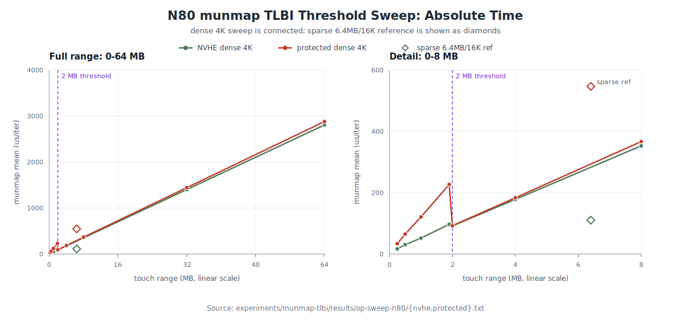

*图 7-2：N80 上 `munmap` 阈值扫描的绝对耗时。左图为 0-64 MB 全范围，右图为 0-8 MB 细节；横轴均按真实触摸范围（MB）线性比例排布。圆点与实线为 4 KB 密集扫描，菱形为原基准形态的 6.4 MB / 16 KB 稀疏参考点。图中数据由 `docs/mmap/scripts/plot-n80-tlbi-threshold.py` 从 `experiments/munmap-tlbi/results/op-sweep-n80/{protected,nvhe}.txt` 解析生成。*

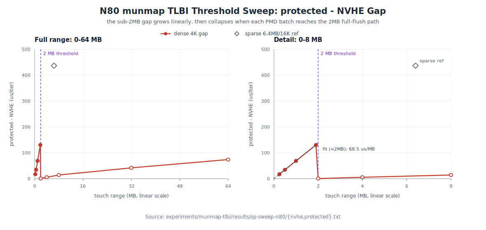

*图 7-3：同一组数据中的 protected−NVHE 差距。2 MB 以下差距随 4 KB 密集刷新范围近似线性增长；2 MB 处切到整表刷新路径后，密集扫描差距塌缩到接近 0。6.4 MB / 16 KB 稀疏参考点虽然总跨度超过 2 MB，但因 dirty 页按 PMD 分批且每批略低于 2 MB，仍落在逐页路径。*

#### 7.5.4 判读

先明确图中两类标记的含义。圆点与实线表示 **4 KB 密集阈值扫描**：每个点都用 4 KB 步长连续写触摸前 N MB，目的是精确控制单个刷新批次是否跨过 2 MB 阈值，因此这些点构成用于判别 a-1 / a-2 的扫描曲线。菱形表示 **6.4 MB / 16 KB 稀疏参考点**：它复刻原始 `lat_mmap` / `mmap_split` 的触摸形态，即 64 MB 映射只在起始 6.4 MB 地址跨度内每 16 KB 写一次。菱形不是阈值扫描曲线的一部分，也不参与 2 MB 以下线性拟合；它的作用是把扫描得到的单 slot 成本与原始 `lat_mmap` 观测对账。

在这个读图口径下，表与图给出了三层证据。

第一，差距在阈值处发生突变。1.9 MB 时 protected 比 nvhe 多 +130.2 µs；2.0 MB 时差距只剩 +0.4 µs。两点之间页表清理工作量只小幅增加，变化的核心是 `__flush_tlb_range_nosync()` 从逐 slot TLBI 切换到 `flush_tlb_mm()` 整表刷新路径。因此，这个断崖支持 a-1，而不支持 a-2。

第二，2 MB 以下的逐页区间呈线性关系。差距从 +17.2、+34.4、+68.8 增长到 +130.2 µs，斜率约为 68.5 µs/MB。按每 MB 256 个 4 KB flush slot 折算，protected 相对 nvhe 的额外成本约为 **0.27 µs/slot**（1.8 GHz 下约 480 cycles/slot）。这里的 slot 指 `__flush_tlb_range_op()` 循环中的 4 KB 刷新槽位；这个数值是整段逐页 TLBI 序列及其完成等待的斜率，不是单独一条裸 `tlbi` 汇编的孤立延迟。

第三，菱形的稀疏参考点把阈值扫描和原始观测连起来。它看起来位于 6.4 MB，超过 2 MB 阈值，但它不是 4 KB 密集连续触摸；由于 16 KB 稀疏步长与 dirty 页 PMD 分批，每个 PMD 批次仍略低于 2 MB，因此继续落在逐页 TLBI 路径。按连续跨度近似折算为约 1638 个 4 KB flush slot，1638 × 0.267 µs/slot ≈ 438 µs，与本表的 +436.6 µs 以及 C0 日志中的 +435 µs（§7.3）一致。若按 §7.4 的 PMD 分批精确计算，满 PMD 内每批约 509 个 slot，6.4 MB 稀疏点总数约 1628 个 slot，差异不到 1%，不影响结论。Kaitian 平台同一形态下的 +205 µs（§4.3）则是同一机制在不同硬件上的较低单 slot 单价。

#### 7.5.5 阈值作用的真实粒度：为什么 6.4 MB 稀疏触摸仍走逐页路径

本小节处理的是**原基准稀疏形态的对账问题**。§7.5.3 的 4 KB 密集扫描已经证明：连续密集触摸下，一旦单个刷新批次达到 2 MB，protected−nvhe 差距会塌缩。现在要解释的是另一个相关但不同的问题：§4.3 的 `munmap_after_write_touch` 复刻的是 `lat_mmap` 默认的 16 KB 稀疏写触摸；64 MB 行的总触摸跨度是 6.4 MB，已经超过 2 MB，为什么它没有像密集扫描那样越过阈值后塌缩，反而仍然有 +205 µs 的差距？

答案是：2 MB 阈值比较的是**单次 `flush_tlb_range` 调用覆盖的虚拟地址范围**，不是 mmap 总大小，也不是整个触摸跨度的总和。从测试参数到这一次刷新调用，中间还有两层换算：一层是 `lat_mmap` 的稀疏触摸几何，另一层是内核对 dirty 共享文件页按 PMD 分批刷新。

第一层来自基准形态。`write_touch()` 复刻 `lat_mmap`，只触摸前 `size/10`，步长为 16 KB。因此 0.5 MB 到 16 MB 各行的触摸跨度只有 0.05 MB 到 1.6 MB，本来就低于 2 MB，落在逐页区间。

第二层来自内核拆除路径。64 MB 行的总触摸跨度虽然是 6.4 MB，但 munmap 不会把整个跨度合成一次刷新；写触摸过的共享文件页是 dirty 页，`zap_pmd_range()` 按 2 MB PMD 子范围处理，`zap_pte_range()` 在含 dirty 页的 PMD 内触发 `force_flush`，使刷新按 PMD 分批发生：

```c
/* mm/memory.c:1489（zap_present_folio_ptes，节选）：dirty 共享文件页强制本批刷新 */
if (pte_dirty(ptent)) {
    folio_mark_dirty(folio);
    if (tlb_delay_rmap(tlb)) {
        delay_rmap = true;
        *force_flush = true;    /* 反向映射拆除须推迟到 TLB 刷新之后 */
    }
}

/* mm/memory.c:1687（zap_pte_range 结尾）：刷新本批累积范围并清零 */
if (force_flush) {
    tlb_flush_mmu_tlbonly(tlb);
    tlb_flush_rmaps(tlb, vma);
}
pte_unmap_unlock(start_pte, ptl);
```

于是每个含 dirty 页的 PMD 块结束时都会发出一次刷新，范围是该块内第一个到最后一个被清除 PTE 之后的连续 VA 跨度。两种触摸步长由此走向不同路径：

| 触摸步长 | 满 PMD 块内最后被触摸的页 | 单批刷新范围 | 与 2 MB 阈值比较 | 走向 |
|---|---|---|---|---|
| 16 KB（稀疏，原基准） | 2 MB − 16 KB 处 | 2 MB − 12 KB | **差 12 KB 未达到** | 逐页，约 509 个 slot / PMD |
| 4 KB（密集，§7.3 对照与本节扫描） | 2 MB − 4 KB 处 | 恰好 2 MB | **达到** | 整表刷新路径 / PMD |

这里的重点是：逐页 TLBI 的 slot 数不是实际触摸页数。一个完整 PMD 中，16 KB 稀疏触摸只建立约 128 个 PTE；但 `mmu_gather` 记录的是从本批第一个被清除 PTE 到最后一个被清除 PTE 之后的连续 VA 范围，所以刷新范围约为 `2 MB - 12 KB`，折算为约 509 个 4 KB slot。每多一个满 PMD，protected 额外增加的不是 128 个 slot，而是接近 512 个 slot。这就是 §4.3 的差距能随大尺寸继续放大的原因。

把这个关系代回 Kaitian 的 §4.3 数据，也能看到同一条线性规律。这里的"近似 slot 数"按刷新跨度估算，而不是按实际触摸页数估算。`lat_mmap` 默认只触摸映射起始的 `size / 10` 地址跨度；逐页 TLBI 循环的步长是 4 KB，所以可先用下式折算触摸跨度覆盖了多少个 4 KB flush slot：

```text
近似 slot 数 = (size / 10) / 4KB
             = size_MB * 1024KB/MB / 10 / 4KB
             = size_MB * 25.6
```

例如 0.5 MB 映射的触摸跨度是 0.05 MB = 51.2 KB，折算为 12.8 个 4 KB slot；64 MB 映射的触摸跨度是 6.4 MB，折算为 6.4 * 256 = 1638.4 个 4 KB slot。这里出现小数，是因为这是按 `size/10` 的连续跨度做近似折算；真实内核会按 PMD 子范围、被触摸 PTE 的起止位置和对齐关系分批刷新，slot 数必须是整数。这个近似的目的不是还原每一批的精确 TLBI 条数，而是看 Δ 是否按"4 KB 刷新跨度"线性增长。

按这个口径计算，Δ/slot 基本恒定：

| size | 近似 slot 数 | Δ µs/iter | Δ/slot µs |
|---:|---:|---:|---:|
| 0.5 MB | 12.8 | 1.433 | 0.112 |
| 1 MB | 25.6 | 2.907 | 0.114 |
| 2 MB | 51.2 | 6.342 | 0.124 |
| 4 MB | 102.4 | 13.140 | 0.128 |
| 8 MB | 204.8 | 26.218 | 0.128 |
| 16 MB | 409.6 | 51.597 | 0.126 |
| 64 MB | 1638.4 | 205.003 | **0.125** |

约 0.125 µs/slot 就是 Kaitian 上每个 4 KB flush slot 的 protected 额外单价；它低于 N80 的 0.27 µs/slot，但二者都指向同一机制：差距与逐页 slot 数成正比。

Δ% 列从 +47% 上升到 +227%，也可以用同一模型解释。munmap 时间可近似拆成固定开销 F（系统调用、VMA 摘除等）、两模式共有的释放成本 r·P（清 PTE、释放页缓存，随触摸页数 P 增长）、以及 protected 独有的逐页失效税 t·slot。小尺寸时 F 在分母里占比大，所以 Δ% 偏低；尺寸增大后，F 被摊薄，Δ% 逐步逼近 `t·slot / (r·P)` 的渐近比值。因此，Δ% 增长不是"pKVM 随尺寸无限变慢"，而是固定成本被摊薄后，逐页 TLBI 税在 munmap 总成本中的占比显露出来。

同一机制也解释了 §4.3 的读触摸路径异常。读触摸建立的是干净页，不触发上面 dirty 页路径中的 `force_flush`，刷新范围可以跨 PMD 累积到最后的 `tlb_finish_mmu`。64 MB 行的读触摸跨度为 6.4 MB，超过 2 MB 后走整表刷新路径，protected 差距随之消失；而 0.5 MB 到 16 MB 行的跨度仍低于 2 MB，累积到最后也还是逐页路径，因此仍能看到明显差距。写、读两张表的走势由 dirty 页是否强制 PMD 分批刷新统一起来。

综上，对稀疏原基准而言，"2 MB 阈值"的准确表述是：它作用于**单次刷新调用的虚拟地址范围**。`lat_mmap` / `mmap_split` 的稀疏写触摸由于 dirty 页 per-PMD 分批和 16 KB 步长的组合，每批都略低于 2 MB，因此差距会随尺寸线性增长，而不会在总触摸跨度超过 2 MB 后自动塌缩。

### 7.6 补充分析：为什么密集扫描过 2 MB 后绝对时间仍继续上升

上一小节解释的是稀疏原基准为什么仍留在逐页路径；本节换一个问题，只看 §7.5.3 的 **4 KB 密集阈值扫描曲线本身**：既然 protected−nvhe 差距在 2 MB 处已经塌缩，为什么两模式的绝对时间在 2 MB 之后仍随触摸范围继续增长？

这组密集数据的关键现象是：差距在 2 MB 处消失，但两模式的**绝对时间**在 2 MB 之后仍随范围继续增长（以 protected 行为例：92 → 184 → 367 → 1444 → 2880 µs）。这是与 pKVM 逐页 TLBI 额外开销无关的另一项成本，将 munmap-only 时间分解为两部分即可解释：

```
munmap-only ≈ [释放页与清除页表项的成本]      + [TLB 刷新的成本]
                与触摸页数成正比                  <2MB：N 个逐页 slot
                两模式基本相同（~0.17 µs/页）      ≥2MB：每批整表刷新（不再逐 slot）
                                                  pKVM 的额外开销仅存在于此项
```

- **第一部分（释放页/清除页表项）**：munmap 须清除每个已建立的页表项、将每页归还页缓存或伙伴系统、更新 `struct page`。该成本与触摸页数成正比，且两模式几乎相同——验证：nvhe 侧 91.7/512 ≈ 352.7/2048 ≈ 2806.6/16384 ≈ **0.17 µs/页**，斜率恒定。宿主机内存为 1G 块映射（§7.1），这些访存的 stage-2 翻译开销很小，两模式在整表区间只剩约 0%～4% 的残差。
- **第二部分（TLB 刷新）**：2 MB 以下为 N 个逐页 flush slot（pKVM 的额外开销集中于此），2 MB 及以上改走整表刷新路径，不再随 4 KB slot 数线性增长。

据此，整条曲线的形态完全自洽：

| 区段 | 释放页成本 | TLB 刷新成本 | 绝对时间 | 差距（pKVM 额外开销） |
|---|---|---|---|---|
| < 2 MB | 随页数增长 | N 个逐页 slot，随范围增长 | 增长（两项叠加） | 与范围成正比（TLBI 项） |
| 2 MB 拐点 | 略增（约 487 → 512 页） | N 个逐页 slot → 整表刷新路径，骤降 | 反而下降（227 → 92） | 降至 ≈0 |
| > 2 MB | 随页数继续增长 | 维持整表刷新路径，不再逐 slot 增长 | 再次增长（仅释放页项） | 约 0%～4%（释放页访存的小幅残差） |

即：2 MB 之后绝对时间继续上升来自"释放页"成本（两模式同等增长，与 pKVM 无关）；pKVM 的额外开销位于"逐 slot TLB 刷新"项内，已随整表刷新路径收敛到很小的残差。

## 8. TLBI 微机制复查：广播假说的检验与否定（N80）

阶段五已经把根因从两个大候选收敛到 a-1：退化来自小于 2 MB 刷新范围下的逐页 `TLBI` 路径，而不是页表遍历成本。这里还剩一个更细的问题：**同一条 `tlbi vae1is` 为什么在 protected 下每个 4K flush slot 多约 0.27 µs？**

先回顾本节要反复对比的两条 TLBI 指令。二者的匹配键基本相同，都是按虚拟地址作废 EL1&0 翻译域中的条目；区别在于失效请求的传播范围：

| 指令 | 助记符拆解 | 作用范围 | 本文中的含义 |
|---|---|---|---|
| `tlbi vae1is, <VA\|ASID>` | `VA` = 按虚拟地址；`E1` = EL1&0 翻译域；`IS` = Inner Shareable | 作废当前 ASID/VMID 上下文中匹配该 VA 的条目，并让失效对内部共享域可见；Linux 普通用户地址空间刷新实际走这一路，随后配 `dsb ish` | 代表 `munmap` 的真实逐页刷新路径 |
| `tlbi vae1, <VA\|ASID>` | 同样是按 VA、EL1&0 翻译域；没有 `is` 后缀 | 只要求在非共享 / 本地作用域完成，测试中配 `dsb nsh` | 作为"只看本地失效"的对照路径 |

之所以比较 `vae1is` 与 `vae1`，是因为它们控制住了同一个 VA、同一个 ASID、同样的 slot 数和同类条目匹配，主要变量只剩"是否需要 Inner-Shareable 传播与等待"。如果 +0.27 µs/slot 主要来自跨核 DVM 广播或远端完成等待，`vae1is` 应明显慢于 `vae1`，并且可能随在线核数或跨簇放置变化；如果二者接近，则说明主要成本发生在发起核本地的条目失效本身。

从体系结构直觉看，一个自然假说是"跨核广播等待"：Linux 发出的是 Inner-Shareable `tlbi vae1is`，随后以 `dsb ish` 等待共享域内失效完成。如果这笔时间主要花在等待其他核心响应 DVM 广播，那么它应该随在线核数、簇间拓扑或 IS/NSH 作用域变化而变化。2026-06-15 的 N80 复查就是针对这一点设计的。最终结果否定了广播假说：+0.27 µs/slot 是**本地失效 stage-1 × stage-2 合成、VMID 标记 TLB 条目**的成本。

### 8.1 从 a-1 到两个子假说

逐页路径在 nvhe 与 protected 下发出的内核指令相同；变化的是这条指令要匹配和作废的 TLB 条目类型：

- **nvhe（无 host stage-2）**：宿主机为单级翻译，TLB 中主要是按 VA/ASID 标记的 stage-1 条目。
- **protected（host stage-2 使能）**：宿主机运行在 host stage-2 之下，TLB 中存在 stage-1 与 stage-2 合成后的条目，除 ASID 外还带宿主机 stage-2 上下文的 VMID。

这只能说明"同一条 TLBI 在 protected 下要处理更复杂的条目"，还不能说明多出来的时间到底落在哪里。复查将 a-1 拆成两个可检验的子假说：

| 子假说 | 机制 | 关键预测 |
|---|---|---|
| **a-1-broadcast** | `vae1is` 经 DVM 广播到其他核心，发起核在 `dsb ish` 等待远端失效完成 | 在线核数增加或跨簇放置应变慢；IS 应显著慢于 NSH；广播与访存叠加可能放大后端停顿 |
| **a-1-local** | 主要成本发生在发起核本地：失效带 VMID 的合成条目本身更慢 | 耗时应与在线核数/拓扑无关；protected 下裸 TLBI 每 slot 成本应约等于阈值扫描得到的 +0.27 µs/slot |

### 8.2 实验设计与实施脚本

复查使用两类实验互相约束：第一类仍测真实 `munmap`，只改变在线 CPU 集合；第二类把 TLBI 从 `munmap` 路径中抽出，用内核模块直接计时。

| 实验 | 工具与数据 | 作用 |
|---|---|---|
| 在线核数扫描 | `experiments/munmap-tlbi/run-core-scaling.sh`、`munmap_only.c`、`results/corescaling-n80/*.csv` | 观察真实 `munmap` 是否随在线核数、同簇/跨簇放置变化 |
| TLBI 直接计时 | `experiments/munmap-tlbi/tlbi_ab/`、`results/tlbi-ab-n80/*.txt` | 在固定核心、关中断条件下比较 `vae1is`（IS）与 `vae1`（NSH）的每 slot 耗时 |
| 过程日志 | `experiments/munmap-tlbi/INVESTIGATION-LOG.md`、`docs/mmap/pkvm-munmap-corescaling-followup.en.md` | 记录在线核数复查、TLBI 直接计时与统计口径复核的完整过程 |

`run-core-scaling.sh` 的核心设计是：基准进程固定在 cpu0，逐组调整在线核心，并在每次热插拔后重新锁定频率。N80 有两个簇，`{0-3}` 与 `{4-7}`；因此 `{0,1}` 和 `{0,4}` 这两组具有相同远端核心数，但分别代表同簇与跨簇：

```bash
SETS=${SETS:-"0 0,1 0,4 0,1,2,3 0,1,2,3,4 0,1,2,3,4,5,6,7"}
POINTS=${POINTS:-"1.0:4 6.4:16"}

out=$(taskset -c "$CORE" "$BENCH" file "$SIZE" "$ITERS" "$FILE" "$tm" "$st")
mean=$(echo "$out" | grep -o 'mean=[0-9.]*' | cut -d= -f2)
```

这里的 `6.4:16` 表示触摸跨度 6.4 MB、步长 16 KB。它复刻 `lat_mmap` 的稀疏触摸特征，实际每个 PMD 子范围内建立的 PTE 数不足 2 MB 阈值，仍落在逐页 TLBI 路径。正文以 mean 作为主要判据。

`tlbi_ab.ko` 则直接在内核态计时一批 TLBI。它关闭抢占和本地中断，用 `CNTVCT_EL0` 读取架构计时器；同一批地址分别发 IS 与 NSH 版本：

```c
preempt_disable();
local_irq_save(flags);

t0 = read_sysreg(cntvct_el0);
for (i = 0; i < nslots; i++) {
    u64 op = tlbi_op(base + (unsigned long)i * PAGE_SIZE, asid);
    if (shareable)
        asm volatile("tlbi vae1is, %0" :: "r"(op) : "memory");
    else
        asm volatile("tlbi vae1, %0" :: "r"(op) : "memory");
}
if (shareable)
    asm volatile("dsb ish" ::: "memory");
else
    asm volatile("dsb nsh" ::: "memory");
t1 = read_sysreg(cntvct_el0);

local_irq_restore(flags);
preempt_enable();
```

模块还支持 user-VA + 进程 ASID 模式，用来匹配 `munmap` 实际拆除的用户态 nG 条目；并支持插入依赖性随机访存，用于检验"广播流量拖慢访存"这一中间假说。

### 8.3 core-scaling mean：在线核数不放大 munmap 成本

广播假说的第一条直接预测是：真实 `munmap` 的耗时应随在线核心数增加，或者至少在同簇 `{0,1}` 与跨簇 `{0,4}` 之间出现可见分离。在线核数扫描的 mean 数据不支持这个预测。以 64 MB 映射、6.4 MB 跨度/16 KB 稀疏触摸为例，protected 下 n=1、同簇 n=2、跨簇 n=2、n=8 的 mean 全部落在约 545～561 µs；nvhe 基线也保持在约 108～114 µs：

| 模式 | 在线集合 | 拓扑 | mean µs/iter |
|---|---|---|---:|
| protected | `{0}` | 单核 | 560.8 |
| protected | `{0,1}` | 同簇 n=2 | 545.1 |
| protected | `{0,4}` | 跨簇 n=2 | 547.6 |
| protected | `{0..7}` | 双簇 n=8 | 548.0 |
| nvhe | `{0}` | 单核 | 112.8 |
| nvhe | `{0,1}` | 同簇 n=2 | 107.7 |
| nvhe | `{0,4}` | 跨簇 n=2 | 111.6 |
| nvhe | `{0..7}` | 双簇 n=8 | 114.4 |

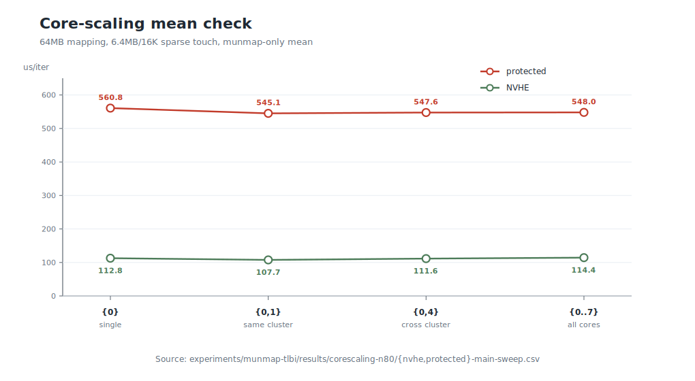

*图 8-1：N80 上真实 `munmap` 的 core-scaling mean 对照。基准固定在 cpu0，横轴依次增加同簇、跨簇和全部在线核心；protected 与 NVHE 的 mean 均未随在线核心数或跨簇拓扑上升。该图与图 8-2 共同构成对广播假说的直接复查；数据由 `docs/mmap/scripts/plot-n80-mechanism-controls.py` 从 `experiments/munmap-tlbi/results/corescaling-n80/{nvhe,protected}-main-sweep.csv` 解析生成。*

为确认这不是单次扫描偶然结果，protected 下又对 6.4 MB / 16 KB 点复测三轮。三轮 mean 的方向一致：远端核心 online 后没有变慢，n=2 与 n=8 也没有分离。

| 复测 | `{0}` mean | `{0,1}` mean | `{0..7}` mean |
|---|---:|---:|---:|
| run 1 | 578.4 | 546.4 | 547.1 |
| run 2 | 564.6 | 547.6 | 549.3 |
| run 3 | 564.0 | 548.6 | 547.4 |

稀疏/密集对照同样按 mean 判读。若广播成本与 TLBI 条数和在线核数共同放大，则稀疏 16 KB 触摸在 n=8 下应明显慢于 n=1；实测没有。密集 4 KB 触摸与稀疏 16 KB 触摸在 n=8 下都不比 n=1 慢：

| 8 MB 跨度触摸模式 | TLB 刷新形态 | `{0}` mean | `{0..7}` mean | 判读 |
|---|---|---:|---:|---|
| 8 MB / 4 KB 密集 | 整表刷新，逐页 TLBI 很少 | 443.4 | 367.6 | 不随核数放大 |
| 8 MB / 16 KB 稀疏 | 逐页 TLBI，slot 数多 | 694.3 | 680.3 | 不随核数放大 |

因此，真实 `munmap` 的 mean 数据已经排除了 a-1-broadcast 的关键预测：protected 下即使处在稀疏逐页 TLBI 路径，在线核数、同簇/跨簇拓扑都没有带来额外耗时。接下来再用 TLBI 指令直接计时，验证这条结论是否也成立于裸 TLBI 本身。

### 8.4 TLBI 指令直接计时：IS 与 NSH 不分离

真正直接的检验是 `tlbi_ab.ko`。如果 +0.27 µs/slot 来自跨核广播，IS（`vae1is` + `dsb ish`）应当比 NSH（`vae1` + `dsb nsh`）显著更慢，并且可能随在线核数或同簇/跨簇放置变化。实测相反：protected 下 IS 与 NSH 基本重合。

| 每个 slot（reps=2，nslots=2048） | NSH | IS | IS − NSH |
|---|---:|---:|---:|
| nvhe | 10.019 ns | 23.232 ns | +13.213 ns |
| **protected** | **288.837 ns** | **288.896 ns** | **+0.059 ns** |

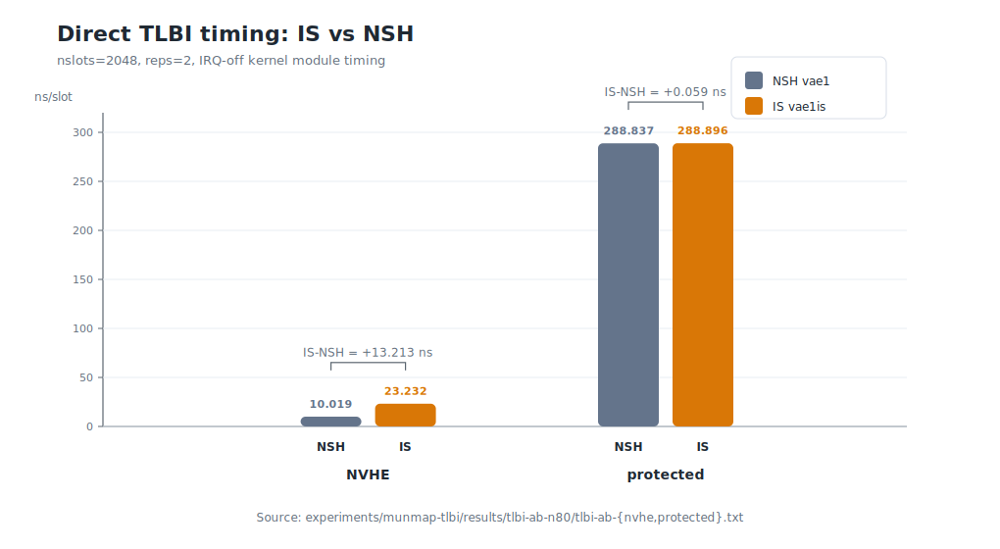

*图 8-2：N80 上 `tlbi_ab.ko` 的裸 TLBI 直接计时。NVHE 下 IS 比 NSH 多约 13 ns/slot；protected 下 NSH 与 IS 几乎完全重合，但二者都升至约 289 ns/slot。图 8-1 说明真实 `munmap` 不随在线核数放大，图 8-2 进一步说明裸 TLBI 的 shareable 作用域不是 protected 额外成本的来源。数据由 `docs/mmap/scripts/plot-n80-mechanism-controls.py` 从 `experiments/munmap-tlbi/results/tlbi-ab-n80/tlbi-ab-{nvhe,protected}.txt` 解析生成。*

同一文件中 nslots=256/512/1024/2048 的结果也保持稳定：protected 每 slot 约 289 ns，IS−NSH 约为 0。按 user-VA + 进程 ASID 重测后结论不变。这说明裸 TLBI 在 protected 下确实显著变慢，但慢的是**本地合成条目失效**，不是 shareable 作用域额外带来的远端等待。

这个数值还给出了定量闭环：protected 约 289 ns/slot，nvhe 的 IS 约 23 ns/slot，差值约 266 ns/slot，正好对应 §7.5 阈值扫描从真实 `munmap` 中反推出的 +0.27 µs/slot。

### 8.5 访存对照与 `perf`/mean 复核

为了排除另一种折中解释——"广播本身不慢，但广播流量拖慢了 `munmap` 中并发的访存/释放页操作"——复查在 `tlbi_ab` 中加入一段受控的依赖性随机访存。实验目标不是模拟 `munmap` 的完整页释放逻辑，而是构造一个容易产生 cache miss 的访存负载，再把它和 TLBI 放进同一计时窗口，观察二者叠加后是否随在线核数变慢。

实现方式如下。模块启动时分配一个 128 MB 的 `u64` 数组 `chase`（16M 个元素，远大于 N80 的 2 MB L3），并用 LCG 公式把每个下标映射到下一个伪随机下标。计时循环中，每处理一个 TLBI slot，就按当前下标读出下一个下标：

```c
/* 初始化：构造一个 128 MB 的伪随机下标链 */
for (i = 0; i < CHASE_N; i++)
    chase[i] = (i * LCG_A + LCG_C) & CHASE_MASK;

/* 计时区内：每次读取的地址依赖上一次读取结果 */
for (k = 0; k < memwork; k++)
    idx = chase[idx];
```

这里说的"冷缓存读取"不是在每次 load 前显式清空 cache，而是用三点降低缓存命中和预取命中的概率：第一，128 MB 工作集远大于 L3；第二，下标是伪随机分布，访问地址没有简单线性规律；第三，下一次访问地址依赖上一次 load 的返回值，处理器难以提前并行发起后续访问。每个 timed batch 又用不同 seed 选起点，避免反复命中同一小段缓存。因此，这个负载可以作为"容易暴露访存等待"的受控对照。

复查分别测三组配置，三者使用同一个 slot 循环和同样的在线核数设置：

| 配置 | 含义 | 目的 |
|---|---|---|
| `reps=0, memwork=4` | 每个 slot 只做 4 次依赖性随机读取，不发 TLBI | 建立"访存本身"的基线，观察这类访存是否随在线核数变化 |
| `reps=2, memwork=0` | 每个 slot 只发 TLBI，不做额外访存 | 建立"TLBI 本身"的基线 |
| `reps=2, memwork=4` | 每个 slot 发 TLBI 后再做 4 次依赖性随机读取 | 检验 TLBI 与访存叠加后是否出现额外等待 |

如果广播流量会拖慢并发访存，第三组应随在线核数增加，或显著超过前两组耗时之和。实测如下：

| 每个 slot | n=1 | n=2 跨簇 | n=8 |
|---|---:|---:|---:|
| 仅依赖性随机访存（4 次读取） | 617 | 621 | 617 |
| 仅 TLBI | 289 | 289 | 289 |
| TLBI + 依赖性随机访存 | 881 | 875 | 878 |

三行都不随核数变化；`TLBI + 依赖性随机访存` 也没有超过 `仅 TLBI + 仅依赖性随机访存` 的简单相加值。于是"广播流量挤占访存带宽，表现为后端停顿"也被排除。

最后再回到真实 `munmap`，用 `perf` 进程计数和 mean 复核 n=1 与 n=8。`perf` 的进程计数排除了被抢占时间，测到的是进程实际消耗的 cycles、instructions 和 stall：

| 整轮运行（protected，300 iters） | n=1 | n=8 |
|---|---:|---:|
| 实际经过时间 | 0.362 s | 0.348 s |
| cycles | 636 M | 625 M |
| `stall_backend`（r0024） | 427 M | 431 M |
| instructions | 552 M | 549 M |

整轮工作量不随在线核数增加；`stall_backend` 也基本持平。换成逐迭代均值后结论一致：

| µs/iter（mean） | n=1 | n=8 |
|---|---:|---:|
| touch | 485 | 465 |
| `munmap`（mmap_split） | 699 | 681 |
| `munmap`（munmap_only，1000 iters） | 696 | 680 |

因此，core-scaling 的正确判读是：均值、IRQ-off TLBI 直接计时、冷访存对照和 `perf` 进程计数全部指向同一个结论——这笔成本与在线核数无关。

### 8.6 代码层面：同一条 TLBI，作废对象不同

既然差异是本地的，又只在 protected 与 nvhe 之间出现，解释不在 Linux 发射路径。`arch/arm64/include/asm/tlbflush.h` 不按 KVM 模式区分 TLBI；`munmap` 在两种模式下发出的都是同一类 `tlbi vae1is`（运行时 KPTI 开启时两边都会追加 user ASID TLBI）。差异来自 host stage-2 是否启用后，硬件中可匹配的 TLB 条目类型不同。

- **protected 启用 host stage-2**：`__pkvm_prot_finalize()`（`mem_protect/host.rs:2249`）设置 host stage-2 的 `VTTBR_EL2`/`VTCR_EL2` 参数，并置位 `HCR_EL2.VM`；之后宿主机 EL1&0 的地址翻译经过 stage-1 × stage-2，两级结果会形成带 VMID 的合成条目。
- **nvhe 不启用 host stage-2**：`__load_host_stage2()`（`host.rs:2521`）将 `VTTBR_EL2` 置 0，宿主机 HCR 配置不包含 `HCR_VM`；宿主机 TLB 条目是纯 stage-1、ASID 标记。

按 ARM DDI 0487 D8.16/D8.17，stage-2 激活时，按 VA 的 `tlbi vae1is` 至少多了两类本地工作：除 VA/ASID 外还要匹配 VMID；同时要清理由 VA 编键的 stage-1-only 中间条目和最终 combined 条目。op=3 已证明 host stage-2 本身几乎全是 1 GB 块映射，因此这里的问题不是嵌套 walk 变深，而是要失效的条目类别更复杂。

在 FTC862 上，这个差异表现为约 12 倍的本地 TLBI 耗时：nvhe IS 约 23 ns/slot，protected 约 289 ns/slot。至于 12 倍内部还可拆成 VMID 标签匹配、额外条目类别、TLB 组织方式中的哪一项，需要 Phytium TLB TRM 或更细的核内 PMU 事件；N80 当前没有暴露到这个粒度。

### 8.7 阶段结论

第 8 章把 §7 得到的 a-1 进一步细分并完成判别：

> **pKVM 的 +0.27 µs/slot 不是跨核广播等待，也不是 `dsb ish` 等待远端核心完成失效；它是发起核本地失效一条 stage-1 × stage-2 合成、VMID 标记 TLB 条目的微架构成本。**

这不改变 §7 的主结论：小于 2 MB 的逐页 TLBI 路径仍然是根因，FEAT_TLBIRANGE/整表刷新仍然是有效缓解方向。改变的是更细的归因：应写作"逐页合成条目失效本身更贵"，不应写作"广播等待更贵"。

---

## 9. 最终结论：证据闭环、边界条件与优化方向

### 9.1 全部证据与候选机制对照

至此，主线候选已经从 a-1/a-2 收敛到 a-1-local。下面把所有关键证据按候选重新排列：

| 证据 | 对 a-1-local（本地 TLBI 合成条目失效） | 对 a-2（页表遍历成本） | 对 a-1-broadcast（跨核广播等待） |
|---|---|---|---|
| gate：ΔEL2 = 0 | 相容：宿主机 TLBI 是 EL1 发出的硬件行为 | 相容 | 相容 |
| C0 perf：指令/缺页/DTLB walk 基本相同，`stall_backend` 增加 | 支持：同一指令流中本地 TLBI 执行更久 | 先验上可解释，但缺少更多 walk 证据 | 先验上可解释，但需核数/IS 证据 |
| op=3：host stage-2 99.5% 为 1G 块 | 支持：瓶颈不在 stage-2 walk 深度 | 不利：遍历被放大的基础很弱 | 中性 |
| 密集触摸：遍历量 ×40，差距 ≈0 | 支持：无逐页 TLBI 就无 pKVM 额外成本 | **证伪**：工作量最大处无差距 | 中性 |
| 阈值扫描：2 MB 处突变，2 MB 以下差距 ∝ slot 数 | **证实**：差距由逐页 flush slot 数决定 | **证伪**：遍历机制无法产生 2 MB 突变 | 只说明是 TLBI，不能证明广播 |
| `tlbi_ab`：protected IS≈NSH≈289 ns/slot，nvhe IS≈23 ns/slot | **证实**：差值 266 ns/slot 与阈值扫描吻合 | 不支持 | **证伪**：IS 不比 NSH 慢 |
| core-scaling + perf/mean：n=1 与 n=8 工作量持平 | 支持：机制与核数/拓扑无关 | 中性 | **证伪**：没有随在线核数增加 |
| 平台无 FEAT_TLBIRANGE | 解释退化幅度：只能发长串逐页 TLBI | 中性 | 中性 |

只有 a-1-local 能同时解释全部观测：退化随逐页 flush slot 数线性增长，在内核改走整表刷新路径时消失；同一条 TLBI 在 protected 下本地执行更慢，但不随在线核数或广播作用域放大。

### 9.2 根因

pKVM（protected 模式）下宿主机 `lat_mmap` 的性能退化，根因为：

> **写触摸后的 munmap 在拆除映射时，对小于 2 MB 的刷新范围逐页发出 `TLBI` 指令（本平台无 FEAT_TLBIRANGE，无法使用范围 TLBI；`MAX_DVM_OPS=512` 使 ≥2 MB 的刷新批次改走整表刷新路径）；而 host stage-2 使能后，宿主机 TLB 中存在带 VMID 标记的 stage-1 × stage-2 合成条目，每个 4K flush slot 的本地失效成本从 nvhe 的约 23 ns 增至 protected 的约 289 ns，额外约 +0.27 µs/slot。该成本表现为后端停顿，但不是进入 EL2，也不是跨核广播等待。**

完整证据链如下：

```text
host stage-2（pKVM 隔离机制）
  → lat_mmap 生命周期退化 +29%~+85%，稳态访问不受影响         （阶段一）
  → 退化的 95.7% 位于写触摸后的 munmap                         （阶段二，修正 first-touch 假设）
  → munmap 不进入 EL2，ΔEL2=0                                  （阶段三）
  → 额外成本表现为后端停顿，指令/缺页/遍历次数不变             （阶段四）
  → 粒度检查排除碎片化；密集对照证伪遍历机制；
    源码定位 2 MB 阈值；扫描证实差距 ∝ 逐页 slot 数、在阈值处消失 （阶段五，修正嵌套遍历假设）
  → 在线核数、IS/NSH、访存对照、perf/mean 复查排除广播等待       （第 8 章）
  → 根因 = host stage-2 下逐页 TLBI 的本地合成条目失效成本
```

定量上，两条独立路径吻合：阈值扫描从真实 `munmap` 推得约 +0.267 µs/slot；`tlbi_ab` 直接计时得到 protected 约 289 ns/slot、nvhe 约 23 ns/slot，差值约 266 ns/slot。原始稀疏 64 MB case 的 +435 µs 也可由约 1638 个 4K flush slot × 0.267 µs/slot ≈ 438 µs 解释。

### 9.3 退化边界与实际影响

该退化有明确边界，并非"pKVM 下内存操作普遍变慢"：

- **仅在小范围逐页 TLB 刷新路径上显著**：若单次刷新范围达到 2 MB，内核改用整表刷新路径，protected−nvhe 差距塌缩到约 0%～4%；但 `lat_mmap` 的 16 KB 稀疏触摸会让脏页按 PMD 分批，持续落在逐页路径。
- **主要影响映射生命周期**：稳态读写、长期复用的映射（如 LMDB 打开后的常规读写）几乎不受影响；频繁建立/拆除中小映射的负载更容易触发。
- **平台相关**：退化幅度取决于硬件是否支持 FEAT_TLBIRANGE。N80/N90/Kaitian 均不支持，因此逐页 TLBI 数量成为乘数；支持范围 TLBI 的平台可把长串逐页失效压缩为少数范围失效，退化会显著缩小。

**该退化不限于 `munmap`。** 2026-06-16 的操作谱系复查用同一套阈值扫描对照 `munmap`、`madvise(MADV_DONTNEED)`、`mprotect` 三类操作，显示 protected−nvhe 的逐页 gap 与操作名无关、主要由刷新 slot 数决定。`MADV_DONTNEED` 与 `munmap` 行为一致，因为它同样 zap 脏页并按 PMD 分批；jemalloc、tcmalloc、Go runtime 的 decommit 可能走到这一路。`mprotect` 则只有连续改动区间本身小于 2 MB 时明显受影响，稀疏大跨度不 zap 脏页、可一次性越过阈值，gap 接近 0。完整数据见 `pkvm-teardown-op-generality.en.md`。

### 9.4 优化方向评估

| 方向 | 评估 |
|---|---|
| **FEAT_TLBIRANGE（硬件）** | 核心缓解手段。范围 TLBI 将 N 个逐页 slot 压缩为少数范围失效，直接减少昂贵的合成条目失效次数。内核已有范围分支，平台支持即可受益。 |
| **透明大页 THP（软件，逐映射）** | 已在 Kaitian 实测（[pkvm-thp-mitigation.zh-CN.md](pkvm-thp-mitigation.zh-CN.md)）：2 MB 大页把 512 条 PTE TLBI 折叠成 1 条 PMD TLBI，是 FEAT_TLBIRANGE 的软件侧替代。但**须让内存真的被大页映射**——全局 THP 开关对 ext4 文件 mmap 无效（`huge_fault` 仅 DAX，protected−nvhe 税 +208 µs 不变）；匿名（`MADV_HUGEPAGE`，<2 MB 逐页区间）与 shmem/tmpfs（`huge=`）后端可把税降到约 0。 |
| **调整 `MAX_DVM_OPS` 阈值（内核）** | 可评估：降低阈值可让更多拆除批次提前走整表刷新，避开长串逐页 TLBI。代价是整表刷新会失效该 ASID 的更多 TLB 条目，增加后续重填成本，必须用实际负载权衡。 |
| **应用层规避** | 复用映射、减少频繁小范围 unmap/decommit、合并相邻拆除，可降低逐页 slot 数。 |
| **pKVM/hypervisor 侧** | 空间有限。宿主机 TLBI 不被陷入，hypervisor 无法拦截或加速；host stage-2 粒度已接近最大（99.5% 为 1G 块），提高映射粒度不能解决本问题。 |

### 9.5 方法回顾：三次修正

调查过程中三次修正都来自同一类问题：一个观测与多个假设相容，却被过早归因到其中一个。最终都靠专门对照实验把候选机制拆开。

1. **first-touch 建表假设**：阶段一看到退化随触摸页数增长，曾解读为首次缺页/stage-2 建表昂贵。阶段二拆分计时显示首次写触摸只占额外时间约 4%，主因在写触摸后的 `munmap`。
2. **嵌套页表遍历假设**：阶段四看到后端停顿增加，曾解读为每次 stage-1 walk 被 stage-2 放大。阶段五的 op=3、密集触摸和阈值扫描共同证明遍历不是主因，差距由逐页 TLBI slot 数决定。
3. **广播等待假设**：阶段五后曾把 +0.27 µs/slot 进一步归因到 shareable 广播等待。第 8 章用在线核数、IS/NSH 直接计时、访存对照和 `perf`/mean 复核证明这也是误判；最终应以 mean、进程级 perf 计数和 TLBI 直接计时共同约束结论。

最终写法应避免把"后端停顿"直接翻译成"等待远端核心"。在本案中，后端停顿表示同一条 TLBI 在 protected 下本地执行需要更多周期；广播、核数和拓扑不是决定因素。

---

## 附录 A：测试平台一览

| 平台 | SoC / 频率 | 系统 | 内核 | 用途 |
|---|---|---|---|---|
| N90 | Phytium FTC862 / 2.1 GHz（锁定） | Kylin V10 SP1 | `6.6.30+ #4`（Rust pKVM）、`6.6.30-pkvm-c+ #6`（C pKVM） | 阶段一：四模式对照与实现交叉验证 |
| Kaitian（`ryuu`） | Phytium / — | Kylin V10 | `6.6.30+ #637` | 阶段二：mmap-split 拆分；LMDB 应用级对照 |
| N80 | Phytium / 1.8 GHz（锁定） | Kylin V10 SP1 | `6.6.30xcore-stat+` / `6.6.30xcore-stat2+`（Rust nVHE hyp） | 阶段三至五：gate、perf、op=3、阈值扫描；第 8 章：在线核数与 TLBI 直接计时 |

N80 关键硬件常数：`ID_AA64ISAR0_EL1 = 0x0000111110212120`，TLB 字段 [59:56] = 0，**不支持 FEAT_TLBIRANGE**；`MAX_DVM_OPS = PTRS_PER_PTE = 512`，整表刷新阈值 512 × 4 KB = 2 MB。

对照模式说明：阶段二之后以 NVHE 为基线（与 protected 共用同一内核镜像，仅启动参数不同；阶段一已证明三个非 pKVM 基线等价）。

## 附录 B：复现步骤

```bash
# 0) 环境准备（每次启动后，所有平台一致）
sudo ./prepare-host.sh            # 锁频 / 关 THP / 关 ASLR / 关深度 idle
sudo ./quiet-host.sh quiet        # 压制无关后台服务

# 1) 阶段一：四模式 lat_mmap（按模式重启后分别执行）
ENV_TAG=<tag> CORE=0 ITERS=10 RUN_PRECISE=1 ./bench-mmap.sh

# 2) 阶段二：生命周期拆分（nvhe 与 pkvm 各一轮）
MODE=<nvhe|pkvm> CORE=0 RUNS=10 REFILL=1 WARMUPS=1 scripts/mmap-split-bench.sh
python3 scripts/analyze-mmap-split.py nvhe pkvm

# 3) 阶段三：EL2 gate（protected 模式；内核需启用 CONFIG_XCORE_STATS）
#    先做阳性对照：连续 echo 2 > /proc/xcore_stats 200 次，确认计数器累加
SIZES="8 16 64" ITERS=100 CORE=0 scripts/el2-gate-bench.sh

# 4) 阶段四：perf 分解（两模式各一轮；先 echo 0 释放 PMU）
scripts/host-mm-trace.sh perf      # 含 tlbirange / funcgraph 子命令

# 5) 阶段五：
#    粒度检查（protected）：
echo 3 > /proc/xcore_stats && cat /proc/xcore_stats
#    阈值扫描（两模式各一轮）：
experiments/munmap-tlbi/run-sweep.sh   # RANGES="0.25 0.5 1 1.9 2 4 8 32 64"

# 6) 第 8 章：TLBI 微机制复查
#    在线核数扫描（protected 与 nvhe 各一轮）：
CORE=0 SIZE=64 ITERS=100 experiments/munmap-tlbi/run-core-scaling.sh
#    TLBI IS/NSH 直接计时（需加载 experiments/munmap-tlbi/tlbi_ab/tlbi_ab.ko）：
taskset -c 0 sh -c 'echo "0 2048 2 100" > /proc/tlbi_ab && cat /proc/tlbi_ab'
```

## 附录 C：代码、脚本与数据索引

**内核代码（common 仓库）**

| 路径 | 内容 |
|---|---|
| `arch/arm64/include/asm/tlbflush.h:253,342,369,405,422` | `flush_tlb_mm` / `MAX_DVM_OPS` / 逐页循环 / 阈值分支 |
| `mm/mmap.c:2346`；`mm/mmu_gather.c:437`；`arch/arm64/include/asm/tlb.h:53` | munmap 拆除路径与最终 TLB 刷新 |
| `arch/arm64/include/asm/kvm_arm.h:101` | 宿主机 HCR 配置（TLBI 不陷入的依据） |
| `arch/arm64/kvm/hyp/nvhe/rust/src/hyp_main.rs:1737,2975` | 原始 `xcore_stats_entry`（op=0/1/2）与 `handle_trap` |
| `arch/arm64/kvm/hyp/nvhe/rust/src/mem_protect/host.rs:517,882,1750,1841,1979` | 原始 host stage-2 辅助路径：`force_pte` / `get_leaf` / `adjust_range` / `idmap` / 缺页处理 |
| `arch/arm64/kvm/hyp/nvhe/rust/src/stats.rs:20` | 原始 EL2-only PMU 周期计数基础配置 |
| `arch/arm64/kvm/xcore_stats.c` | 原始 `/proc/xcore_stats` 基础接口（op=0/1/2，protected-only 初始化） |
| `docs/mmap/patch-a-xcore-instrumentation.diff` | 本实验叠加补丁：`CONFIG_XCORE_STATS=y`、PMU per-CPU save/restore、普通 nVHE 下的 PMU op 辅助对照入口、op=2 protected-only 防御、op=3 host stage-2 粒度统计 |

**测试代码与脚本（kylin-lmbench 仓库）**

| 路径 | 内容 |
|---|---|
| `src/lat_mmap.c`、`src/lat_mmap_precise.c` | 原版与纳秒精度版 lat_mmap |
| `experiments/mmap-split/mmap_split_bench.c` | 12 个生命周期子测试 |
| `experiments/munmap-tlbi/{munmap_only.c,run-sweep.sh}` | 阈值扫描微基准与驱动脚本 |
| `experiments/munmap-tlbi/run-core-scaling.sh` | 第 8 章在线核数扫描脚本（mean/min 同时记录，含同簇/跨簇集合） |
| `experiments/munmap-tlbi/tlbi_ab/` | 第 8 章 TLBI IS/NSH 直接计时内核模块与 user-VA 驱动 |
| `scripts/mmap-split-bench.sh`、`scripts/analyze-mmap-split.py` | 拆分实验驱动与分析 |
| `scripts/el2-gate-bench.sh`、`scripts/host-mm-trace.sh` | EL2 gate 与 perf/funcgraph/tlbirange |
| `docs/mmap/scripts/plot-*.py` | 本文图 3、图 4、图 6、图 7、图 8 的可复现绘图脚本；其中 `plot-n80-mechanism-controls.py` 生成 §7.3 与 §8.3/§8.4 的机制对照图 |
| `bench-mmap.sh`、`prepare-host.sh`、`quiet-host.sh` | 四模式测试入口与环境控制 |

**原始数据（kylin-lmbench/results/）**

| 路径 | 内容 |
|---|---|
| `n90-v10-*-mmap/`、`n90-v10-mmap-4mode-summary.txt` | 阶段一四模式数据（含 C 内核复测） |
| `mmap-split-kaitian/{nvhe,pkvm}.csv` | 阶段二拆分数据 |
| `lmdb-bench-kaitian/{nvhe,pkvm}/` | LMDB 应用级数据 |
| `n80-munmap-gate-c0/{protected,nvhe}/` | 阶段三、四的 gate CSV 与 perf/funcgraph 日志 |
| `experiments/munmap-tlbi/results/corescaling-n80/` | 第 8 章在线核数扫描 CSV；其中 README 为早期中间判读，最终结论以 `INVESTIGATION-LOG.md` 和正文 §8 为准 |
| `experiments/munmap-tlbi/results/tlbi-ab-n80/` | 第 8 章 TLBI IS/NSH 直接计时结果 |

## 附录 D：阶段性详细文档

本报告为自包含总览；下列一手文档保留了各阶段更完整的过程记录与逐项数据，供查证之用：

| 阶段 | 文档 |
|---|---|
| 1 现象 | `n90-v10-mmap-host-report.md`、`pkvm-mmap-overhead-analysis.md` |
| 1 应用级 | `lmdb-pkvm-benchmark-plan.zh-CN.md`、`lmdb-kaitian-nvhe-pkvm-results.zh-CN.md` |
| 2 拆分 | `lat-mmap-test-walkthrough.zh-CN.md`、`mmap-split-kaitian-pkvm-comparison.zh-CN.md` |
| 3/4 gate 与 perf | `n80-gate-c0-results.zh-CN.md`（含 §7.3 已更正的旧机制结论） |
| 5 粒度检查 | `c1-host-stage2-granularity.zh-CN.md`（含已更正的旧机制结论） |
| 5 机制判定 | `c1-tlbi-threshold.zh-CN.md`（最终结论的完整推理链） |
| 8 微机制复查 | `pkvm-munmap-corescaling-followup.en.md`、`experiments/munmap-tlbi/INVESTIGATION-LOG.md` |
| 方案与插桩 | `pkvm-mmap-optimization-plan.zh-CN.md`、`agile-popping-anchor.md`、`el2-gate-instrumentation.zh-CN.md` |
